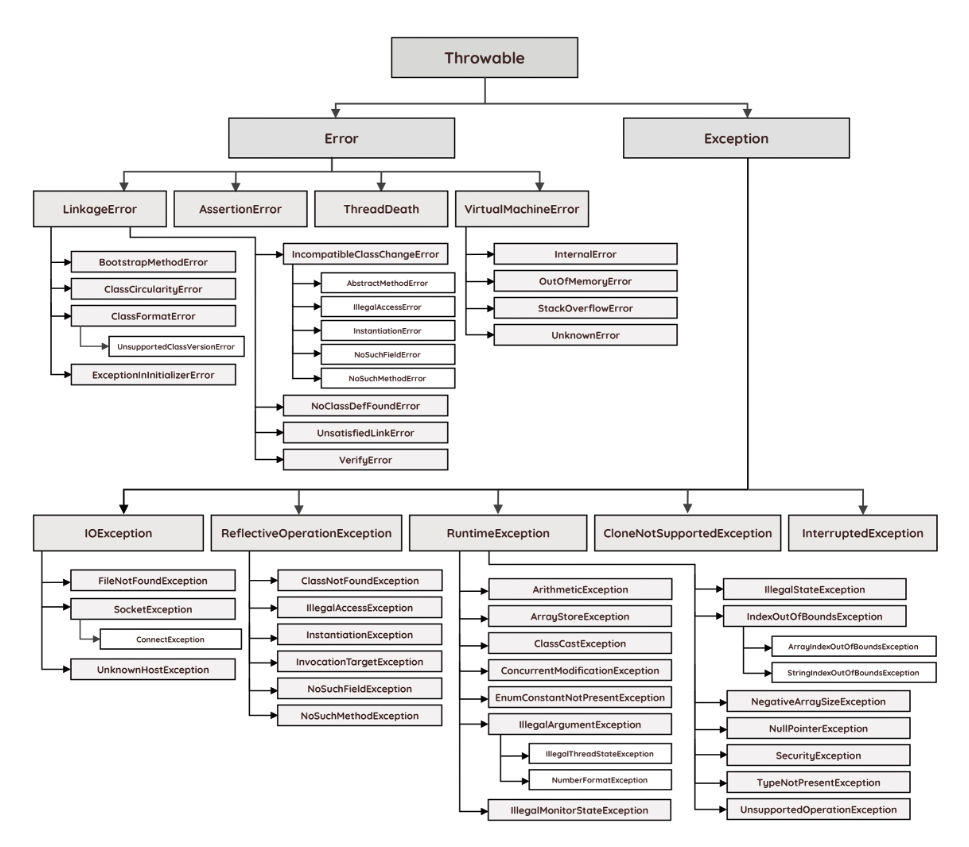
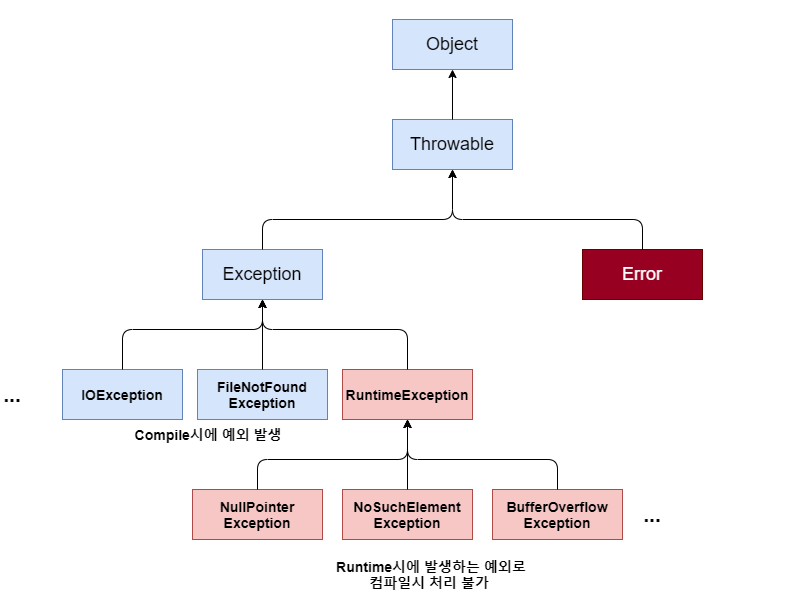
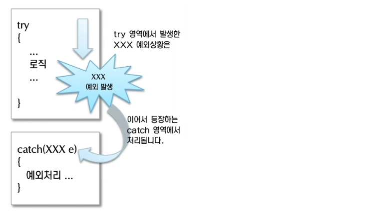
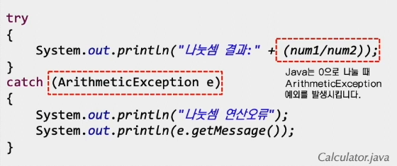

# 예외

나는 예외처리에 대한 코딩 경험이 별로 없어서 예외처리에 많이 약하다. 그래서 예외처리가 무엇인지 어떻게 해야하는지에 대해 알아보자.

## 오류
예외를 알기 전에 오류에 대해 먼저 알아보자. 프로그램 실행 중 어떤 원인에 의해 오작동하거나 비정상적으로 종료되는 경우가 있는데 이런 결과를 초래하는 원인을 프로그램 에러 또는 오류라고 한다. 프로그래밍에서는 발생 시점에 따라 다음과 같이 3가지로 구분한다.
- 컴파일 에러: 컴파일 시에 발생하는 에러
- 런타임 에러: 실행 시에 발생하는 에러
- 논리적 에러: 실행은 되지만 의도와 다르게 동작하는 것

## 논리적 에러 (Logical Error)
논리적 에러는 이른바 '버그' 라고 생각하면 된다.  
프로그램이 실행하고 작동하는데는 아무런 문제가 없는 오류이지만, 결과가 예상과 달라 사용자가 의도한 작업을 수행하지 못하게 되어 서비스 이용에 지장이 생길 수 있다.  
논리적 오류는 컴퓨터 입장에서는 프로그램이 멀쩡히 돌아가는 것이니 에러 메시지를 알려주지 않는다. 따라서 개발자는 프로그램의 전반적인 코드와 알고리즘을 체크할 필요가 있다.

## 컴파일 에러 (Complie Error)
컴파일 에러는 컴파일 단계에서 오류를 발견하면 컴파일러가 에러 메시지를 출력해주는 것을 말한다.  
컴파일 에러 발생의 대표적인 원인으로는 문법 구문 오류를 들 수 있다.  
예를들면 맞춤법, ;, 선언되지 않은 변수를 사용하는 등이 있다.  

## 런타임 에러 (Runtime Error)
컴파일 에러를 꼼꼼하게 잡아 컴파일에는 문제가 없더라도, 프로그램 실행 중에 에러가 발생해서 잘못된 결과를 얻거나 외부적인 요인, 기계적 결함으로 프로그램이 비정상적으로 종료될 수 있다.  
이것이 우리가 집중적으로 파헤쳐 보아야할 실행 오류(런타임 에러)이다.  
대체로 개발 시 설계 미숙(논리적)으로 발생하는 에러가 대부분이며, 런타임 에러 발생 시 프로그래머가 역추적해서 원인 확인해야 한다. 따라서 이러한 잠재적인 런타임 에러를 방지하기 위해서는 프로그램의 실행 도중 발생할 수 있는 경우의 수를 고려하여 이에 대한 대비를 철저히 해야 한다.

## 오류와 에러
자바에서는 실행 시(run time)에 발생하는 프로그램 오류를 다음과 같이 구분한다.
- 에러(error): 프로그램 코드에 의해서 수습될 수 없는 심각한 오류
- 예외(exception): 프로그램 코드에 의해서 수습될 수 있는 다소 미약한 오류

Error는 메모리 부족(OutOfMemoryError)이나 스택오버플로우(StackOverflowError)와 같이 일단 발생하면 복구할 수 없는 심각한 오류이고 예측이 불가능한 녀석이다. 즉, 에러는 JVM 실행에 문제가 생긴 것이므로 개발자가 대처할 방법이 없다. 

반면 Exception은 발생하더라도 수습될 수 있는 비교적 덜 심각한 오류를 말한다. 즉 알고리즘 오류로 Exception 예외가 계속 발생한다고 해도 Error 처럼 프로그램이 죽거나 그럴경우는 적기 때문이다.

그렇다고 예외(Exception)가 단어의 어감 처럼 가볍게 볼 녀석은 아니다. 예외에 대한 오류 처리를 제대로 하지 않으면 전혀 예상하지 못한 오류 발생으로 프로그램에 작지 않은 문제를 야기하기 때문이다.

## 자바의 예외 클래스

### 예외 클래스의 계층 구조

자바에서는 Error와 Exception을 모두 클래스로 구현하여 처리하도록 하였다.

우리에게 익숙한 IllgalArgumentException을 비롯해 NullPointerException과 IOException도 모두 클래스이다.

JVM은 프로그램을 실행하는 도중에 예외가 발생하면 해당 예외 클래스로 객체를 생성하고서 예외 처리 코드에서 예외 객체를 이용할 수 있도록 해준다. 나중에 배울 getMessage()나 pringtStackTrace() 메서드 역시 예외 객체의 메서드를 가져와 오류를 출력하는 것이다.

자바의 오류 클래스 계층 구조를 살펴보면 다음과 같이 구성 되어 있다.

Error 클래스는 위에서 언급한 바와 같이 외부적인 요인으로 인해 발생하는 오류이기 때문에 개발자가 대처 할 수는 없다. 따라서 우리가 중점적으로 봐야할 클래스는 바로 Exception 클래스이다.

## Throwable 클래스
계층구조 가장 위쪽을 보면 Throwable 클래스가 있다.  
오류와 예외 모두 자바의 최상위 클래스인 Object를 상속받는다.  
그리고 그 사이에는 Throwable 클래스와 상속관계가 있는데, Throwable 클래스의 역할은 오류나 예외에 대한 메시지를 담는 것이다. 대표적으로 getMessage()와 printStackTrace() 메서드가 바로 이 클래스에 속해 있다.  
당연히 Throwable을 상속받은 Error와 Exception 클래스에서도 위 두 메서드를 사용할 수 있게 된다.

위의 계층 구조는 보기 복잡하니 간단히 아래 표를 보자

자바에서 다루는 모든 예외 오류는 Exception 클래스에서 처리한다. 그리고 아래의 Exception 클래스 트리 구조를 보면 파랑색과 붉은색으로 색깔별로 구분됨을 볼 수 있는데, 이것이 컴파일 에러와 런타임 에러를 따로 클래스로 구분했기 때문이다.

즉, Exception 클래스는 다시 RuntimeException(런타임 에러)과 그 외의 자식 클래스 그룹(컴파일 에러)로 나뉘게 된다.
1. Exception 및 하위 클래스: 사용자의 실수와 같은 외적인 요인에 의해 발생하는 컴파일 시 발생하는 예외
    - 존재하지 않는 파일의 이름을 입력
    - 실수로 클래스의 이름을 잘못 기재
    - 입력한 데이터 형식이 잘못된 경우
2. RuntimeException 클래스: 프로그래머의 실수로 발생하는 예외
    - 배열의 범위를 벗어남
    - 값이 null인 참조 변수의 멤버를 호출
    - 클래스 간의 형 변환을 잘못함
    - 정수를 0으로 나누는 산술 오류

# 예외 처리

## 예외 처리란?
예외 처리란 프로그램 실행 시 발생할 수 있는 예기치 못한 예외의 발생에 대비한 코드를 작성하는 행위를 말한다.  
프로그램 실행도중에 발생하는 에러는 어쩔 수 없지만, 예외는 프로그래머의 실력에 따라 충분히 포괄적으로 방지할 수 있기 때문이다. 따라서 예외 처리의 목적은 예외의 발생으로 인한 실행중인 프로그램의 갑작스런 비정상 종료를 막고, 정상적인 실행상태를 유지하는 것이다.

## try - catch 문

try 블록에는 예외발생 가능 코드가 위치하고 만일 코드에 오류가 발생되면, 오류 종류(예외 클래스)에 맞는 catch 문으로 가서 catch 블록 안에 있는 코드를 실행 시킨다. 만일 오류가 발생하지 않으면 catch 문은 실행하지 않는다.

catch 문을 보면 예외클래스 타입과 변수 e가 선언되어 있는데, 만일 try문에서 예외가 발생했을 때 그 예외에 맞는 예외 클래스가 catch문에 argument로 선언되어 있으면 실행되어 옳지 못한 동작에 대해서 대비할 수 있다.  

<밑과 같은 형식으로 대비>

## try -catch - finally 문
위에서 살펴봤듯이 프로그램 수행 도중 예외가 발생하면 프로그램이 중지되거나 예외 처리에 의해 catch 구문이 실행된다.

하지만 어떤 예외가 발생하더라도 반드시 실행되어야 하는 부분이 있다면 finally 문으로 처리가 가능하다.

## 예외 메세지 출력

catch 문의 Exception e 에서 Exception은 변수의 클래스 타입이 되고, e는 변수이다. 그리고 이 객체 변수 안에는 에러 메세지를 출력하는 메서드가 들어있다.

- pringStackTrace(): 예외발생 당시의 호출스택에 있었던 메서드의 정보와 예외 메시지를 화면에 출력
- getMessage(): 발생한 예외클래스의 인스턴스에 저장된 메시지를 얻을 수 있음