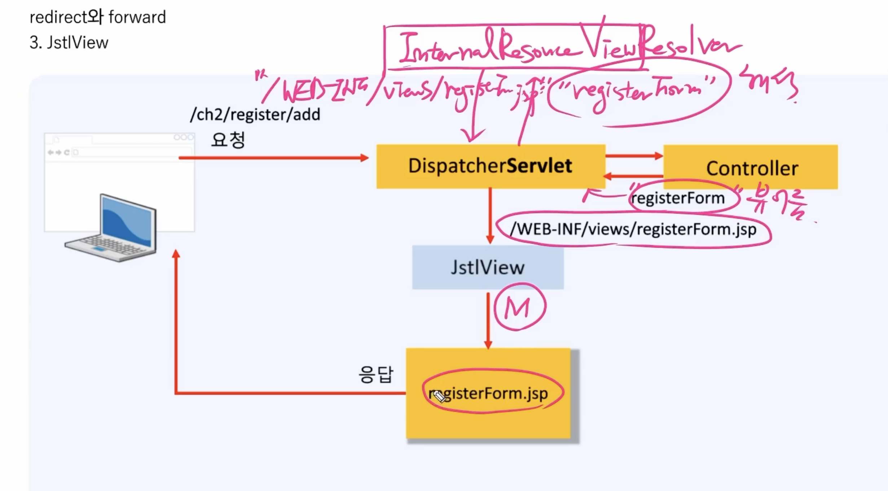
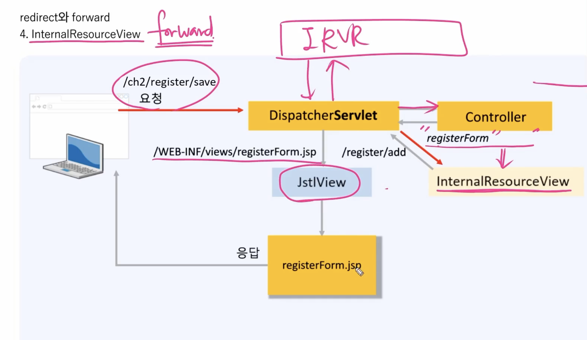

# redirect와 forward
## 1. redirect와 forward의 처리 과정 비교
1. redirect  
redirect는 보통 요청이 들어왔을 때 자신의 역할이 아니면 그 요청을 받을 수 있는 곳으로 재연결을 해줌. 그래서 요청이 두 번 들어가게됨.
2. forward
forward는 요청이 들어왔을 때 그 요청을 곧바로 응답가능한 곳으로 연결해줌. 그렇기 때문에 요청이 두 번 들어갈 일이 없음. 바로 전달해주기 때문에  
이 때 forward되는 request가 model 역할이고 전달해주는 것이 controller, 응답을 보여주는 것이 view

## 2. RedirectView
스프링에서는 클라이언트가 요청을 하면 DispatcherServlet이 무조건 받음  
그 다음 이 요청을 처리할 수 있는 컨트롤러의 메소드를 호출  

근데 유효성 검사를 통과하지 못해서 redirect 문자열이 return  
-> 그럼 DispatcherService는 return으로 redirect를 받았기 때문에 RedirectView에 전달. 그럼 RedirectView는 응답 헤더를 만들어서 클라이언트에 응답 제공. 그 후 브라우저가 자동으로 응답헤더를 보고 요청.

## 3. JstlView
요청이 들어오면 DispatcherServlet이 컨트롤러에게 전달함. 예를 들어 registerForm(뷰 이름)이 return값으로 DispatcherServlet한테 들어오면 이걸 InternalResourceViewResolver에 전달. 그 이후 이 Resolver는 어떤 뷰인지 실제 이름을 해석해줌. 그러면 그 이름을 jstlView(->JSP 뷰를 처리하는 애)에게 넘겨주고 jstlView가 해당 jsp에게 Model을 넘겨줌. 그럼 그 jsp가 최종 응답을 만들어서 응답을 함.

## 4. InternalResourceView
forward할 때 사용되는 뷰  
