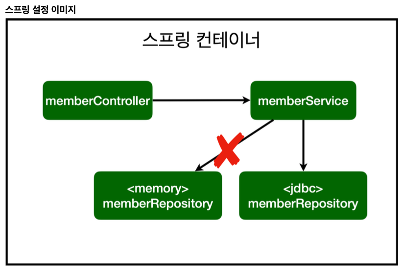

# 스프링에 데이터베이스 연결하기

## 순수 Jdbc
스프링에 데이터베이스 연결을 공부하며 순수 Jdbc로 데이터베이스를 연결하는 방법에 대해 알아보았다.  
일단 build.gradle에 jdbc, h2 데이터베이스 관련 라이브러리를 추가해주었다.  
그 다음 application.properties에 스프링 부트 데이터베이스 연결 설정을 추가해주었고,  
스프링부트 2.4부터는 `spring.datasource.username=`를 꼭 추가해주어야 한다고 한다.  
공백도 들어가지 않게 모두 제거해주기로 한ㄷ나.

그 다음은 Jdbc 리포지토리 구현이다.  약 20년 전 개발자들이 이렇게 코딩했다고 하는데 대충 코드만 봐도 너무 길고 복잡해보인다.  
각 객체마다 sql문을 작성해주어야 하나보다. member의 이름을 save하는 메소드에 insert구문을 넣어준다.  
여기서부턴 조금 어지러우니 안봐도 된다. 그냥 이런게 있었구나하고 정리해본다  

```
@Override
public Member save(Member member) {
    String sql = "insert into member(name) values(?)";
    Connection conn = null;
    PreparedStatement pstmt = null;
    ResultSet rs = null;
    
    try {
        //데이터베이스 연결을 설정하기 위한 메소드 호출이다.
        conn = getConnection(); 
        
        //SQL문을 실행하기위한 객체를 설정하고 자동 생성된 키를 검색하도록 설정하고있다.
        pstmt = conn.prepareStatement(sql, Statement.RETURN_GENERATED_KEYS);

        //SQL쿼리의 '?' 매개변수에 Member 객체의 이름을 설정하고 있다.
        pstmt.setString(1, member.getName());

        //SQL문을 실행하여 데이터베이스에 쿼리를 적용
        pstmt.executeUpdate();
        
        //생성된 키를 검색하기 위한 메소드
        rs = pstmt.getGeneratedKeys();
        
        ResultSet에서 다음 행이 있는지 확인하는 절차
        if (rs.next()) {
            //ResultSet에서 가져온 생성된 키 값을 사용하여 Member 객체의 ID를 설정하고 있음
            member.setId(rs.getLong(1));
        }
        //생성된 키가 없는 경우 예외 발생 
        else {
            throw new SQLException("id 조회 실패");
        }
        //저장된 Member 객체 반환
        return member;
    } catch (Exception e) {
        throw new IllegalStateException(e);
    } finally {
        //데이터베이스 리소스 닫음
        close(conn, pstmt, rs);
    }
}
```

어우, 복잡하긴하다. 코드가 엄청 길어지는 것은 물론이고 반복되는듯한 코드가 정말 많아보이긴 한다.
이렇게 데이터베이스 jdbc 설정을 마쳤으면 로컬 메모리를 사용하도록 설정되었던 스프링 빈 부분을 jdbc로 바꿔주기만 하면 된다.  

그럼 정말 간단하게 그림처럼 jdbc리포지토리로 연결되게 된다.

이 부분이 정말 자바의 편리함과 특징을 보여준다.

- <b>개방 폐쇄 원칙(OCP, Open-Closed Principle)</b>  
SOLID의 O부분인 개방 폐쇄 원칙이 위의 실습을 통해 정말 잘 보여진다고 생각한다.  
    - 확장에는 열려있고, 수정, 변경에는 닫혀있다는 말이 이론적으로 공부할 땐 잘 이해가 되지 않는 부분이었는데 이 실습을 통해 확실히 느낄 수 있었다.  
- 스프링의 DI(Dependencies Injection)을 사용하면 기존 코드를 전혀 손대지 않고, 설정만으로 구현 클래스를 변경할 수 있다.  
- 데이터를 DB에 저장하므로 스프링 서버를 다시 실행해도 데이터가 안전하게 저장된다.  

## 스프링 통합 테스트
스프링 컨테이너와 DB까지 연결한 통합 테스트  
간단하다. 그냥 서비스 테스트 부분에 @SpringBootTest, @Transactional 만 설정해주면된다.

@SpringBootTest: 스프링 컨테이너와 테스트를 함께 실행한다.  
@Transactional: 테스트 케이스에 이 애노테이션이 있으면, 테스트 시작 전에 트랜잭션을 시작하고, 테스트 완료 후에 항상 롤백한다. 이렇게 하면 DB에 데이터가 남지 않으므로 다음 테스트에 영향을 주지 않는다.

제일 재밌었던 부분은 트랜잭션 부분이다. 이건 sqld 자격증을 따거나 sql을 공부해 본 사람이라면 누구나 쉽게 접할 수 있었을 것이다. 그 때 배웠던 트랜잭션의 특징을 이렇게 사용할 수 있구나~ 라고 정말 크게 놀랐다. 이론으로 배웠던 부분이 하나하나 조각처럼 맞춰지는게 정말 재밌는 것 같다.


## 스프링 JdbcTemplate
환경설정은 순수 Jdbc와 동일하다.  
스프링 JdbcTemplate과 MyBatis 같은 라이브러리는 JDBC API에서 본 반복 코드를 대부분 제거해준다. 하지만 SQL은 직접 작성해야한다.
작성 후 역시 스프링 Bean 부분에 UserRepository를 JdbcTemplate로 코드를 수정해주면된다.

## 스프링 JPA
이젠 SQL도 직접 작성안하고 인터페이스만 작성해주면 됨.