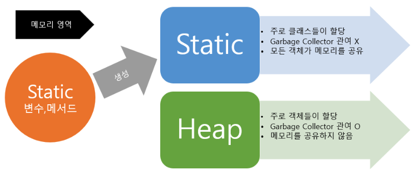

## 자바의 Static

## Static(정적)이란?
static(정적)은 고정된이란 의미를 가지고 있다. Static이라는 키워드를 사용하여 Static변수와 Static메소드를 만들 수 있는데 다른 말로는 정적 필드와 정적 메소드라고도 하며 이 둘을 합쳐 정적 멤버(클래스 멤버)라고 한다. 이 정적 멤버는 객체(인스턴스)에 소속된 멤버가 아니라 클래스에 고정된 멤버이다. 그렇기에 클래스 로더가 클래스를 로딩해서 메소드 메모리 영역에 적재할 때 클래스 별로 관리된다. 따라서 클래스의 로딩이 끝나는 즉시 바로 사용 가능하다.



Static 키워드를 통해 생성된 정적멤버들은 Heap 영역이 아닌 Static 영역에 할당된다. static 영역에 할당된 메모리는 모든 객체가 공유하여 하나의 멤버를 어디서든지 참조할 수 있는 장점을 가지지만 Garbage Collector의 관리 영역 밖에 존재하기 때문에 프로그램의 종료시까지 메모리가 할당된 채로 존재하게 된다. 그래서 static을 너무 남발하게 되면 만들고자 하는 시스템 성능에 악영향을 줄 수 있다.

```
class User{
    static int count = 0; //클래스 필드
    int id = 0; //인스턴스 필드
}

```
위 코드에서 count는 new User()를 통해 인스턴스를 생성하지 않아도 호출이 가능하다.  
또한 정적 변수는 각각의 인스턴스에서 하나의 저장공간을 공유하기에 항상 같은 count 값을 가지고, id는 인스턴스마다 각각 다른 값을 가진다.aa