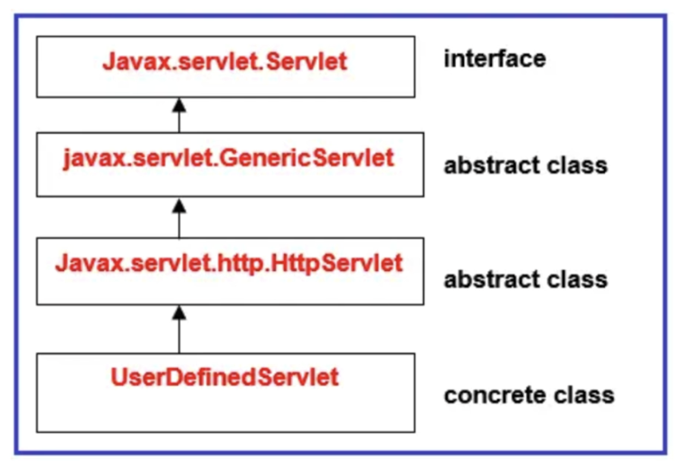

# 서블릿 프로그래밍

## 1. CGI 프로그램과 서블릿
### CGI (Common Gateway Interface)
- 웹 서버와 애플리케이션 사이에 데이터를 주고받는 규약
- CGI 규칙에 따라서 만들어진 프로그램을 CGI 프로그램이라고 함
- CGI 프로그램 종류로는 컴파일 방식 (C, C++, Java 등)과 인터프리터 방식 (PHP, Python등)이 있음

### 인터프리터 방식 CGI 프로그램
    웹 서버 <-> Script engine <-> Script 파일

### 서블릿과 서블릿 컨테이너
    웹 서버 <-> Servlet Container <-> Servlet 파일

### ServletContainer
- 서블릿의 생성부터 소멸까지의 라이프사이클을 관리하는 역할
- 서블릿 컨테이너는 웹 서버와 소켓을 만들고 통신하는 과정을 대신 처리해준다. 개발자는 비즈니스 로직에만 집중하면 된다.
- 서블릿 객체를 싱글톤으로 관리 (인스턴스 하나만 생성하여 공유하는 방식)
    - 상태를 유지(stateful)하게 설계하면 안됨
    - Thread safety 하지 않음

### WAS vs 서블릿 컨테이너
- WAS는 서블릿 컨테이너를 포함하는 개념 (거의 동일하다고 봐도 됨)
- WAS는 매 요청마다 스레드 풀에서 기존 스레드를 사용함
- WAS의 주요 튜닝 포인트는 max thread 수
- 대표적인 WAS로는 톰캣이 있다.

## 2. 계산기 서블릿 만들기

### Servlet 인터페이스
- 서블릿 컨테이너가 서블릿 인터페이스에 있는 메소드를 호출함
- 서블릿 생명주기와 관련된 메소드
    - init(), service(), destroy()
- 서블릿 기타 메소드
    - getServletConfig()
    - getServletInfo()

### 굳이 Servlet을 왜 공부해야하나?
- 스프링 MVC에 대한 전체적인 flow를 이해하기 위해
- Dispatcher Servlet -> 얘가 서블릿이기 때문에 이를 이해하기 위해서는 서블릿이 어떻게 호출되고 전체적인 흐름을 알아야함

