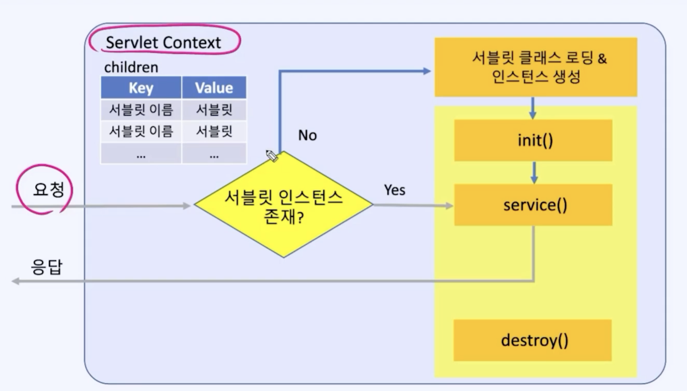
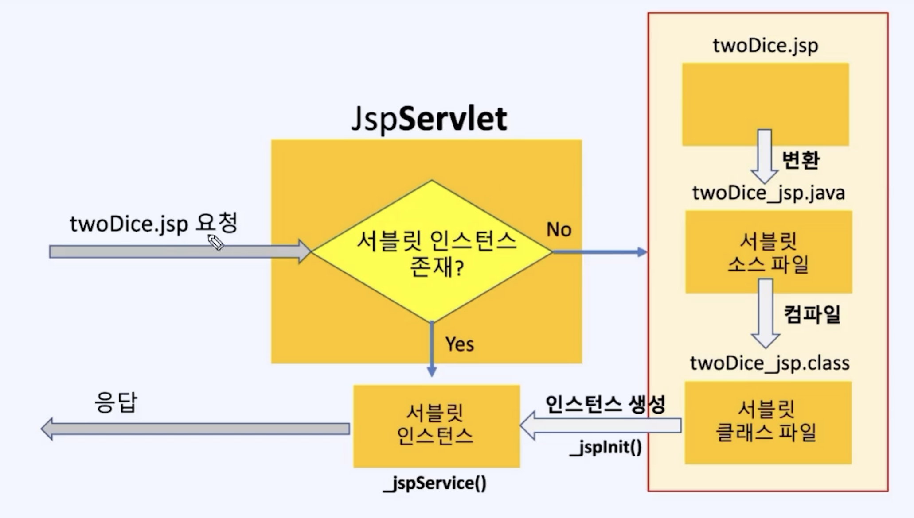
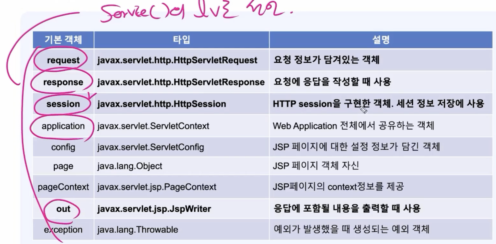
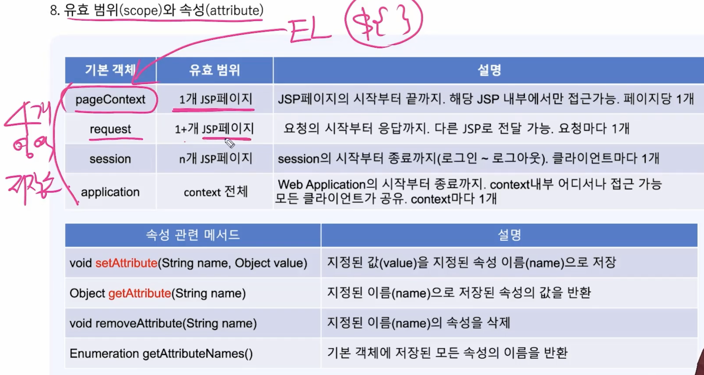

# 서블릿과 JSP
JSP = 서블릿 -> Spring  
jsp랑 서블릿은 거의 동일함 이걸 발전시킨게 스프링  
서블릿 = DispatcherServlet  

@WebServlet = @Controller + @RequestMapping  
HttpServlet을 상속받아야함 (extends HttpServlet)  
- init()
    - 서블릿이 초기화될 때 자동 호출되는 메서드
    - 서블릿의 초기화 작업 담당
- servie()
    1. 입력
    2. 처리
    3. 출력
- destroy()
    - 뒷정리 - 서블릿이 메모리에서 제거될 때 서블릿 컨테이너에 의해서 자동 호출

## 서블릿의 생명주기

## JSP(Java Server Pages)란? = 서블릿과 거의 동일
    HTML안에 Java 코드가 있는 것, JSP가 서블릿으로 변환됨

JSP에서 <%! %> 내부에 들어있는 것들은 인스턴스 변수  
<% %> 내부에 있는 것들은 지역변수
<html> </html> 내부에 있는 것들은 다 out.print로 들어감

## JSP 호출 과정

서블릿: lazy - init, 싱글톤  
Spring: early - init, 싱글톤

## JSP의 기본 객체: 생성없이 사용할 수 있는 객체

## 유효 범위와 속성

### HTTP 특징
- 상태정보저장 x (stateless)
- 그렇기 때문에 4개의 저장소가 있음
    1. 접근 범위
    2. 생존 기간
- 쓰기 -> setAttribute()
- 읽기 -> getAttribute()

1. pageContext
    - 지역변수 저장
    - 기본객체(request,response)
    - EL을 위해 사용 EL = ${}, EL에서는 지역변수에 직접 접근 못함
    - EL에서 사용하려면 pageContext에 거쳐서(저장해서 읽고 쓰기) 사용
    - 같은 페이지에서만 접근 가능

2. application
    - Web App 전체에서 접근 가능한 저장소
    - 단 1개만 존재
    - Http는 상태정보를 저장하지 않기 때문에 asdf라는 유저가 로그인을 하고 글쓰기를 하려고 요청을 해도 같은 클라이언트인지 모름. 그렇기 때문에 그 id를 application에 저장하면 기억 가능 이게 속성
    - 근데 application에서는 다른 유저가 접속하면 그 값이 바뀌어버림 그렇기 때문에 개별적인 id를 저장하기에는 알맞지 않음
    - 그래서 사용되는게 session

3. session
    - 개별 저장소
    - 클라이언트마다 1개씩
    - session에서 쿠키를 이용해서 로그인 또 안해도되게 해줌
    - id, 장바구니 등등
    - 문제점: 사용자마다 1개씩 갖는 개별 저장소이기 때문에 사용자 수만큼 객체가 생김. 그렇기 때문에 최소한의 data만 저장
    - 저장소 중에 서버 부담이 제일 큼

4. request
    - request 객체가 map을 가지고 있음
    - 요청할 때마다 생김
    - request 요청은 보통 한 page에서 이루어짐
    - 근데 또 한 page에서만 이루어지는 것은 아님. jsp가 내가 할 수 없는 request일 때 다른 jsp로 request를 넘겨줌 이게 forward
    - forward 과정에서 jsp에서 jsp로 데이터 전송이 가능. 이러한 데이터 공유가 서버에 부담이 제일 적음. 편하긴 session이 가장 편함 근데 부담이 제일 적으니까 되도록 forward로. 아니면 session에 잠시 저장했다고 전달하고 삭제.

### 정리

## URL 패턴
    @WebServlet으로 서블릿을 URL에 맵핑할 때 사용

우선순위
1. exact mapping -> 정확히 일치하는 것
2. path mapping -> 경로 매핑 ex) /login/*
3. extension mapping -> 확장자 매핑 ex) *.do
4. default mapping -> 디폴트 매핑. 모든 주소

## EL (Expression Language)
    <%=값%> => ${값}, 이렇게 간단하고 편리하게 쓸 수 있게 해줌

