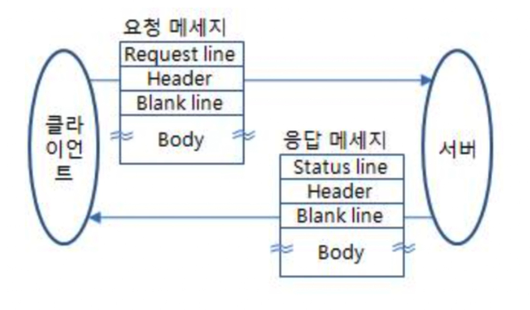
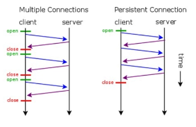

# 웹 애플리케이션 이해

## 1. 계산기 프로그램 웹 애플리케이션으로 만들기
- Step1 - 사용자 요청을 메인 Thread가 처리하도록 한다.
- Step2 - 사용자 요청이 들어올 때마다 Thread를 새로 생성해서 사용자 요청을 처리하도록 한다.
- Step3 - Thread Pool을 적용해 안정적인 서비스가 가능하도록 한다.

## 2. HTTP 프로토콜 이해

### HTTP
- 서버와 클라이언트가 웹에서 데이터를 주고받기 위한 프로토콜(규약)
- 참고
    - HTTP/1.1, HTTP/2는 TCP 기반 위에서 동작
    - HTTP/3는 UDP 기반 위에서 동작

## 3. HTTP 요청/응답 메시지 구조

## 4. HTTP 특징
- 클라이언트-서버 모델 
    - 클라이언트가 서버에 요청을 보내면 서버는 응답

- 무상태 프로토콜(Stateless)
    - 서버가 클라이언트 상태를 유지하지 않음
    - 해결책: Keep-Alive 속성 사용 (다만 사용자가 많아지면 Keep-Alive는 취약)
    

- 비 연결성(Connectionless)
    - 서버가 클라이언트 요청에 대해 응답을 마치면 맺었던 연결을 끊어 버림
    - 해결책: 쿠키(클라이언트에 정보 저장), 세선(서버에 정보 저장), JWT

## 5. 기타
### HTTP 요청 메소드
- GET,POST,PUT,DELETE 등
### HTTP 응답 코드
- 2xx(성공), 3xx(리다이렉션), 4xx(클라이언트 에러), 5xx(서버 에러) 등
### HTTP 헤더
- Content-type, Accept, Cookie, Set-Cookie, Authorization 등

