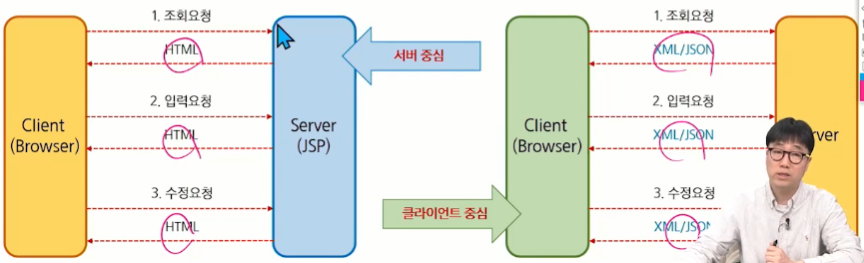

## Ajax(Asynchronous Javascript And XML)

- Ajax(Asynchronous Javascript and XML)는 언어나 프레임워크가 아닌 구현하는 방식을 의미
- Ajax는 웹(Web)에서 화면을 갱신하지 않고 데이터를 서버러부터 가져와 처리하는 방법을 의미
- Javascript의 XMLHttpRequest(XHR) 객체로 데이터를 전달하고 비동기 방식으로 결과를 조회
- 화면 갱신이 없으므로 사용자 입장에서는 편리하지만, 동적으로 DOM을 구성해야 하므로 구현이 복잡
---
- 일반 요청에 대한 응답
    - data를 입력 후 event 발생
    - Ajax를 적용하지 않은 요청은 서버에서 data를 이용하여 logic 처리
    - logic 처리에 대한 결과에 따라 응답 page를 생성하고 client에 전송(화면 전환이 일어남)
    
- Ajax 요청에 대한 응답
    - data를 입력 후 event 발생
    - Ajax를 적용하면 event 발생 시 서버에서 요청을 처리한 후 Text, XML 또는 JSON으로 응답
    - client(Browser)에서는 이 응답 data를 이용하여 화면 전환없이 현재 페이지에서 동적으로 화면을 재구성
    

### 서버와 클라이언트의 상호작용
- 웹 화면을 구성하는 방식은 서버 중심의 상호작용 방식과 클라이언트 중심의 상호작용 방식으로 구분
- 서버 중심의 개발방식은 화면 구성이 서버에서 이루어짐(프레젠테이션 영역의 JSP나 PHP, ASP 등) (`SSR`)
- 클라이언트 중심의 개발방식은 클라이언트(웹 브라우저)에서 화면을 구성(주로 JS) (`CSR`)
- Ajax는 클라이언트 중심의 개발 방식이며 비동기 요청보다는 동적 화면구성이 관건.

### GET 방식과 POST 방식

- GET 방식의 특징
    - URL에 변수(데이터)를 포함시켜 요청
    - 데이터를 Header(헤더)에 포함하여 전송
    - URL에 데이터가 노출되어 보안에 취약
    - 전송하는 길이에 제한이 있음
    - 캐싱할 수 있음
    
- POST 방식의 특징
    - URL 변수(데이터)를 노출하지 않고 요청
    - 데이터를 Body에 포함
    - URL에 데이터가 노출되지 않아서 기본 보안은 되어있음
    - 전송하는 길이에 제한이 없음
    - 캐싱 불가능
    
## XMLHttpRequest
- XMLHttpRequest는 자바스크립트가 Ajax 방식으로 통신할 때 사용하는 객체
- XMLHttpRequest 객체는 Ajax 통신 시 전송방식, 경로, 서버로 전송할 data등 전송 정보를 담는 역할
- 실제 서버와의 통신은 브라우저의 Ajax 엔진에서 수행
- 직접 자바스트립트로 Ajax를 프로그래밍할 경우 브라우저 별로 통신 방식이 달라 코드가 복잡해짐

## fetch()

### fetch()
- 브라우저에서 fetch() 함수를 지원하기 이전에는 XMLHttpRequest를 이용하여 직접 HTTP 요청하고 응답을 직접 구현
- 복잡한 구현때문에 jQuery와 axios등과 같은 라이브러리를 사용
- 브라우저가 fetch() 함수를 지원하면서 위와 같은 라이브러리를 쓰지 않아도 간단히 구현 가능

### 사용법
- fetch() 함수는 첫번째 인자로 URL, 두번째 인자로 options 객체를 받음
- options에 아무것도 넘기지 않으면 요청은 GET 방식으로 진행되며 url로 부터 contents가 다운로드 됨
- 실행 결과 Promise 타입의 객체를 반환
- 반환된 Promise 객체는 API 호출이 성공했을 경우 응답객체(response)를 resolve하고, 실패했을 경우 예외(error) 객체를 reject함

### 응답 본문(data)를 받는 방법
- response.text() - 응답을 읽고 text를 반환
- response.json() - 응답을 JSON 형식으로 파싱함
- response.formData() - 응답을 FormData 객체 형태로 반환
- response.blob() - 응답을 Blob 형태로 반환

### fetch() 사용 예 - POST
- method option: POST로 설정
- headers option: Content-Type에 JSON 사용 여부 설정
- body option: 요청 data값을 JSON 형식으로 직렬화 하여 설정
- PUT 방식의 경우 method option만 PUT으로 수정하고 나머지는 거의 비슷함.

### CRUD
- C - POST
- R - GET
- U - PUT
- D - DELETE

## Data 전송 형식 (CSV, XML, JSON)

### CSV
- Server와 Client는 주고 받을 data의 형식을 맞춰야 함
- 대표적인 data의 형식은 CSV, XML, JSON등이 있음

1. CSV (Comma Separated Values)
    - 각 항목을 쉼표로 구분해 데이터를 표현하는 방법
    - 다른 두 형식에 비해 굉장히 짧음. 많은 양의 데이터 전송 시 유리
    - 단, 각각의 데이터가 어떤 내용인지 파악하기 어려움(서버와 클라이언트가 완벽히 데이터 구조를 공유할 경우 가능)
    - ex) 20201111,김싸피,A,90
    
### XML
### JSON
- 직렬화(serialize)
    - 객체를 문자열로 변환하는 작업
    - 통신을 할 때는 문자열로 직렬화 하여 주고 받는 것이 안전함
    - 사용법: JSON.stringify(JSON 객체)
    
- 역 직렬화(deserialize)
    - 문자열을 객체로 변환하는 작업
    - 서버로부터 받은 분자열은 객체로 역직렬화 하여 사용
    - 사용법: JSON.parse(JSON형식의 문자열)