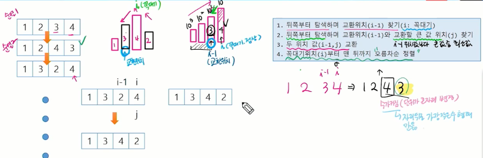
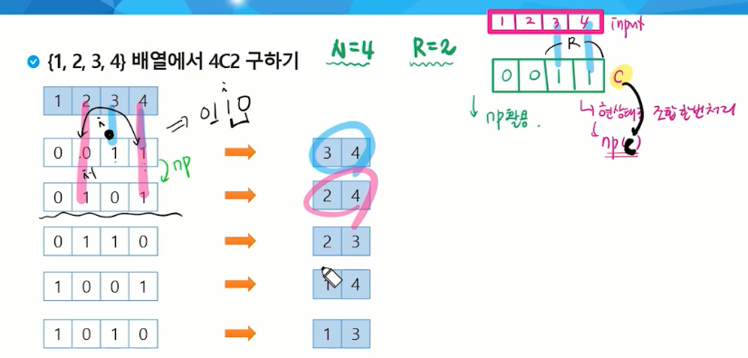

## 순열 응용 - 비트마스킹 순열
nPn -> n! 경우의 수

## 순열
- 서로 다른 것들 중 몇 개를 뽑아서 한 줄로 나열하는 것
- 서로 다른 n개 중 r개를 택하는 순열은 아래와 같이 표현  
    nPr
- 그리고 nPr은 다음과 같은 식이 성립  
    nPr = n * (n-1) * (n-2) * ... * (n-r+1)
- nPn = n!라고 표기하며 Factorial이라 부름  
    n! = n * (n-1) * (n-2) * ... * 2 * 1


```java
import java.util.Arrays;
import java.util.Scanner;

// nPr
public class BitmaskingPermutationTest {

    static int N, R, input[], numbers[];

    public static void main(String[] args) {
        Scanner sc = new Scanner(System.in);
        N = sc.nextInt();
        R = sc.nextInt();
        input = new int[N];
        numbers = new int[R];

        for(int i = 0; i < N; i++){
            input[i] = sc.nextInt();
        }
        permutation(0, 0);
    }

    public static void permutation(int cnt, int flag){
        if (cnt == R) {
            System.out.println(Arrays.toString(numbers));
            return;
        }
        for(int i = 0; i < N; i++) {
           if((flag & 1<<i) != 0) continue;
           numbers[cnt] = input[i];
           permutation(cnt + 1, flag | 1 << i);
        }

    }

}
```

## 순열을 생성하는 방법 - Next Permutation
- 현 순열에서 사전 순으로 다음 순열 생성 - NextPermutation
- 알고리즘
    - 배열을 오름차순으로 정렬한 후 시작
    - 아래 과정을 반복하여 사전 순으로 다음으로 큰 순열 생성(가장 큰 내림차순 순열을 만들 때까지 반복)
        1. 뒤쪽부터 탐색하며 교환위치(i-1)찾기 (i: 꼭대기)
        2. 뒤쪽부터 탐색하며 교환위치(i-1)와 교환할 큰 값 위치(j)(-> i-1 위치값보다 큰값 중 최소값) 찾기  
        -> 뒤쪽부터 탐색하다가 교환위치의 값보다 큰 값이 나오면 그 값으로 선택하면 됨
        3. 두 위치 값(i-1, j) 교환
        4. 꼭대기 위치(i)부터 맨 뒤까지 오름차순 정렬
- **주의사항**
    - NextPermutation 사용 전에 숫자배열을 **오름차순으로 정렬하여 가장 작은 순열 한번 처리**  
    

```java
import java.util.Arrays;
import java.util.Scanner;

public class NPTest {
    public static void main(String[] args) {
        Scanner sc = new Scanner(System.in);
        int N = sc.nextInt();
        int[] input = new int[N];

        for (int i = 0; i < N; i++) {
            input[i] = sc.nextInt();
        }
        // step0: 정렬(오름차순)
        Arrays.sort(input);

        do {
            // 순열 이용한 처리 로직이 여기에...
            System.out.println(Arrays.toString(input));
        } while (np(input));
    }

    // 순열의 뒤쪽부터 작은 변화를 준다
    public static boolean np(int[] p) { // 현 순열의 사전 순 다음 순열 생성 (p: 현 순열)
        final int N = p.length;
        // step1: 교환위치 찾기(뒤쪽부터 꼭대기를 찾으면 꼭대기 이전이 교환위치가 됨)
        int i = N - 1;
        while (i > 0 && p[i - 1] >= p[i]) {
            --i;
        }
        if(i==0) return false; //현 순열의 상태가 가장 큰 순열이므로 np 없음

        // step2: 교환위치(i-1)에 넣을 값 뒤쪽부터 찾기(큰 값 중 최소값)
        int j = N-1;
        while(p[i-1] >= p[j]) --j;

        // step3: 교환위치(i-1) 값과 찾은 위치(j)값 교환
        swap(p, i - 1, j);

        // step4: 꼭대기(i) 위치부터 맨 뒤까지 오름차순 정렬
        int k = N-1;
        while (i < k) {
            swap(p, i, k--);
        }

        return true;
    }

    public static void swap(int[] arr, int i, int j){
        int tmp = arr[i];
        arr[i] = arr[j];
        arr[j] = tmp;
    }
}
```

## 조합을 생성하는 방법 - Next Permutation
- NextPermutation 활용
    - 원소크기와 같은 크기의 int 배열 P를 생성하여 r개 크기만큼 뒤에서 0이 아닌 값(예를 들어 1)으로 초기화 함
    - nextPermutation 알고리즘을 활용    
    - nextPermutation 알고리즘 한 번 수행시마다 조합이 만들어짐  
        -> nextPermutation 과정 수행 시마다 0이 아닌 값의 위치가 변경됨
    - P 배열에서 0이 아닌 값을 갖고 있는 위치에 해당하는 원소가 조합에 선택된 것임  
    