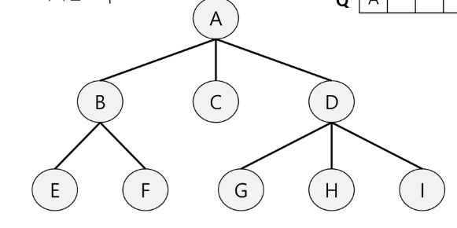
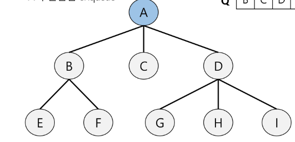
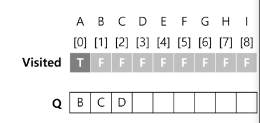

# BFS(큐의 활용)

## BFS(Breadth First Search)
- 그래프를 탐색하는 방법 두 가지
    - 깊이 우선 탐색(DFS)
    - 너비 우선 탐색(BFS)

- 너비우선탐색은 탐색 시작점의 인접한 정점들을 먼저 모두 차례로 방문한 후에, 방문했던 정점을 시작점으로 하여 다시 인접한 정점들을 차례로 방문하는 방식
- 인접한 정점들에 대해 탐색을 한 후, 차례로 다시 너비우선탐색을 진행해야 하므로, 선입선출 형태의 자료구조인 큐를 활용함

### BFS 알고리즘
```
def BFS(G, v):
    visited = [0] * (n+1)       # n: 정점의 개수
    queue = []                  # 큐 생성
    queue.append(v)             # 시작점 v를 큐에 삽입
    while queue:                # 큐가 비어있지 않은 경우
        t = queue.pop(0)        # 큐의 첫번째 원소 반환
        if not visited[t]:      # 방문하지 않은 곳이라면
            visited[t] = True   # 방문한 것으로 표시하고
            visit(t)            # 정점 t에서 할 일
            for i in G[t]:      # t와 연결된 모든 정점에 대해
                if not visited[i]:  # 방문되지 않은 곳이라면
                    queue.append(i) # 큐에 삽입
```

### BFS 예제
- 초기상태
    - Visited 배열 초기화
    - Q 생성
    - 시작점 enqueue  
    
    
- A점부터 시작
    - dequeue: A
    - A 방문한 것으로 표시
    - A의 인접점 enqueue  
    
    
- 탐색 진행
    - dequeue: B
    - B 방문한 것으로 표시
    - B의 인접점 enqueue

    - dequeue: C
    - C 방문한 것으로 표시
    - C의 인접접 enqueue  
        ...
    
    - Q가 비었으면 탐색 종료