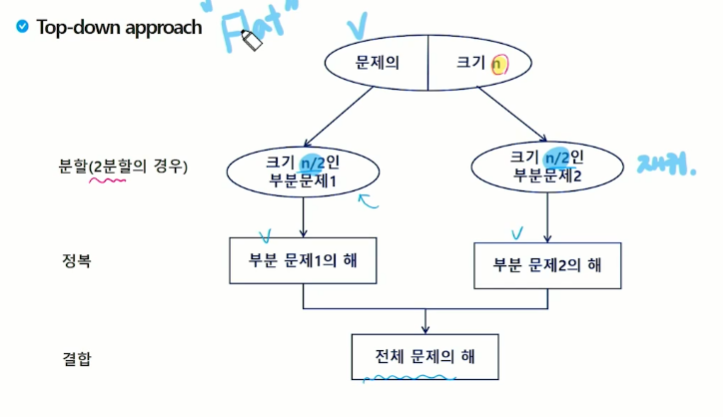

# 분할 정복 기법

## 가짜 동전 찾기
- n개의 동전들 중에 가짜 동전이 하나 포함되어 있음. 가짜 동전은 진짜 동전에 비해 아주 조금 가벼움. 진짜 동전들의 무게가 동일하다고 할 때 양팔 저울을 이용해서 가짜 동전을 찾아보자.
- 양팔 저울을 최소로 사용해서 가짜 동전을 찾는 방법은 무엇인가?
- 예를 들어 동전이 24(진짜 23, 가짜1)개 있다면?

## 분할 정복 기법

### 설계 전략
- 분할(Divide): 해결할 문제를 여러 개의 작은 부분으로 나눔
- 정복(Conquer): 나눈 작은 문제를 각각 해결
- 통합(Combine): (필요하다면) 해결된 해답을 모음
- ex) 병합정렬 -> 통합이 필요, 퀵정렬

### Top-down approach


### 거듭 제곱을 분할 정복으로
- 분할 정복 기반의 알고리즘: O(n)
C^n = C x C x C ... C

```
Iterative_Power(x, n)
    result <- 1

    for i in 1 -> n
        result <- result * x
    
    return result
```

- 분할 정복 기반의 알고리즘: O(log2n)
C^n = C^(n/2) * C^(n/2) (n은 짝수)
C^n = C^((n/2)/2) * C^((n/2)/2) (n은 홀수)

```
recursive_Power(x, n)
    if n == 1: return x
    if n is even
        y <- Recursive_Power(x, n/2)
        return y * y
    else
        y <- Recursive_Power(c, (n-1)/2)
        return y * y * x
```