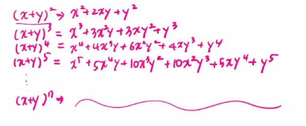
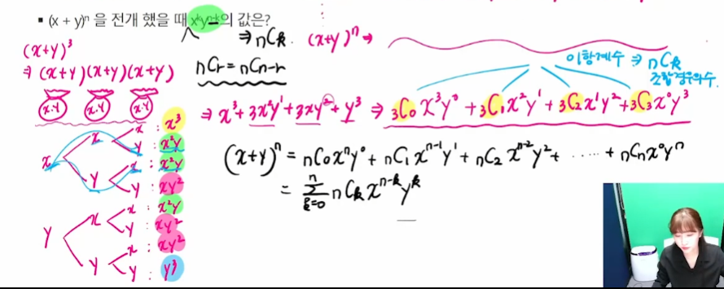
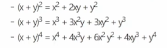
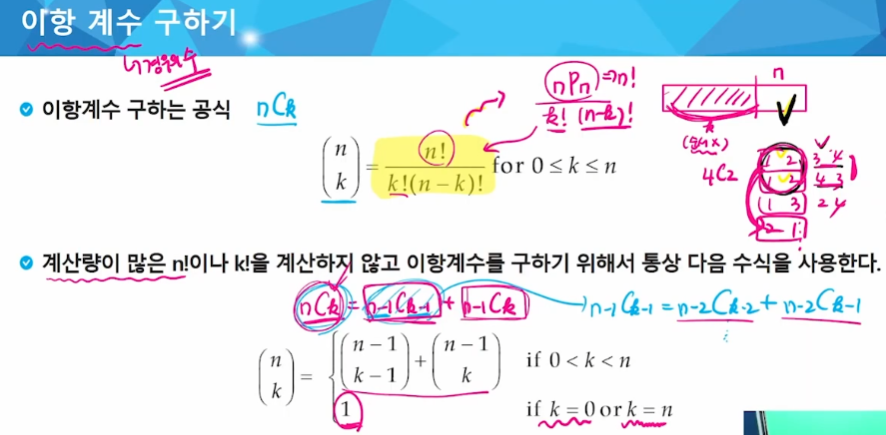

# 동적 계획법
- 동적 계획법(Dynamic Programming)은 그리디 알고리즘과 같이 최적화 문제를 해결하는 알고리즘이다.
- 동적 계획법은 먼저 작은 부분 문제들의 해들을 구하고 이들을 이용하여 보다 큰 크기의 부분 문제들을 해결하여, 최종적으로 원래 주어진 문제를 해결하는 알고리즘 설계 기법이다.

- 동적 계획법을 적용하려는 문제는 필히 다음과 같은 요건을 가지고 있어야 한다.
  - 중복 부분문제 구조(Overlapping subproblems): 동일한 부분문제들로 구성
  - 최적 부분문제 구조(Optimal substructure)

### 중복 부분 문제 구조(Overlaping subproblems)
- DP는 큰 문제를 이루는 작은 문제들을 먼저 해결하고 작은 문제들의 최적해를 이용하여 순환적으로 큰 문제를 해결한다.
  - 순환적인 관계(recurrence relation)를 명시적으로 표현하기 위해서 동적 계획법에서는 일반적으로 수학적 도구인 점화식을 사용한다.
- DP는 문제의 순환적인 성질 때문에 이전에 계산되어졌던 작은 문제의 해가 다른 어딘가에서 필요하게 되는데 이를 위해 DP에서는 이미 해결된 작은 문제들의 해들을 어떤 저장 공간(table)에 저장하게 된다.
- 그리고 이렇게 저장된 해들이 다시 필요할 때마다 해를 얻기 위해 다시 문제를 재계산하지 않고 table의 참조를 통해서 중복된 계산을 피하게 된다.

### 최적 부분 문제 구조(Optimal substructure)
- 동적 계획법이 최적화에 대한 어느 문제에나 적용될 수 있는 것은 아니다. 주어진 문제가 최적화의 원칙을 만족해야만 동적 계획법을 효율적으로 적용할 수 있다.
- 최적화의 원칙이란 어떤 문제에 대한 해가 최적일 때 그 해를 구성하는 작은 문제들의 해 역시 최적이어야 한다는 것이다. 동적 계획법의 방법 자체가 큰 문제의 최적해를 
작은 문제의 최적해들을 이용하여 구하기 때문에 만약 큰 문제의 최적해가 작은 문제들의 최적해들로 구성되지 않는다면 이 문제는 동적 계획법을 적용할 수 없다.

### 분할 정복과 동적 계획법의 비교
- 분할 정복
  - 연관 없는 부분 문제로 분할
  - 부분 문제를 재귀적으로 해결
  - 부분 문제의 해를 결합
  - ex) 병합 정렬, 퀵 정렬
  - 하향식 접근

- DP
  - 부분 문제들이 연관이 없으면 적용할 수 없다. 즉 부분 문제들은 더 작은 부분 문제들을 공유
  - 모든 부분 문제를 한번만 계산하고 결과를 저장하고(메모이제이션) 재사용
  - 상향식 접근
  - DP에는 부분 문제들 사이에 의존적 관계가 존재
  - 이러한 관계는 문제에 따라 다르고, 대부분의 경우 뚜렷이 보이지 않아서 함축적인 순서(implicit order)라고 한다.
  - 분할 정복은 하향식 방법으로 DP는 상향식 방법으로 접근

### 3단계 DP 적용 접근 방법
- 최적해 구조의 특성을 파악
  - 문제를 부분 문제로 나눈다.
- 최적해의 값을 재귀적으로 정의
  - 부분 문제의 최적해 값에 기반하여 문제의 최적해 값을 정의한다.
- 상향식 방법으로 최적해의 값을 계산
  - 가장 작은 부분 문제부터 해를 구한 뒤 테이블에 저장한다.
  - 테이블에 저장되어 있는 부분 문제의 해를 이용하여 점차적으로 상위 부분 문제의 최적해를 구한다.(상향식 방법)
  
## 이항 계수 구하기 1
### 다음 수식의 ?의 값은?
- (x + y)^4 = x^4 + 4x^3y + ?x^2y^2+ 4xy^3 +y^4
- (x + y)^n을 전개했을 때 x^ky^(n-k)의 값은?  



### 이항정리는
- 이항 다항식 x + y의 거듭제곱 (x + y)^n에 대해서, 전개한 각 항 x^k * y^(n-k)의 계수 값을 구하는 정리이다.
- 구체적으로 x^k * y^(n-k)의 계수는 n개에서 k개를 고르는 조합의 가짓수인 nCk이고 이를 이항계수라고 부른다.
- 예를 들어, n=2, n=3, 그리고 n=4일 경우에는 다음과 같다.  


### 이항 계수 구하기  


- 이항계수 nCk를 구하는 재귀함수
```
comb(n, k)
  IF n==k or k==0: RETURN 1
  ELSE: RETURN comb(n-1, k-1) + comb(n-1, k)
```
-> 이거 파스칼 삼각형이랑 같음

```java
import java.io.BufferedReader;
import java.io.IOException;
import java.io.InputStreamReader;
import java.util.StringTokenizer;
import java.util.jar.JarEntry;

public class BinomialCoefTest {
    // nCk
    public static void main(String[] args) throws IOException {
        BufferedReader br = new BufferedReader(new InputStreamReader(System.in));
        StringTokenizer st = new StringTokenizer(br.readLine());
        int n = Integer.parseInt(st.nextToken());
        int k = Integer.parseInt(st.nextToken());

        int[][] B = new int[n + 1][k + 1];

        for(int i = 0; i <= n; i++){
            for (int j = 0, end = Math.min(i, k); j <= end; ++j) {
                if(j == 0 || j == i) B[i][j] = 1;
                else B[i][j] = B[i-1][j-1] + B[i-1][j];
            }
        }
        
        System.out.println(B[n][k]);
    }
}
```

### 최소 동전 수 구하기
```java
import jdk.internal.util.xml.impl.Input;

import java.io.BufferedReader;
import java.io.IOException;
import java.io.InputStreamReader;
import java.util.Arrays;

public class MinCoinTest {
    public static void main(String[] args) throws IOException {
        BufferedReader br = new BufferedReader(new InputStreamReader(System.in));
        int n = Integer.parseInt(br.readLine());
        int[] D = new int[n + 1];

        D[9] = 0;
        for (int i = 1; i <= n; i++) {
            int min = D[i-1] + 1;
            if(i >= 4) min = Math.min(D[i - 4] + 1, min);
            if(i >= 6) min = Math.min(D[i - 6] + 1, min);

            D[i] = min;
        }
        System.out.println(Arrays.toString(D));
        System.out.println(D[n]);
    }
}

```