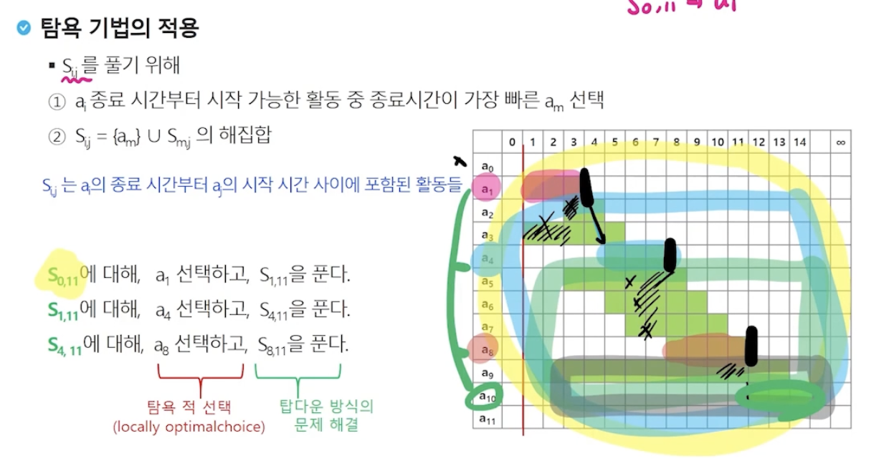

# 그리디

## 거스름돈 줄이기
- 손님이 지불한 금액에서 물건값을 제한 차액(거스름돈)을 지불하는 문제를 생각해보자.
- 어떻게 하면 손님에게 거스름돈으로 주는 지폐와 동전의 개수를 최소한으로 줄일 수 있을까?

## 탐욕(Greedy) 알고리즘
- 탐욕 알고리즘은 최적해를 구하는 데 사용되는 근시안적인 방법
- 최적화 문제(optimization)란 가능한 해들 중에서 가장 좋은(최대 또는 최소) 해를 찾는 문제
- 일반적으로, 머리 속에 떠오르는 생각을 검증 없이 바로 구현하면 Greedy 접근이 됨
- 여러 경우 중 하나를 선택할 때마다 그 순간에 최적이라고 생각되는 것을 선택해 나가는 방식으로 진행하여 최종적인 해답에 도달함
- 각 선택 시점에서 이루어지는 결정은 지역적으로는 최적이지만, 그 선택들을 계속 수집하여 최종적인 해답을 만들었다고 하여, 그것이 최적이라는 보장은 없음
- 일단, 한번 선택된 것은 번복하지 않음. 이런 특성 때문에 대부분의 탐욕 알고리즘들은 단순하며, 또한 제한적인 문제들에 적용됨

- 동전 문제에서 반례는 배수가 되지 않는 동전 예를들면 400원임

## 배낭 짐싸기(Knapsack)
- Knapsack 문제의 정혁적 정의
    - S = {item1, item2,...,itemn}, 물건들의 집합 (창고 안의 모든 물건)
    - wi = itemi의 무게, Pi = itemi의 값
    - W: 배낭이 수용 가능한 총 무게  
    

- Knapsack 문제 유형
    - 0-1 Knapsack
        - 배낭에 물건을 통째로 담아야 하는 문제
        - 물건을 쪼갤 수 없는 경우

    - Fractional Knapsack
        - 물건을 부분적으로 담는 것이 허용되는 문제
        - 물건을 쪼갤 수 있는 경우

- 0-1 Knapsack에 대한 완전 검색 방법
    - 완전 검색으로 물건들의 집합 S에 대한 모든 부분집합을 구함
    - 부분집합의 총 무게가 W를 초과하는 집합들은 버리고, 나머지 집합에서 총 값이 가장 큰 집합을 선택할 수 있음
    - 물건의 개수가 증가하면 시간 복잡도가 지수적으로 증가함
        - 크기 n인 부분합의 수 2^n


## 회의실 배정
-> 활동 선택 문제(Activity-seleciton problem)
- 시작시간과 종료시간(si, fi)이 있는 n개의 활동들의 집합 A = {A1,A2,...,An}, 1<= i <= n에서 서로 겹치지 않는(non-overlapping) 최대개수의 활동들의 집합 S를 구하는 문제
- 양립 가능한 활동들의 크기가 최대가 되는 S0,n+1의 부분집합을 선택하는 문제
    - 종료 시간 순으로 활동들을 정렬
    - S0,n+1는 a0의 종료 시간부터 an+1의 시작 시간 사이에 포함된 활동들
    - S0,11 = {a1,a2,a3,a4,a5,a6,a7,a8,a9,a10} = S  


- 탐욕 기법을 적용한 반복 알고리즘
```
A: 활동들의 집합, s: 선택한 활동(회의)들 집합
s[i]: i활동의 시작 시간, f[i]: i활동의 종료시간, 1 <= i <= n

Sort A by finish time(오름차순)
S <- {A[1]}
j <- 1
for i in 2 -> n
    if f[j] <= s[i]
        S <- S U {A[i]}
        j <- i
```
- 종료 시간이 빠른 순서로 활동들을 정렬
- 첫 번째 활동 (A[1])을 선택
- 선택한 활동(A[1])의 종료시간보다 빠른 시작 시간을 가지는 활동은 무시하며 같거나 늦은 시작시간을 갖는 활동을 선택
- 선택된 활동의 종료시간을 기준으로 뒤에 남은 활동들에 대해 앞의 과정을 반복

### 탐욕 알고리즘의 필수 요소
- 탐욕적 선택 속성(greedy choice property)
    - 탐욕적 선택은 최적해로 갈 수 있음을 보여라  
        -> 즉, 탐욕적 선택은 항상 안전

- 최적 부분 구조(optimal substructure property)
    - 최적화 문제를 정형화하라  
        -> 하나의 선택을 하면 풀어야 할 하나의 하위 문제가 남음

- [원문제의 최적해 = 탐욕적 선택 + 하위 문제의 최적해]임을 증명하라

```java
import java.util.ArrayList;
import java.util.Arrays;
import java.util.List;
import java.util.Scanner;

public class MeetingRoomTest {
    static class Meeting implements Comparable<Meeting> {
        int start, end;

        Meeting(int start, int end) {
            this.start = start;
            this.end = end;
        }

        @Override
        public int compareTo(Meeting o) {
            return this.end != o.end ? this.end - o.end : this.start - o.start;
        }

        @Override
        public String toString() {
            return "Meeting{" +
                    "start=" + start +
                    ", end=" + end +
                    '}';
        }
    }

    public static void main(String[] args) {
        Scanner sc = new Scanner(System.in);
        int N = sc.nextInt();
        Meeting[] meetings = new Meeting[N];

        for (int i = 0; i < N; i++) {
            meetings[i] = new Meeting(sc.nextInt(), sc.nextInt());
        }

        Arrays.sort(meetings);

        //회의 선택을 최대로 하고 선택된 회의들의 내용을 출력
        List<Meeting> list = new ArrayList<>();
        list.add(meetings[0]);
        for (int j = 1; j < N; j++) {
            if (list.get(list.size() - 1).end <= meetings[j].start) {
                list.add(meetings[j]);
            }
        }

        System.out.println(list.size());
        for (Meeting meeting : list) {
            System.out.println(meeting);
        }
    }
}
```

