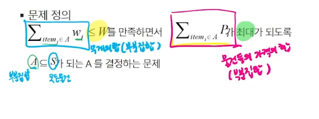

# 그리디

## 거스름돈 줄이기
- 손님이 지불한 금액에서 물건값을 제한 차액(거스름돈)을 지불하는 문제를 생각해보자.
- 어떻게 하면 손님에게 거스름돈으로 주는 지폐와 동전의 개수를 최소한으로 줄일 수 있을까?

## 탐욕(Greedy) 알고리즘
- 탐욕 알고리즘은 최적해를 구하는 데 사용되는 근시안적인 방법
- 최적화 문제(optimization)란 가능한 해들 중에서 가장 좋은(최대 또는 최소) 해를 찾는 문제
- 일반적으로, 머리 속에 떠오르는 생각을 검증 없이 바로 구현하면 Greedy 접근이 됨
- 여러 경우 중 하나를 선택할 때마다 그 순간에 최적이라고 생각되는 것을 선택해 나가는 방식으로 진행하여 최종적인 해답에 도달함
- 각 선택 시점에서 이루어지는 결정은 지역적으로는 최적이지만, 그 선택들을 계속 수집하여 최종적인 해답을 만들었다고 하여, 그것이 최적이라는 보장은 없음
- 일단, 한번 선택된 것은 번복하지 않음. 이런 특성 때문에 대부분의 탐욕 알고리즘들은 단순하며, 또한 제한적인 문제들에 적용됨

- 동전 문제에서 반례는 배수가 되지 않는 동전 예를들면 400원임

## 배낭 짐싸기(Knapsack)
- Knapsack 문제의 정혁적 정의
    - S = {item1, item2,...,itemn}, 물건들의 집합 (창고 안의 모든 물건)
    - wi = itemi의 무게, Pi = itemi의 값
    - W: 배낭이 수용 가능한 총 무게  
    

- Knapsack 문제 유형
    - 0-1 Knapsack
        - 배낭에 물건을 통째로 담아야 하는 문제
        - 물건을 쪼갤 수 없는 경우

    - Fractional Knapsack
        - 물건을 부분적으로 담는 것이 허용되는 문제
        - 물건을 쪼갤 수 있는 경우