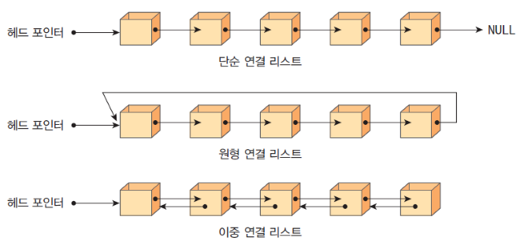
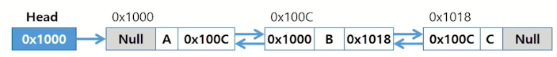

# 리스트

## 리스트
- 순서를 가진 데이터의 집합을 가리키는 추상자료형(abstract data type)
- 동일한 데이터를 가지고 있어도 상관 없음 (값의 중복허용)

- 구현 방법에 따라 크게 두 가지로 나뉨
    1) 순차 리스트: 배열을 기반으로 구현된 리스트 (자료의 저장된 물리적 순서 = 탐색 순서(관리하고자 하는 순서))
    2) 연결 리스트: 메모리의 동적할당을 기반으로 구현된 리스트 (자료의 저장된 물리적 순서 != 탐색 순서(관리하고자 하는 순서))

### 순차 리스트
- 구현 방법
    - 1차원 배열에 항목들을 순서대로 저장
    - 데이터의 종류와 구조에 따라 구조화된 자료구조를 만들어 배열에 저장할 수도 있음

- 데이터 접근
    - 배열의 인덱스를 이용해 원하는 위치의 데이터에 접근 가능

- 삽입 연산
    - 삽입 위치 다음의 항목들을 뒤로 이동해야 함

- 삭제 연산
    - 삭제 위치 다음의 항목들을 앞으로 이동해야 함

### 순차 리스트의 문제점
- 단순 배열을 이용한 순차리스트를 구현해 사용하는 경우, 자료의 삽입/삭제 연산 과정에서 연속적인 메모리 배열을 위해 원소들을 이동시키는 작업이 필요
- 원소의 개수가 많고 삽입/삭제 연산이 빈번하게 일어날수록 작업에 소요되는 시간이 크게 증가 (비효율적) -> 삽입에서의 최악의 경우는 제일 앞에 삽입하는 것 (O(N))
- 배열의 크기가 정해져 있는 경우, 실제로 사용될 메모리보다 크게 할당하여 메모리의 낭비를 초래할 수도 있고, 반대로 할당된 메모리보다 많은 자료를 사용하여 새롭게 배열을 만들어 작업을 해야 하는 경우가 발생할 수 있음

### 연결 리스트(Linked List)
- 특성
    - 자료의 논리적인 순서와 메모리 상의 물리적인 순서가 일치하지 않고, 개별적으로 위치하고 있는 각 원소를 연결하여 하나의 전체적인 자료구조를 이룸
    - 링크를 통해 원소에 접근하므로, 순차 리스트에서처럼 물리적인 순서를 맞추기 위한 작업 필요X
    - 자료구조의 크기를 동적으로 조정 가능해 메모리의 효율적인 사용 가능
    - 앞의 주소와 뒤의 주소를 가지고 있음

### 연결 리스트의 기본 구조
- 노드
    - 연결 리스트에서 하나의 원소를 표현하는 building block
    - 구성 요소
        1) 데이터 필드
            - 원소의 값을 저장
            - 저장할 원소의 종류나 크기에 따라 구조를 정의하여 사용함
        2) 링크 필드
            - 다음 노드의 참조값을 저장
            - 1개: 단순연결리스트, 2개: 이중연결리스트
- 헤드
    - 연결 리스트의 첫 노드에 대한 참조값을 갖고 있음

### 연결 리스트의 종류
- 단순 연결 리스트
- 이중 연결 리스트: 이전 노드 탐색 용이, 양방향 탐색 가능
- 원형 연결 리스트: 단순연결, 이중연결  


### 단순 연결 리스트(Singly Linked List)
- 연결 구조
    - 노드가 하나의 링크 필드에 의해 다음 노드와 연결되는 구조를 가짐
    - 헤드가 가장 앞의 노드를 가리키고, 링크 필드가 연속적으로 다음 노드를 가리킴
    - 링크 필드가 Null인 노드가 연결 리스트의 가장 마지막 노드

### 단순 연결 리스트의 삽입 연산 - 첫 번째 노드로 삽입
- 공백 리스트의 첫번째에 'A' 노드를 삽입할 때
    1) 새로운 노드 new 생성
    2) 새로운 노드 new의 데이터 필드에 'A' 저장
    ```java
    class Node<T>{
        T data;
        Node<T> link;
    }
    ```
    3) Head에 저장된 참조값을 새로운 노드 new의 링크 필드값에 저장
    4) Head에 새로운 노드 new의 참조값을 저장

- 'A'를 원소로 갖고 있는 리스트의 첫번째에 'C' 노드를 삽입할 때
    1) 새로운 노드 new 생성
    2) 새로운 노드 new의 데이터 필드에 'C' 저장
    3) Head에 저장된 참조값을 새로운 노드 new의 링크 필드값에 저장
    4) Head에 새로운 노드 new의 참조값을 저장
    - 알고리즘
    ```
    addtoFirst(L, i)            //리스트 헤드 L, 원소 i
        new <- createNode();    //새로운 노드 생성
        new.data = i;           //데이터 필드 작성
        new.link = L;           //링크 필드 작성
        L = new;                //리스트의 처음으로 지정
    end addtoFirst()
    ```

- 'C','A'를 원소로 갖고 있는 리스트의 마지막에 'D' 노드를 삽입할 때
    1) 새로운 노드 new 생성
    2) 새로운 노드 new의 데이터 필드에 'D', 링크 필드에는 Null 저장
    3) 리스트의 마지막 노드의 링크 필드에 새로운 노드 new의 참조값을 저장
    - 알고리즘
    ```
    addtoLast(L, i)
        new <- createNode()
        new.data = i;
        new.link = Null;
        if (L == Null){
            L = new;
            return;
        }
        temp = L;
        while (temp.link != Null){
            temp = temp.link;
        }
        temp.link = new;
    end addtoLast()
    ```

- 'C', 'A', 'C'를 원소로 갖고 있는 리스트의 두번째에 'B' 노드를 삽입할 때
    1) 새로운 노드 new 생성
    2) 새로운 노드 new의 데이터 필드에 'B' 저장
    3) 삽입될 위치의 바로 앞에 위치한 노드의 링크 필드를 new의 링크 필드에 복사
    4) 새로운 노드 new의 참조값을 바로 앞 노드의 링크 필드에 저장


### 단순 연결 리스트 - 삭제연산
- 'A', 'B', 'C', 'D'를 원소로 갖고 있는 리스트의 'B' 노드를 삭제할 때
  1) 삭제할 노드의 앞 노드(선행노드) 탐색
  2) 삭제할 노드의 링크 필드를 선행노드의 링크 필드에 복사
  3) 삭제할 노드의 링크 필드에 Null 저장

### 단순 연결 리스트 응용 - 스택 구현
- 단순 연결리스트로 스택 자료구조 구현
- Push와 Pop에 적합한 삽입/삭제 알고리즘은?

```java
public class Node<T> {
    public T data;
    public Node<T> link;

    public Node(T data) {
        super();
        this.data = data;
    }
    public Node(T data, Node<T> link) {
        super();
        this.data = data;
        this.link = link;
    }
    @Override
    public String toString(){
        return "Node [data=" + data + ", link=" + link +"]"
    }
}

public interface IStack<E> {
    void push(E e);
    E pop();
    E peek();
    boolean isEmpty();
    int size();
}

public class SsafyStack<E> implements IStack<E> {
    
    private Node<E> top;

    public void push(E e){  // top으로 넣기
        top = new Node<E>(e, top)
    }

    public E pop(){
        if(isEmpty()) throw new EmptyStackException();

        Node<E> popNode = top;
        top = popNode.link;
        popNode.link = null;
        return popNode.data;
    }

    public E peek() {
        if(isEmpty()) throw new EmptyStackException();
        return top.data;
    }

    public boolean isEmpty(){
        return top == null;
    }

    public int size() { // 모든 노드를 순회하는 로직을 ㅗ작성(노드 순회 목적)
        int count = 0;

        for(Node<E> temp = top; temp != null; temp = temp.link) ++count;

        return count;
    }
}
```

## 이중 연결 리스트
- 특성
    - 양쪽 방향으로 순회할 수 있도록 노드를 연결한 리스트
    - 두 개의 링크 필드와 한 개의 데이터 필드로 구성
- 연결 구조  
    

### 이중 연결 리스트의 삽입 연산
- cur이 가리키는 노드 다음으로 D값을 가진 노드를 삽입하는 과정
    1) 새로운 노드 new를 생성하고 데이터 필드에 'D'를 저장
    2) cur노드의 next를 new노드의 next에 저장하여 cur의 다음노드를 new노드의 다음 노드로 연결

### 이중 연결 리스트의 삭제 연산
- cur이 가리키는 노드를 삭제하는 과정
    1) 삭제할 노드 cur의 next를 cur의 이전 노드 next에 저장하여 cur의 다음 노드를 cur의 이전노드의 다음 노드로 연결
    2) 삭제할 노드 cur의 prev를 cur의 다음노드의 prev에 저장하여 cur의 이전 노드를 cur의 다음 노드의 이전 노드로 연결
    3) 삭제할 노드 cur의 prev, next에 Null을 저장

### 이진 트리의 표현
- 배열을 이용한 이진 트리의 표현
    - 이진 트리에 각 노드 번호를 다음과 같이 부여
    - 루트의 번호를 1로 함
    - 레벨 n에 있는 노드에 대하여 왼쪽부터 오른쪽으로 2^n부터 2^(n+1) - 1까지 번호를 차례로 부여

- 노드 번호의 성질
    - 노드 번호가 i인 노드의 부모 노드 번호? i/2
    - 노드 번호가 i인 노드의 왼쪽 자식 노드 번호? 2 * i
    - 노드 번호가 i인 노드의 오른쪽 자식 노드 번호? 2 * i + 1
    - 레벨 n의 노드 번호 시작 번호는? 2^n

- 노드 번호를 배열의 인덱스로 사용
- 높이가 h인 이진 트리를 위한 배열의 크기는?
    - 레벨 i의 최대 노드 수는? 2^i
    - 따라서 모든 노드의 수는? 1 + 2 + 4 + 8 +...+ 2^i = 2^(h+1) - 1
    - 배열의 크기는? 2^(h+1)

- 배열을 이용한 이진 트리의 표현의 단점
    - 편향 이진 트리의 경우에 사용하지 않는 배열 원소에 대한 메모리 공간 낭비 발생
    - 트리의 중간에 새로운 노드를 삽입하거나 기존의 노드를 삭제할 경우 배열의 크기 변경 어려워 비효율적

## 비선형 자료구조 탐색

### 비선형 자료구조 완전탐색
- 비선형구조인 트리, 그래프의 각 노드(정점)를 중복되지 않게 전부 방문(visit) 하는 것을 말하는데 비선형구조는 선형 구조에서와 같이 선후 연결 관계를 알 수 없음. 따라서, 특별한 방법이 필요

- 두 가지 방법
    - 너비 우선 탐색(Breadth First Search, BFS)
    - 깊이 우선 탐색(Depth First Search, DFS)

### BFS(Breadth First Search)
- 너비 우선 탐색
- 너비우선탐색은 루트 노드의 자식 노드들을 먼저 모두 차례로 방문한 후에, 방문했던 자식 노드들을 기준으로 하여 다시 해당 노드의 자식 노드들을 차례로 방문하는 방식
- 인접한 노드들에 대해 탐색을 한 후, 차례로 다시 너비우선탐색을 진행해야 하므로, 선입선출 형태의 자료구조인 큐를 활용함  
    -> "탐색순서 관리" => Queue 사용 => `선입선출`

```
BFS()
    큐 생성
    루트 v를 큐에 삽입
    while (큐가 비어있지 않은 경우){
        t <- 큐의 첫 번째 원소 반환
        t 방문
        for (t와 연결된 모든 간선에 대해) {
            u <- t의 자식노드
            u를 큐에 삽입
        }
    }
end BFS()
```
- 구현
```java
// 완전이진트리 - 배열 구현
// 크기 늘리지 않는 버전
public class CompleteBinaryTree<T> {

    private Object[] nodes;
    private final int SIZE;
    private int lastIndex; // 마지막으로 저장된 노드의 인덱스

    public CompleteBinaryTree(int size) {
        SIZE = size;
        nodes = new Object[size+1]; // 0 인덱스 사용하지 않음
    }
    public boolean isEmpty() {
        return lastIndex == 0;
    }
    public boolean isFull() {
        return lastIndex == SIZE;
    }
    public void add() {
        if(isFull()){
            System.out.println("포화상태입니다.");
            return;
        }
        nodes[++lastIndex] = e;
    }

    public void bfs() {
        if(isEmpty()) return;

        Queue<Integer> queue = new ArrayDeque<>(); 
        queue.offer(1); // 방문할 노드를 관리할 값 넣기(노드 번호인덱스)

        while(!queue.isEmpty()){ //방문할 대상이 있는 동안 반복
            int current = queue.poll();
            System.out.println(nodes[current]); // 노드 처리로직

            // 왼쪽 자식노드
            if(current*2 <= lastIndex) queue.offer(current*2);
            // 오른쪽 자식노드
            if(current*2+1 <= lastIndex) queue.offer(current*2+1);
        }
    }

    public class CompleteBinaryTreeTest{

        public static void main(String[] args){
            CompleteBinaryTree<Character> tree = new CompleteBinaryTree<>(10);
            for(int i = 0; i < 10; i++){
                tree.add((char)(65+i));
            }

            tree.bfs();
        }
    }
}
```