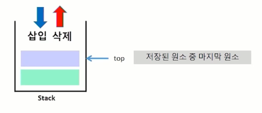
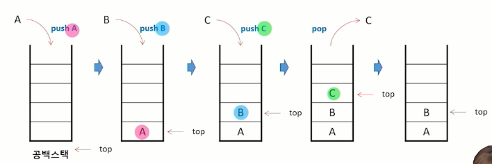
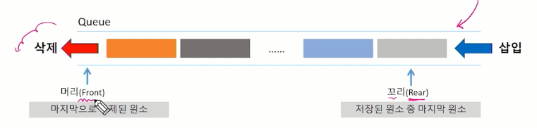

# 스택(Stack)과 큐(Queue)
## 스택(Stack)
### 스택의 특성
- 물건을 쌓아 올리듯 자료를 쌓아 올린 형태의 자료구조
- 스택에 저장된 자료는 선형 구조를 가짐
    - 선형구조: 자료 간의 관계가 1대1의 관계를 가짐(배열, List, Stack, Queue, 연결 리스트)
    - 비선형구조: 자료 간의 관계가 1대N의 관계를 가짐(그래프, 트리)
- 스택에 자료를 삽입하거나 스택에서 자료를 꺼낼 수 있음
- 후입선출구조(LiFo, Last-In-First-Out)
    - 마지막에 삽입한 자료를 가장 먼저 꺼냄
    - 예를 들어 스택에 1,2,3 순으로 자료를 삽입한 후 꺼내면 역순으로 즉 3,2,1 순으로 꺼낼 수 있음

- 스택의 후입선출 구조  

- 주요 연산
    - push: 저장소에 자료를 저장(삽입)
    - pop: 저장소에서 자료를 꺼냄(삭제)  
            꺼낸 자료는 삽입한 자료를 역순으로 꺼냄
    - peek: 스택의 top에 있는 item(원소)를 반환

- 스택의 삽입/삭제 과정
    - 빈 스택에 원소 A,B,C를 차례로 삽입 후 한번 삭제하는 연산과정  
    

## Stack API
- java.util.Stack
- 주요 메서드
    - push()
    - pop()
    - peek()
    - isEmpty(): boolean -> true: 공백스택, false: 공백스택x
    - size()

## 스택 응용1: 괄호 검사
- 괄호의 종류: 대괄호[], 중괄호{}, 소괄호()
- 조건
    1. 왼쪽 괄호의 개수와 오른쪽 괄호의 개수가 같아야 함
    2. 같은 괄호에서 왼쪽 괄호는 오른쪽 괄호보다 먼저 나와야 함
    3. 괄호 사이에는 포함 관계만 존재
- 잘못된 괄호 사용의 예
    (a(b)  
    a(b)c)  
    a{b(c[d]e}f)  

- 알고리즘
    - 문자열에 있는 괄호를 차례대로 조사하면서 왼쪽 괄호를 만나면 스택에 삽입하고, 오른쪽 괄호를 만나면 스택에서 top 괄호를 삭제한 후 오른쪽 괄호와 짝이 맞는지를 검사
    - 이 때, 스택이 비어 있으면 조건1 또는 조건2에 위배되고 괄호의 짝이 맞지 않으면 조건 3에 위배
    - 마지막 괄호까지 조사한 후에도 스택에 괄호가 남아 있으면 조건 1에 위배

- Function call
    - 프로그램에서의 함수 호출과 복귀에 따른 수행 순서를 관리
        - 가장 마지막에 호출된 함수가 가장 먼저 실행을 완료하고 복귀하는 후입선출 구조이므로, 후입선출 구조의 스택을 이용하여 수행순서 관리
        - 함수 호출이 발생하면 호출한 함수 수행에 필요한 지역변수, 매개변수 및 수행 후 복귀할 주소 등의 정보를 스택 프레임에 저장하여 시스템 스택에 삽입
        - 함수의 실행이 끝나면 시스템 스택의 top 원소(스택 프레임)를 삭제(pop)하면서 프레임에 저장되어 있던 복귀주소를 확인하고 복귀
        - 함수 호출과 복귀에 따라 이 과정을 반복하여 전체 프로그램 수행이 종료되면 시스템 스택은 공백 스택이 됨

## 스택 활용 - 계산기
- 문자열로 된 계산식이 주어질 때, 스택을 이용하여 이 계산식의 값을 계산할 수 있다.
- 문자열 수식 계산의 일반적 방법
    - step1. 중위 표기법의 수식을 후위 표기법으로 변경한다.(스택 이용)
    - step2. 후위 표기법의 수식을 스택을 이용하여 계산한다.
    ```
    중위 표기법(infix notation)
    - 연산자를 피연산자의 가운데 표기하는 방법
    ex) A+B
    
    후위 표기법(postfix notation)
    - 연산자를 피연산자 뒤에 표기하는 방법
    ex) AB+
    ```

- Step1. 중위 표기식의 후위 표기식 변환
    1. 수식의 각 연산자에 대해서 우선순위에 따라 괄호를 사용하여 다시 표현
    2. 각 연산자를 그에 대응하는 오른쪽 괄호의 뒤로 이동
    3. 괄호를 제거
    ```
    ex) A*B-C/D
    1단계: ((A*B)-(C/D))
    2단계: ((A B)* (CD)/)-
    3단계: AB*CD/-

    ex) (6+((5*(2-8))/2))
    -> 6528-*2/+
    ```
- Step2. 후위 표기법의 수식을 스택을 이용하여 계산
    1. 피연산자를 만나면 스택에 push
    2. 연산자를 만나면 필요한 만큼의 피연산자를 스택에서 pop하여 연산하고, 연산결과를 다시 스택에 push
    3. 수식이 끝나면, 마지막으로 스택을 pop하여 출력

## 스택 활용 - 브라우저
- 표준 웹 브라우저는 방문한 페이지들 내에서 이전, 이후 페이지를 방문하는 기능이 있음  
그 기능이 back_stack과 forward_stack

## 큐(Queue)
- 큐(Queue)의 특성
    - 스택과 마찬가지로 삽입과 삭제의 위치가 제한적인 자료구조
        - 큐의 뒤에서는 삽입만 하고, 큐의 앞에서는 삭제만 이루어지는 구조
    - 선입선출구조(FIFO: First In First Out)
        - 큐에 삽입한 순서대로 원소가 저장되어, 가장 먼저 삽입(First In)된 원소는 가장 먼저 삭제(First Out) 됨

- 큐의 선입선출 구조  

- 큐의 기본 연산
    - 삽입: enQueue
    - 삭제: deQueue

### Queue API
- java.util.Queue
    - 큐에 필요한 연산을 선언해 놓은 인터페이스
    - LinkedList 클래스를 Queue 인터페이스의 구현체로 많이 사용
- 주요 메서드
    - offer()
    - poll()
    - peek()
    - isEmpty()
    - size()

### 큐 활용 - 버퍼
- 버퍼
    - 데이터를 한 곳에서 다른 한 곳으로 전송하는 동안 일시적으로 그 데이터를 보관하는 메모리의 영역
    - 버퍼는 일반적으로 입출력 및 네트워크와 관련된 기능에서 이용됨
    - 순서대로 입력/출력/전달되어야 하므로 FIFO 방식의 자료구조인 큐가 활용됨
