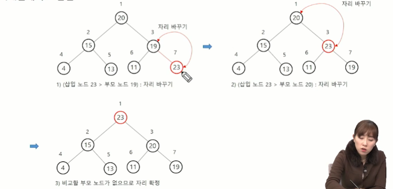

## 트리 탐색 - DFS
### DFS(Depth First Search)
- 깊이 우선 탐색
- 루트 노드에서 출발하여 한 방향으로 갈 수 있는 경로가 있는 곳까지 깊이 탐색해 가다가 더 이상 갈 곳이 없게 되면, 가장 마지막에 만났던 갈림길 간선이 있는 노드로 되돌아와서 다른 방향의 노드로 탐색을 계속 반복하여 결국 모든 노드를 방문하는 순회방법
- 가장 마지막에 만났던 갈림길의 노드로 되돌아가서 다시 깊이 우선 탐색을 반복해야 하므로 재귀적으로 구현하거나 후입선출 구조의 스택 사용해서 구현 

### DFS 예
1) 루트노드 A를 시작으로 깊이 우선 탐색을 시작
```
DFS(A)
    A 방문;

    //A의 자식노드(B,C,D) 모두에 대하여
    DFS(B)
    DFS(C)
    DFS(D)
```  
2) 노드 B에서 깊이 우선 탐색 처리
3) 노드 E에서 깊이 우선 탐색 처리 -> 리프노드라서 리턴
4) 노드 F에서 깊이 우선 탐색 처리
5) 노드 C에서 깊이 우선 탐색 처리  
...

=> 탐색순서: A B E F C D G H I

### 이진트리
### 이진트리 - 순회(traversal)
- 순회(traversal): 트리의 노드들을 체계적으로 방문하는 것
- 3가지의 기본적인 순회방법
    - 전위순회(preorder traversal): VLR
        - 부모 노드 방문 후, 자식노드를 좌,우 순서로 방문
    - 중위순회(inorder traversal): LVR
        - 왼쪽 자식노드, 부모노드, 오른쪽 자식노드 순으로 방문
    - 후위순회(postorder traversal): LRV
        - 자식노드를 좌우 순서로 방문한 후, 부모노드로 방문


  
- 전위순회  
    -> 총 순서: A B D H I E C F G
- 중위순회  
    -> 총 순서: H D I B E A F C G
- 후위순회
    -> 총 순서: H I D E B F G C A

### 수식트리
- 수식을 표현하는 이진트리
- 수식 이진 트리 (Expression Binary Tree)라고 부르기도 함.
- 연산자는 루트 노드이거나 가지 노드
- 피연산자는 모두 잎 노드

## 힙(heap)
- 완전 이진 트리에 있는 노드 중에서 키 값이 가장 큰 노드나 키 값이 가장 작은 노드를 찾기 위해서 만든 자료구조
- 최대 힙(max heap)
    - 키 값이 가장 큰 노드를 찾기 위한 완전 이진 트리
    - 부모 노드의 키 값 >= 자식 노드의 키 값
    - 루트 노드: 키 값이 가장 큰 노드
- 최소 힙(min heap)
    - 키 값이 가장 작은 노드를 찾기 위한 완전 이진 트리
    - 부모 노드의 키 값 =< 자식 노드의 키 값
    - 루트 노드: 키 값이 가장 작은 노드


### 힙 연산 - 삽입
- 최대 힙에서 23 삽입  


### 힙 연산 - 삭제
- 힙에서는 루트 노드의 원소만을 삭제할 수 있음
- 루트 노드의 원소를 삭제하여 반환
- 힙의 종류에 따라 최대값 또는 최소값을 구할 수 있음  
