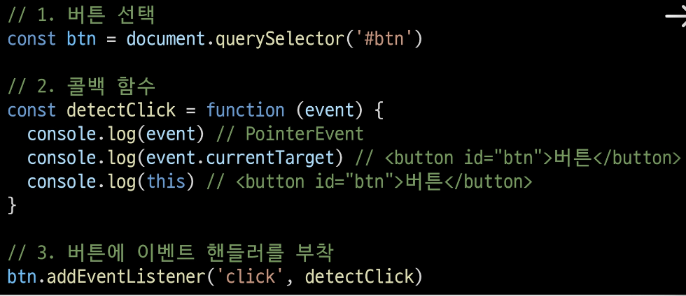

# 이벤트

## event 객체
### event
무언가 일어났다는 신호, 사건  
-> 모든 DOM 요소는 이러한 event를 만들어 냄

### 'event' object
- DOM에서 이벤트가 발생했을 때 생성되는 객체
- 이벤트 종류
    - mouse, input, keyboard, touch ...

### DOM 요소는 event를 받고 받은 event를 '처리'(->event handler 이벤트 처리기) 할 수 있음

## event handler
### event handler
이벤트가 발생했을 때 실행되는 함수  
> 사용자의 행동에 어떻게 반응할지를 JavaScript 코드로 표현한 것

### .addEventListener()
대표적인 이벤트 핸들러 중 하나
> 특정 이벤트를 DOM 요소가 수신할 때마다 콜백 함수를 호출

`EventTarget.addEventListener(type, handler)`  
- EventTarget - DOM 요소
- type - 수신할 이벤트
- handelr - 콜백 함수

> "대상에 특정 Event가 발생하면, 지정한 이벤트를 받아 할 일을 등록한다."

### addEventListener의 인자
- type
    - 수신할 이벤트 이름
    - 문자열로 작성 (ex. 'click')

- handler
    - 발생한 이벤트 객체를 수신하는 콜백 함수
    - 콜백 함수는 발생한 event object를 유일한 매개변수로 받음

### addEventListener 활용
- 버튼을 클릭하면 버튼 요소 출력하기  
> 버튼에 이벤트 처리기를 부착하여 클릭 이벤트가 발생하면 이벤트가 발생한 버튼정보를 출력  
- 요소에 addEventListener를 부착하게 되면 내부의 this 값은 대상 요소를 가리키게 됨(event 객체의 currentTarget 속성 값과 동일)

### addEventListener의 콜백 함수 특징
- 발생한 이벤트를 나타내는 event 객체를 유일한 매개변수로 받음
- 반환 값 없음

## 버블링

### 버블링 개요
- form > div > p 형태의 중첩된 구조에 각각 이벤트 핸들러가 있을 때 만약 `
` 요소를 클릭하면 어떻게 될까?
- `
` 요소만 클릭했는데도 불구하고 모든 핸들러가 동작함  
> 왜 p를 클릭했는데 div와 form에 할당된 핸들러까지 동작할까?

### 버블링 (Bubbling)
- 한 요소에 이벤트가 발생하면, 이 요소에 할당된 핸들러가 동작하고, 이어서 부모 요소의 핸들러가 동작하는 현상
- 가장 최상단의 조상 요소(document)를 만날 때까지 이 과정이 반복되면서 요소 각각에 할당된 핸들러가 동작  
> 이벤트가 제일 깊은 곳에 있는 요소에서 시작해 부모 요소를 거슬러 올라가며 발생하는 것이 마치 물 속 거품과 닮았기 때문

> 가장 안쪽의 `
` 요소를 클릭하면 p -> div -> form 순서로 3개의 이벤트 핸들러가 모두 동작했던 것

### 이벤트가 정확히 어디서 발생했는지 접근할 수 있는 방법
- event.currentTarget
- event.target

### 'currentTarget' & 'target' 속성
- 'currentTarget' 속성
    - '현재' 요소
    - 항상 이벤트 핸들러가 연결된 요소만을 참조하는 속성
    - 'this'와 같음

- 'target' 속성
    - 이벤트가 발생한 가장 안쪽의 요소(target)를 참조하는 속성
    - 실제 이벤트가 시작된 요소
    - 버블링이 진행 되어도 변하지 않음

### 'target' & 'currentTarget' 예시
- 세 요소 중 가장 최상위 요소인 outerouter 요소에만 핸들러가 부착
- 각 요소를 클릭 했을 때 event의 target과 currentTarget의 차이 비교
- 'currentTarget'
    - 핸들러가 연결된 outerouter 요소만을 가리킴
- 'target'
    - 실제 이벤트가 발생하는 요소를 가리킴

- 핸들러는 outerouter에만 할당되어 있지만 하위 요소 outer와 inner를 클릭해도 해당 핸들러가 동작함
- 클릭 이벤트가 어디서 발생했든 상관없이 outerouter까지 이벤트가 버블링되어 핸들러를 실행시키기 때문

### 캡처링(capturing)
- 이벤트가 하위 요소로 전파되는 단계 (버블링과 반대)

### 캡처링과 버블링
- table 안에 td를 클릭하면 이벤트는 최상위 요소로부터 아래로 전파
- 실제 이벤트가 발생한 지점(event.target)에서 실행된 후 다시 위로 전파
    - 이 과정에서 상위 요소에 할당된 이벤트 핸들러가 호출되는 것

> 캡처링은 실제 다루는 경우가 거의 없으므로 버블링에 집중하기

### 버블링이 필요한 이유
- 만약 각자 다른 동작을 수행하는 버튼이 여러 개가 하나의 div 아래 있다고 가정
- 그렇다면 각 버튼마다 서로 다른 이벤트 핸들러를 할당해야 할까?

> 각 버튼의 공통 조상인 div 요소에 이벤트 핸들러 단 하나만 할당하기

- 요소의 공통 조상에 이벤트 핸들러를 단 하나만 할당하면 여러 요소를 한꺼번에 다룰 수 있음
- 공통 조상에 할당한 핸들러에서 event.target을 이용하면 실제 어떤 버튼에서 이벤트가 발생했는지 알 수 있기 때문

## 이벤트 기본 동작 취소
### 이벤트의 기본 동작 취소학
- HTML의 각 요소가 기본적으로 가지고 있는 이벤트가 때로는 방해가 되는 경우가 있어 이벤트의 기본 동작을 취소할 필요가 있음

- 예시
    - form 요소의 제출 이벤트를 취소하여 페이지 새로고침을 막을 수 있음
    - a 요소를 클릭할 때 페이지 이동을 막고 추가 로직을 수행할 수  있음

### .preventDefault()
해당 이벤트에 대한 기본 동작을 실행하지 않도록 지정

## 참고
### addEventListener에서의 화살표 함수 주의사항
- 화살표 함수는 자신만의 this를 가지지 않기 때문에 자신을 포함하고 있는 함수의 this를 상속받음

> this를 사용 해야하는 경우 addEventListener에서는 일반 함수로 사용하기