# Reference_Type
## 함수
### Function
참조 자료형에 속하며 모든 함수는 Function object

### 참조 자료형(Reference type)
- Objects(Object, Array, Function)
- 객체의 주소가 저장되는 자료형(가변, 주소가 복사)

## 함수 정의

### 함수 구조
```javascript
function name ([parm[, para, [..., param]]]){
  statements
  return value
}
```
- function 키워드
- 함수의 이름
- 함수의 매개변수
- 함수의 body를 구성하는 statements
- return 값이 없다면 undefined를 변환

### 함수 정의 2가지 방법
- 선언식(function declaration)  
  ```javascript
  function funcName () {
    statements
  }
  ```
- 표현식(function expression)  
  ```javascript
  const funcName = function () {
    statements
  }
  ```

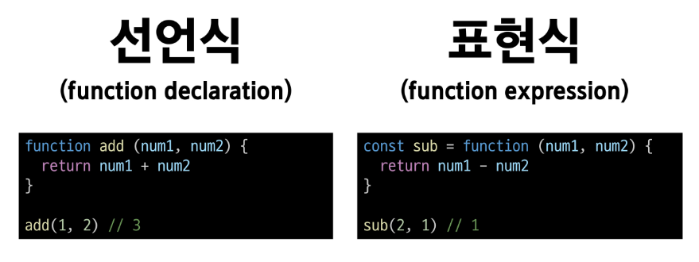

### 함수 표현식 특징
- 함수 이름이 없는 '익명 함수'를 사용할 수 있음
- 선언식과 달리 표현식으로 정의한 함수는 호이스팅 되지 않으므로 함수를 정의하기 전에 먼저 사용할 수 없음  

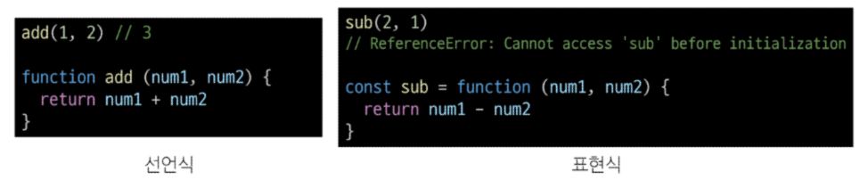

### 함수 선언식과 표현식 종합
||선언식|표현식|
|:---:|:---:|:---:|
|특징|익명 함수 사용 불가능, 호이스팅 있음|익명 함수 사용 가능, 호이스팅 없음|
|기타||사용 권장|

## 매개변수

### 매개변수 정의 방법
1. 기본 함수 매개변수
2. 나머지 매개변수

### 1. 기본 함수 매개변수(Default function parameter)
- 전달하는 인자가 없거나 undefined가 전달될 경우 이름 붙은 매개변수를 기본값으로 초기화  
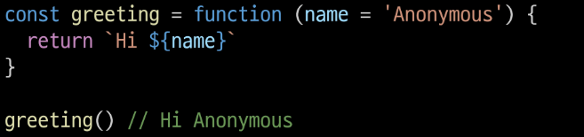

### 2. 나머지 매개변수(Rest Parameters)
- 임의의 수의 인자를 '배열'로 허용하여 가변 인자를 나타내는 방법
- 작성 규칙
  - 함수 정의 시 나머지 매개변수는 하나만 작성할 수 있음
  - 나머지 매개변수는 함수 정의에서 매개변수 마지막에 위치해야 함  

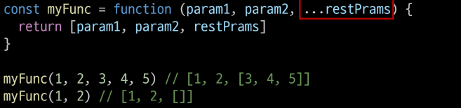

### 매개변수와 인자 개수가 불일치 할 때
- 매개변수 개수 > 인자 개수
- 누락된 인자는 undefined로 할당  
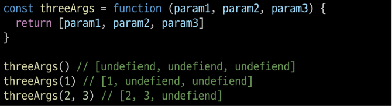

- 매개변수 개수 < 인자 개수
- 초과 입력한 인자는 사용하지 않음  
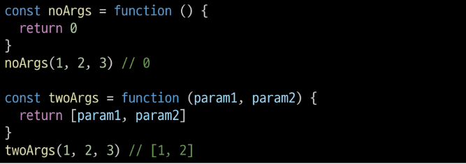

## Spread syntax
### '...'(Spread syntax)
전개 구문

### 전개 구문
- 배열이나 문자열과 같이 반복 가능한 항목을 펼치는 것 (확장, 전개)
- 전개 대상에 따라 역할이 다름
  - 배열이나 객체의 요소를 개별적인 값으로 분리하거나 다른 배열이나 객체의 요소를 현재 배열이나 객체에 추가하는 등

### 전개 구문 활용처
1. 함수와의 사용
  1. 함수 호출 시 인자 확장
  2. 나머지 매개변수 (압축)
2. 객체와의 사용
3. 배열과의 사용

### 전개 구문 활용
- 함수와의 사용
  1. 함수 호출 시 인자 확장  
    ```javascript
    function myFunc(x, y, z){
      return x + y + z
    }

    let numbers = [1, 2, 3]

    console.log(myFunc(...numbers)) // 6
    ```
  
  2. 나머지 매개변수 (압축)  
    ```javascript
    function myFunc2(x, y, ...restArgs) {
      return [x, y, restArgs]
    }
    
    console.log(myFunc2(1, 2, 3, 4, 5)) // [1, 2, [3, 4, 5]]
    console.log(myFunc2(1, 2)) //[1, 2, []]
    ```

## 화살표 함수
### 화살표 함수 표현식(Arrow function expressions)
함수 표현식의 간결한 표현법

### 화살표 함수 작성 결과
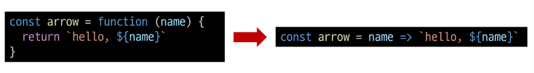

### 화살표 함수 작성 과정
1. function 키워드 제거 후 매개변수와 중괄호 사이에 화살표(=>) 작성  
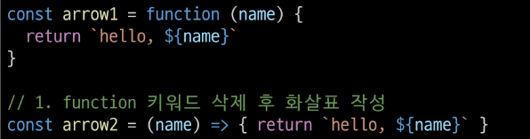  
2. 함수의 매개변수가 하나뿐이라면, 매개변수의 '()' 제거 가능(단, 생략하지 않는 것을 권장)  

3. 함수 본문의 표현식이 한 줄이라면, '{}'와 'return'제거 가능  
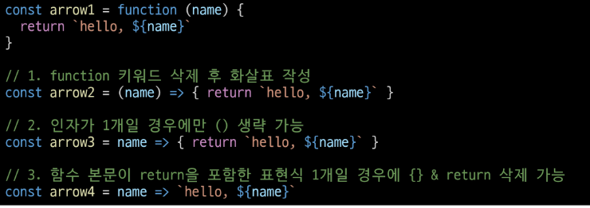

### 화살표 함수 심화
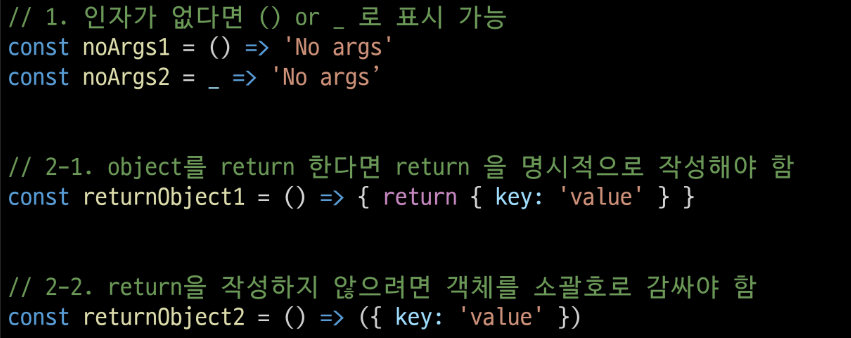

## 객체

### Object
키로 구분된 데이터 집합을 저장하는 자료형 (data collection)

## 구조 및 속성

### 객체 구조
- 중괄호('{}')를 이용해 작성
- 중괄호 안에는 key: value 쌍으로 구성된 속성(property)를 여러 개 작성 가능
- key는 문자형만 허용
- value는 모든 자료형 허용


### 속성 참조
- 점('.', chaining operator) 또는 대괄호('[]')로 객체 요소 접근
- key 이름에 띄어쓰기 같은 구분자가 있으면 대괄호 접근만 가능

```javascript
// 조회
console.log(user.name) // Alice
console.log(user['key with space']) // true

// 추가
user.address = 'korea'

// 수정
user.name = 'Bella'

// 삭제
delete user.name
```

### 'in' 연산자
- 속성이 객체에 존재하는지 여부를 확인  
```javascript
console.log('greeting' in user)
```

## 객체와 함수

### Method
객체 속성에 정의된 함수

### Method 사용 예시
- object.method() 방식으로 호출
- 메서드는 객체를 '행동'할 수 있게 함

## this
### Method
객체 속성에 정의된 함수  

-> 'this' 키워드를 사용해 객체에 대한 특정한 작업을 수행할 수 있음

### 'this' keyword
함수나 메서드를 호출한 객체를 가리키는 키워드  
-> 함수 내에서 객체의 속성 및 메서드에 접근하기 위해 사용

### JavaScript에서 this는 함수를 "호출하는 방법"에 따라 가리키는 대상이 다름
|호출방법|대상|
|:---:|:---:|
|단순 호출|전역 객체|
|메서드 호출|메서드를 호출한 객체|

### 1. 단순 호출 시 this
- 가리키는 대상 -> 전역 객체

```javascript
const myFunc = function () {
  return this
}

console.log(myFunc()) // window
```

### 2. 메서드 호출 시 this
- 가리키는 대상 => 메서드를 호출한 객체

```javascript
const myObj = {
  data: 1,
  myFunc: function () {
    return this
  }
}

console.log(myObj.myFunc()) // myObj
```

### 중첩된 함수에서의 this 문제점과 해결책

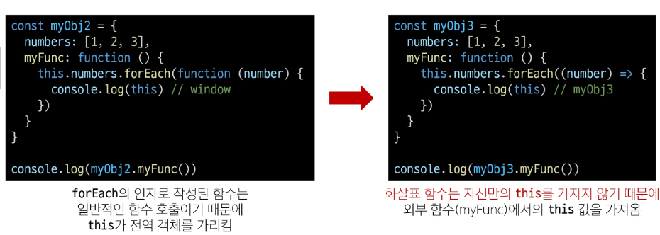

### JavaScript 'this' 정리
- JavaScript의 함수는 호출될 때 this를 암묵적으로 전달 받음
- JavaScript에서 this는 함수가 "호출되는 방식"에 따라 결정되는 현재 객체를 나타냄
- Python의 self와 Java의 this가 선언 시 이미 값이 정해지는 것에 비해 JavaScript의 this는 함수가 호출되기 전까지 값이 할당되지 않고 호출 시에 결정됨(동적 할당)
- this가 미리 정해지지 않고 호출 방식에 의해 결정되는 것은
- 장점
  - 함수(메서드)를 하나만 만들어 여러 객체에서 재사용할 수 있다는 것
- 단점
  - 이런 유연함이 실수로 이어질 수 있다는 것

-> 개발자는 this의 동작 방식을 충분히 이해하고 장점을 취하면서 실수를 피하는 데에 집중

## 추가 객체 문법
1. 단축 속성
- 키 이름과 값으로 쓰이는 변수의 이름이 같은 경우 단축 구문을 사용할 수 있음  
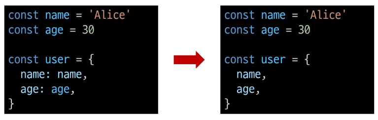

2. 단축 메서드
- 메서드 선언 시 function 키워드 생략 가능  
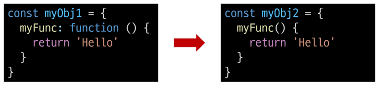

3. 계산된 속성(computed property name)
- 키가 대괄호([])로 둘러싸여 있는 속성  
-> 고정된 값이 아닌 변수 값을 사용할 수 있음  
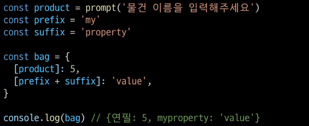

4. 구조 분해 할당(destructing assignment)
- 배열 또는 객체를 분해하여 객체 속성을 변수에 쉽게 할당할 수 있는 문법  
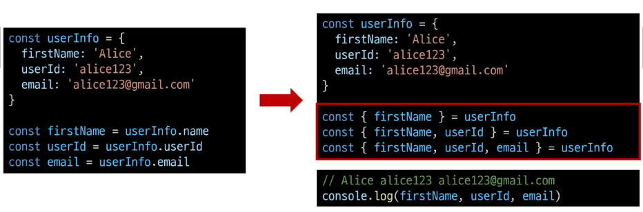

- '함수의 매개변수'로 객체 구조 분해 할당 활용 가능  
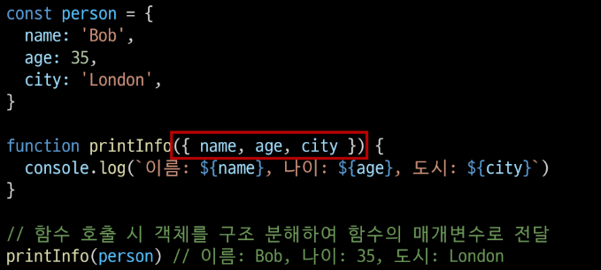

5. Object with '전개 구문'
- "객체 복사"
  - 객체 내부에서 객체 전개
- 얕은 복사에 활용 가능  
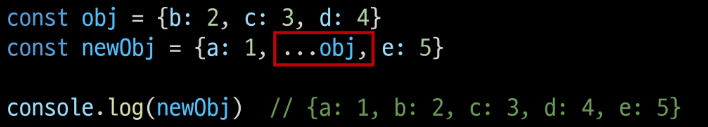