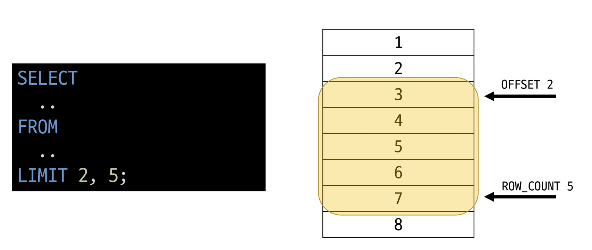

# Database

### 데이터베이스
체계적인 데이터 모음

### 데이터
저장이나 처리에 효율적인 형태로 변환된 정보

### 데이터 사용량이 늘어남에 따라 데이터를 저장하고 잘 관리하여 활용할 수 있는 기술이 중요해짐

### 기존의 데이터 저장 방식
1. 파일 이용
2. 스프레드 시트 이용

### 1. 파일을 이용한 데이터 관리
- 어디에서나 쉽게 사용 가능
- 데이터를 구조적으로 관리하기 어려움

### 2. 스프레드 시트를 이용한 데이터 관리
- 테이블의 열과 행을 사용해 데이터를 구조적으로 관리 가능
- 한계
    - 크기 - 일반적으로 약 100만 행까지만 저장가능
    - 보안 - 단순히 파일이나 링크 소유 여부에 따른 단순한 접근 권한 기능 제공
    - 정확성 - 만약 공식적으로 강원의 지명이 강언으로 바뀌었다고 가정한다면 이 변경으로 인해 테이블 모든 위치에서 해당 값을 업데이트 해야 함  
            - 찾기 및 바꾸기 기능을 사용해 바꿀 수 있지만 만약 데이터가 여러 시트에 분산되어 있다면 변경에 누락이 생기거나 추가 문제가 발생할 수 있음  
      
### 데이터베이스 역할
데이터를 저장하고 조작(CRUD)

## Relational Database
### 관계형 데이터베이스
데이터 간에 관계가 있는 데이터 항목들의 모음

- 테이블, 행, 열의 정보를 구조화하는 방식
- 서로 관련된 데이터 포인터를 저장하고 이에 대한 액세스를 제공

### 관계
여러 테이블 간의 (논리적) 연결

### 관계로 할 수 있는 것
- 이 관계로 인해 두 테이블을 사용하여 데이터를 다양한 형식으로 조회할 수 있음
    - 특정 날짜에 구매한 모든 고객 조회
    - 지난 달에 배송일이 지연된 고객 조회 등
    
- 고객 데이터 간 비교를 위해서는 어떤 값을 활용해야 할까?
    - 각 데이터에 고유한 식별 값을 부여하기(기본 키, Primary Key)
    
- 누가 어떤 주문을 했는지 어떻게 식별할 수 있을까?
    - 주문 정보에 고객의 고유한 식별 값을 저장하기 (외래 키, Foreign Key)
    
### 관계형 데이터베이스 관련 키워드
1. Table(Relation)
    - 데이터를 기록하는 곳
    
2. Field(Column, Attribute)
    - 각 필드에는 고유한 데이터 형식(타입)이 지정됨
    
3. Record(Row, Tuple)
    - 각 레코드에는 구체적인 데이터 값이 저장됨
    
4. Database(Schema)
    - 테이블의 집합
    
5. Primary Key(기본 키, PK)
    - 각 레코드의 고유한 값
    - 관계형 데이터베이스에서 레코드의 식별자로 활용
    
6. Foreign Key(외래키, FK)
    - 테이블의 필드 중 다른 테이블의 레코드를 식별할 수 있는 키
    - 다른 테이블의 기본 키를 참조
    - 각 레코드에서 서로 다른 테이블 간의 관계를 만드는 데 사용
    
## RDBMS

### DBMS(Database Management System)
데이터베이스를 관리하는 소프트웨어 프로그램

- 데이터 저장 및 관리를 용이하게 하는 시스템
- 데이터베이스와 사용자 간의 인터페이스 역할
- 사용자가 데이터 구성, 업데이트, 모니터링, 백업, 복구 등을 할 수 있도록 도움
- 종류 - SQLite, MySQL, PostgreSQL, Oracle Database 등

### SQLite
경랑의 오픈 소스 데이터베이스 관리 시스템  
-> 컴퓨터나 모바일 기기에 내장되어 간단하고 효율적인 데이터 저장 및 관리를 제공

### 데이터베이스 정리
- Table은 데이터가 기록되는 곳
- Table에는 행에서 고유하게 식별 가능한 기본 키라는 속성이 있으며, 외래 키를 사용하여 각 행에서 서로 다른 테이블 간의 관계를 만들 수 있음
- 데이터는 기본 키 또는 외래 키를 통해 결합(join)될 수 있는 여러 테이블에 걸쳐 구조화 됨

## SQL

### SQL(Structure Query Language)
데이터베이스에 정보를 저장하고 처리하기 위한 프로그래밍 언어  
테이블의 형태로 구조화된 관계형 데이터베이스에게 요청을 질의(요청)

### SQL Syntax
1. SQL 키워드는 대소문자를 구분하지 않음  
    - 하지만 대문자로 작성하는 것을 권장(명시적 구분)
    
2. 각 SQL Statements의 끝에는 세미콜론이 필요  
    - 세미콜론은 각 SQL Statements을 구분하는 방법(명령어의 마침표)
    

## SQL Statements

### SQL Statements
SQL을 구성하는 가장 기본적인 코드 블록

### SQL Statements 예시
```sql
SELECT column_name FROM table_name;
```
- 해당 예시 코드는 SELECT Statement라 부름
- 이 Statement는 SELECT, FROM 2개의 keyword로 구성 됨


### 수행 목적에 따른 SQL Statements 4가지 유형
1. DDL - 데이터 정의
2. DQL - 데이터 검색
3. DML - 데이터 조작
4. DCL - 데이터 제어

### 수행 목적에 따른 SQL Statements 4가지 유형


### Query
- 데이터베이스로부터 정보를 요청하는 것
- 일반적으로 SQL로 작성하는 코드를 쿼리문(SQL문)이라 함

## Querying data(DQL)
## SELECT
### SELECT statement
테이블에서 데이터를 조회

### SELECT syntax
```SQL
SELECT
    select_list
FROM
    table_name;
```
- SELECT 키워드 이후 데이터를 선택하려는 필드를 하나 이상 지정
- FROM 키워드 이후 데이터를 선택하려는 테이블의 이름을 지정


### SELECT 활용
1. 하나의 필드 조회  
   ```SQL
   SELECT
        LastName
   FROM
        emplyees;
   ```
   
2. 두개의 필드 조회  
   ```SQL
   SELECT
        LastName, FirstName
   FROM
        employees
   ```
      
3. 모든 필드 조회  
   ```SQL
   SELECT
        *
   FROM 
        employees;
   ```
   
4. 하나의 필드 조회, 필드 이름 출력 변경  
    ```SQL
    SELECT
        FirstName AS '이름'
    FROM
        employees;
    ```

4. 두개의 필드 조회, 필드 값, 이름 출력 변경  
    ```SQL
    SELECT
        Name,
        Milliseconds / 60000 AS '재생 시간(분)'
    FROM
        tracks;
    ```

### SELECT 정리
- 테이블의 데이터를 조회 및 반환
- '*' (asterisk)를 사용하여 모든 필드 선택

## Sorting data
### ORDER BY
### ORDER BY statement
조회 결과의 레코드를 정렬

### ORDER BY syntax
- FROMM clause 뒤에 위치
- 하나 이상의 컬럼을 기준으로 결괄르 오름차순(ASC, 기본 값), 내림차순(DESC)으로 정렬

### ORDER BY 활용
1. 하나의 필드 데이터 오름차순 조회  
    ```SQL
    SELECT
        FirstName
    FROM
        employees
    ORDER BY
        FirstName;
    ```

2. 하나의 필드 데이터 내림차순 조회  
    ```SQL
    SELECT
        FirstName
    FROM
        employees
    ORDER BY
        FirstName DESC;
    ```

3. 두개의 필드 데이터 각각 정렬(Country 필드를 기준으로 내림차순 정렬한 다음 City 필드 기준으로 오름차순 정렬하여 조회)
    ```SQL
    SELECT
        Country, City
    FROM
        customers
    ORDER BY
        Country DESC, City;
    ```

4. 하나의 필드를 기준으로 내림차순 정렬한 다음 두 개 필드의 모든 데이터를 조회  
    ```SQL
    SELECT
        Name,
        Milliseconds / 60000 AS '재생 시간(분)'
    FROM
        tracks
    ORDER BY
        Milliseconds DESC;
    ```

### 정렬에서의 NULL
NULL 값이 존재할 경우 오름차순 정렬 시 결과에 NULL이 먼저 출력

### SELECT statement 실행 순서
FROM -> SELECT -> ORDER BY  
1. 테이블에서 (FROM)
2. 조회하여 (SELECT)
3. 정렬 (ORDER BY)

## Filtering data
### Filtering data 관련 Keywords
- Clause
    - DISTINCT
    - WHERE
    - LIMIT

- Operator
    - BETWEEN
    - IN
    - LIKE
    - Comparison
    - Logical

## DISTINCT
### DISTINCT statement
조회 결과에서 중복된 레코드를 제거

### DISTINCT syntax
```SQL
SELECT DISTINCT
    select_list
FROM
    table_name;
```

- SELECT 키워드 바로 뒤에 작성해야 함
- SELECT DISTINCT 키워드 다음에 고유한 값을 선택하려는 하나 이상의 필드를 지정


### DISTINCT 활용
1. 한 개 필드의 모든 데이터를 중복없이 오름차순 조회  
    ```SQL
    SELECT DISTINCT
        Country
    FROM
        customers
    ORDER BY
        Country;
    ```

## WHERE

### WHERE statement
조회 시 특정 검색 조건을 지정

### WHERE syntax
- FROM clause 뒤에 위치
- search_condition은 비교연산자 및 논리연산자(AND, OR, NOT 등)를 사용하는 구문이 사용됨

### WEHRE 활용
1. 필드 값이 특정 값인 데이터 조회  
    ```SQL
    SELECT
        LastName, FirstName, City
    FROM
        customers
    WHERE
        City = 'Prague';
    ```

2. 필드 값이 특정 값이 아닌 데이터 조회  
    ```SQL
    SELECT
        LastName, FirstName, City
    FROM
        customers
    WHERE
        City != 'Prague';
    ```

3. 필드 값에 여러 조건  
    ```SQL
    SELECT
        LastName, FirstName, Company, Country
    FROM
        customers
    WHERE
        Company IS NULL
        AND Country = 'USA';
    ```

4. BETWEEN 활용  
    ```SQL
    SELECT
        Name, Bytes
    FROM
        tracks
    WHERE
        Bytes BETWEEN 100000 AND 500000;
    
    -- WHERE
    --    Bytes >= 10000
    --    AND Bytes <= 50000;
    ```

5. ORDER BY, BETWEEN 활용  
    ```SQL
    SELECT
        Name, Bytes
    FROM
        tracks
    WHERE
        Bytes BETWEEN 100000 AND 500000
    ORDER BY Bytes;
    ```

6. OR 연산  
    ```SQL
    SELECT
        LastName, FirstName, Country
    FROM
        customers
    WHERE
        Country IN ('Canada', 'Germany', 'France');

    --WHERE
    --    Country = 'Canada'
    --    OR Country = 'Germany'
    --    OR Country = 'France';
    ```

7. NOT IN 연산  
    ```SQL
    SELECT
        LastName, FirstName, Country
    FROM
        customers
    WHERE
        Country NOT IN ('Canada', 'Germany', 'France');
    ```

8. 필드 값이 특정한 값으로 끝나는 데이터 조회  
    ```SQL
    SELECT
        LastName, FirstName
    FROM
        customers
    WHERE
        LastName LIKE '%son';
    ```

9. 필드 값이 n자리 이면서 특정한 값으로 끝나는 데이터 조회  
    ```SQL
    SELECT
        LastName, FirstName
    FROM
        customers
    WHERE
        FirstName LIKE '___a';
    ```

## Operators

### Comparison Operators(비교 연산자)
=, >=, <=, !=, IS, LIKE, IN, BETWEEN ... AND

### Logicla Operators(논리 연산자)
AND(&&), OR(||), NOT(!)

### IN Operator
값이 특정 목록 안에 있는지 확인

### LIKE Operator
값이 특정 패턴에 일치하는지 확인(Wildcards와 함께 사용)

### Wildcard Characters
- `%` - 0개 이상의 문자열과 일치 하는지 확인
- `_` - 단일 문자와 일치하는지 확인


### LIMIT clause
조회하는 레코드 수를 제한

### LIMIT syntax
- 하나 또는 두 개의 인자를 사용 (0 또는 양의 정수)
- row_count는 조회하는 최대 레코드 수를 지정

### LIMIT & OFFSET 예시


### LIMIT 활용
1. 필드 데이터를 내림차순으로 n개만 조회  
    ```SQL
    SELECT
        TrackId, Name, Bytes
    FROM
        tracks
    ORDER BY Bytes DESC
    LIMIT 7;
    ```

2. 필드 데이터를 내림차순으로 4번째부터 7번째 데이터만 조회  
    ```SQL
    SELECT
        TrackId, Name, Bytes
    FROM
        tracks
    ORDER BY
        Bytes DESC
    LIMIT 3, 4;
    -- LIMIT 4 OFFSET 3;
    ```

## Grouping data

### GROUP BY
### GROUP BY clause
레코드를 그룹화하여 요약본 생성('집계 함수'와 함께 사용)

### Aggregation Functions(집계 함수)
값에 대한 계산을 수행하고 단일한 값을 반환하는 함수(SUM, AVG, MAX, MIN, COUNT)

### GROUP BY syntax
- FROM 및 WHERE 절 뒤에 배치
- GROUP BY 절 뒤에 그룹화 할 필드 목록을 작성

### GROUP BY 예시
1. 필드를 그룹화  
    ```SQL
    SELECT
        Country
    FROM
        customers
    GROUP BY
        Country;
    ```

2. COUNT 함수가 각 그룹에 대한 집계된 값을 계산  
    ```SQL
    SELECT
        Country, COUNT(*)
    FROM
        customers
    GROUP BY
        Country;
    ```

3. 특정 필드를 그룹화하여 각 그룹에 대한 Bytes의 평균 값을 내림차순 조회  
    ```SQL
    SELECT
        Composer,
        AVG(Bytes)
    FROM
        tracks
    GROUP BY
        Composer
    ORDER BY
        AVG(Bytes) DESC;
    ```

4. AS로 네이밍 후 그 값으로 정렬  
    ```SQL
    SELECT
        Composer,
        AVG(Bytes) AS avgOfBytes
    FROM
        tracks
    GROUP BY
        Composer
    ORDER BY
        avgOfBytes DESC;
    ```

5. 필드를 그룹화하여 각 그룹에 대한 필드 평균 값이 10 미만인 데이터 조회  
    ```SQL
    SELECT
        Composer,
        AVG(Milliseconds / 60000) AS avgOfMinute
    FROM
        tracks
    WHERE
        avgOFMinute < 10
    GROUP BY
        Composer;
    ```  
    -> 이렇게하면 `에러 발생`

    - `HAVING` clause 사용
        - 집계 항목에 대한 세부 조건을 지정
        - 주로 GROUP BY와 함께 사용되며 GROUP BY가 없다면 WHERE 처럼 동작
    ```SQL
    SELECT
        Composer,
        AVG(Milliseconds / 60000) AS avgOfMinute
    FROM
        tracks
    WHERE
        avgOFMinute < 10
    HAVING
        Composer;
    ```

### SELECT statement 실행 순서
FROM -> WHERE -> GROUP BY -> HAVING -> SELECT -> ORDER BY -> LIMIT  

1. 테이블에서 (FROM)
2. 특정 조건에 맞추어 (WHERE)
3. 그룹화 하고 (GROUP BY)
4. 만약 그룹화 조건이 있다면 맞추고 (HAVING)
5. 조회하여 (SELECT)
6. 정렬하고 (ORDER BY)
7. 특정 위치의 값을 가져옴 (LIMIT)

## Managing Tables(DDL)

## Create a table
### CREATE TABLE statement
테이블 생성

### CREATE TABLE syntax
```SQL
CREATE TABLE table_name (
    column_1 data_type constraints,
    column_2 data_type constraints,
)
```
- 각 필드에 적용할 데이터 타입 작성
- 테이블 및 필드에 대한 제약조건(constraints) 작성

### CREATE TABLE 활용
- example 테이블 생성 및 확인
```SQL
CREATE TABLE examples (
    ExamID INTEGER PRIMARY KEY AUTOINCREMENT,
    LastName VARCHAR(50) NOT NULL,
    FirstName VARCHAR(50) NOT NULL
);
```

### PRAGMA
- 테이블 schema(구조) 확인  
    ```SQL
    PRAGMA table_info('examples');
    ```

- cid
    - Column ID를 의미하며 각 컬럼의 고유한 식별자를 나타내는 정수 값
    - 직접 사용하지 않으며 PRAGMA 명령과 같은 메타데이터 조회에서 출력 값으로 활용됨

### SQLite 데이터 타입
1. NULL  
    - 아무런 값도 포함하지 않음을 나타냄

2. INTEGER  
    - 정수

3. REAL  
    - 부동 소수점

4. TEXT  
    - 문자열

5. BLOB  
    - 이미지, 동영상, 문서 등의 바이너리 데이터

### Constraints(제약 조건)
테이블의 필드에 적용되는 규칙 또는 제한 사항  
-> 데이터의 무결성을 유지하고 데이터베이스의 일관성을 보장

### 대표 제약 조건 3가지
- PRIMARY KEY  
    - 해당 필드를 기본 키로 지정
    - INTEGER 타입에만 적용되며 INT, BIGINT 등과 같은 다른 정수 유형은 적용되지 않음

- NOT NULL
    - 해당 필드에 NULL 값을 허용하지 않도록 지정

- FOREIGN KEY
    - 다른 테이블과의 외래 키 관계를 정의

### AUTOINCREMENT keyword
자동으로 고유한 정수 값을 생성하고 할당하는 필드 속성

### AUTOINCREMENT 특징
- 필드의 자동 증가를 나타내는 특수한 키워드
- 주로 primary key 필드에 적용
- INTEGER PRIMARY KEY AUTOINCREMENT가 작성된 필드는 항상 새로운 레코드에 대해 이전 최대 값보다 큰 값을 할당
- 삭제된 값은 무시되며 재사용할 수 없게 됨


## Modifying table fields
## ALTER TABLE

### ALTER TABLE statement
테이블 및 필드 조작

### ALTER TABLE 역할
|명령어|역할|
|:---:|:---:|
|ALTER TABLE ADD COLUMN|필드 추가|
|ALTER TABLE RENAME COLUMN|필드 이름 변경|
|ALTER TABLE RENAME TO|테이블 이름 변경|