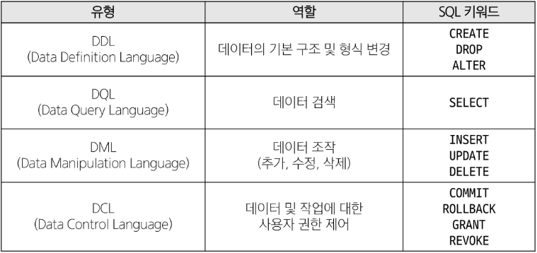

# Database

### 데이터베이스
체계적인 데이터 모음

### 데이터
저장이나 처리에 효율적인 형태로 변환된 정보

### 데이터 사용량이 늘어남에 따라 데이터를 저장하고 잘 관리하여 활용할 수 있는 기술이 중요해짐

### 기존의 데이터 저장 방식
1. 파일 이용
2. 스프레드 시트 이용

### 1. 파일을 이용한 데이터 관리
- 어디에서나 쉽게 사용 가능
- 데이터를 구조적으로 관리하기 어려움

### 2. 스프레드 시트를 이용한 데이터 관리
- 테이블의 열과 행을 사용해 데이터를 구조적으로 관리 가능
- 한계
    - 크기 - 일반적으로 약 100만 행까지만 저장가능
    - 보안 - 단순히 파일이나 링크 소유 여부에 따른 단순한 접근 권한 기능 제공
    - 정확성 - 만약 공식적으로 강원의 지명이 강언으로 바뀌었다고 가정한다면 이 변경으로 인해 테이블 모든 위치에서 해당 값을 업데이트 해야 함  
            - 찾기 및 바꾸기 기능을 사용해 바꿀 수 있지만 만약 데이터가 여러 시트에 분산되어 있다면 변경에 누락이 생기거나 추가 문제가 발생할 수 있음  
      
### 데이터베이스 역할
데이터를 저장하고 조작(CRUD)

## Relational Database
### 관계형 데이터베이스
데이터 간에 관계가 있는 데이터 항목들의 모음

- 테이블, 행, 열의 정보를 구조화하는 방식
- 서로 관련된 데이터 포인터를 저장하고 이에 대한 액세스를 제공

### 관계
여러 테이블 간의 (논리적) 연결

### 관계로 할 수 있는 것
- 이 관계로 인해 두 테이블을 사용하여 데이터를 다양한 형식으로 조회할 수 있음
    - 특정 날짜에 구매한 모든 고객 조회
    - 지난 달에 배송일이 지연된 고객 조회 등
    
- 고객 데이터 간 비교를 위해서는 어떤 값을 활용해야 할까?
    - 각 데이터에 고유한 식별 값을 부여하기(기본 키, Primary Key)
    
- 누가 어떤 주문을 했는지 어떻게 식별할 수 있을까?
    - 주문 정보에 고객의 고유한 식별 값을 저장하기 (외래 키, Foreign Key)
    
### 관계형 데이터베이스 관련 키워드
1. Table(Relation)
    - 데이터를 기록하는 곳
    
2. Field(Column, Attribute)
    - 각 필드에는 고유한 데이터 형식(타입)이 지정됨
    
3. Record(Row, Tuple)
    - 각 레코드에는 구체적인 데이터 값이 저장됨
    
4. Database(Schema)
    - 테이블의 집합
    
5. Primary Key(기본 키, PK)
    - 각 레코드의 고유한 값
    - 관계형 데이터베이스에서 레코드의 식별자로 활용
    
6. Foreign Key(외래키, FK)
    - 테이블의 필드 중 다른 테이블의 레코드를 식별할 수 있는 키
    - 다른 테이블의 기본 키를 참조
    - 각 레코드에서 서로 다른 테이블 간의 관계를 만드는 데 사용
    
## RDBMS

### DBMS(Database Management System)
데이터베이스를 관리하는 소프트웨어 프로그램

- 데이터 저장 및 관리를 용이하게 하는 시스템
- 데이터베이스와 사용자 간의 인터페이스 역할
- 사용자가 데이터 구성, 업데이트, 모니터링, 백업, 복구 등을 할 수 있도록 도움
- 종류 - SQLite, MySQL, PostgreSQL, Oracle Database 등

### SQLite
경랑의 오픈 소스 데이터베이스 관리 시스템  
-> 컴퓨터나 모바일 기기에 내장되어 간단하고 효율적인 데이터 저장 및 관리를 제공

### 데이터베이스 정리
- Table은 데이터가 기록되는 곳
- Table에는 행에서 고유하게 식별 가능한 기본 키라는 속성이 있으며, 외래 키를 사용하여 각 행에서 서로 다른 테이블 간의 관계를 만들 수 있음
- 데이터는 기본 키 또는 외래 키를 통해 결합(join)될 수 있는 여러 테이블에 걸쳐 구조화 됨

## SQL

### SQL(Structure Query Language)
데이터베이스에 정보를 저장하고 처리하기 위한 프로그래밍 언어  
테이블의 형태로 구조화된 관계형 데이터베이스에게 요청을 질의(요청)

### SQL Syntax
1. SQL 키워드는 대소문자를 구분하지 않음  
    - 하지만 대문자로 작성하는 것을 권장(명시적 구분)
    
2. 각 SQL Statements의 끝에는 세미콜론이 필요  
    - 세미콜론은 각 SQL Statements을 구분하는 방법(명령어의 마침표)
    

## SQL Statements

### SQL Statements
SQL을 구성하는 가장 기본적인 코드 블록

### SQL Statements 예시
```sql
SELECT column_name FROM table_name;
```
- 해당 예시 코드는 SELECT Statement라 부름
- 이 Statement는 SELECT, FROM 2개의 keyword로 구성 됨


### 수행 목적에 따른 SQL Statements 4가지 유형
1. DDL - 데이터 정의
2. DQL - 데이터 검색
3. DML - 데이터 조작
4. DCL - 데이터 제어

### 수행 목적에 따른 SQL Statements 4가지 유형


### Query
- 데이터베이스로부터 정보를 요청하는 것
- 일반적으로 SQL로 작성하는 코드를 쿼리문(SQL문)이라 함

## Querying data
## SELECT
### SELECT statement
테이블에서 데이터를 조회

### SELECT syntax
```SQL
SELECT
    select_list
FROM
    table_name;
```
- SELECT 키워드 이후 데이터를 선택하려는 필드를 하나 이상 지정
- FROM 키워드 이후 데이터를 선택하려는 테이블의 이름을 지정