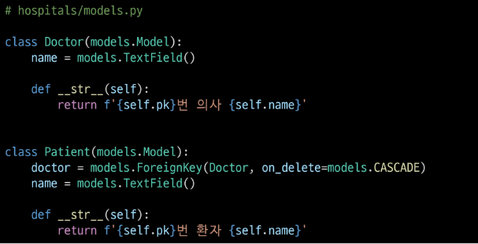
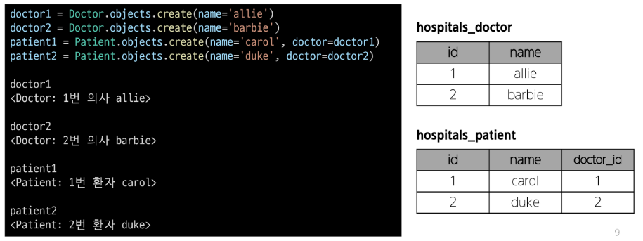
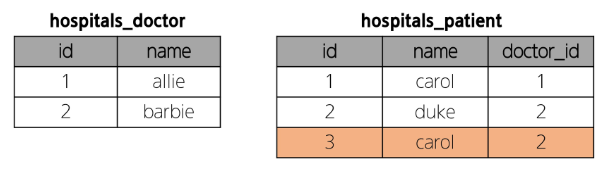
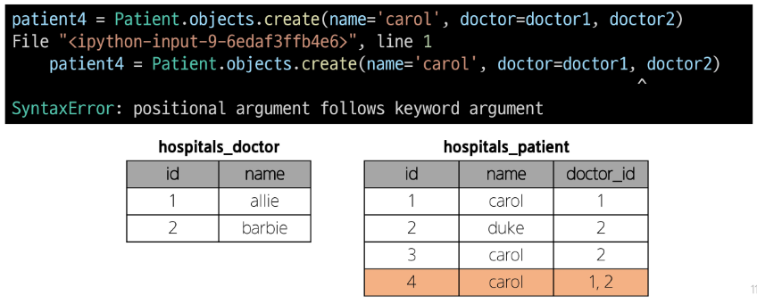
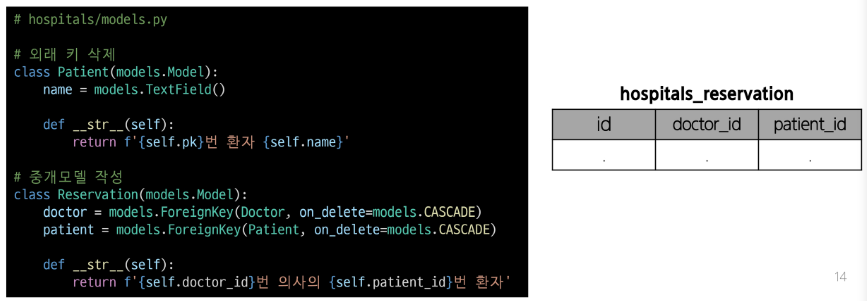
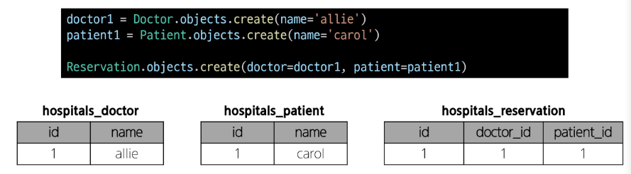
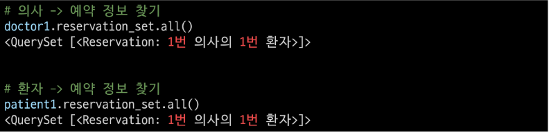
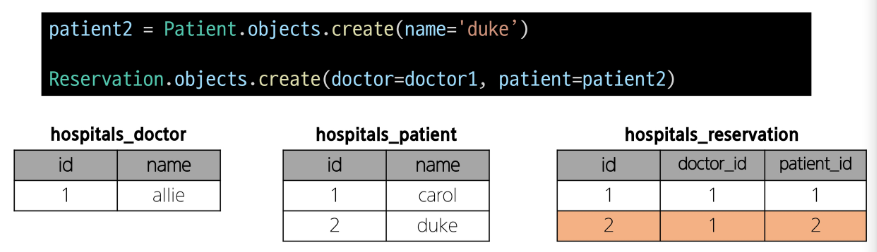

# Many to many relationships

### Many to many relationships(N:M or M:N)
한 테이블의 0개 이상의 레코드가 다른 테이블의 0개 이상의 레코드와 관련된 경우  
-> 양쪽 모두에서 N:1 관계를 가짐

## N:1의 한계
### 의사와 환자 간 모델 관계 설정
한명의 의사에게 여러 환자가 예약할 수 있도록 설계  

### 의사와 환자 데이터 생성
2명의 의사와 환자를 생성하고 환자는 서로 다른 의사에게 예약

### N:1의 한계 상황
- 1번 환자가 두 의사 모두에게 진료를 받고자 한다면 환자 테이블에 1번 환자 데이터가 중복으로 입력될 수 밖에 없음

- 동시에 예약을 남길 수는 없을까?

- 동일한 환자지만 다른 의사에게도 진료 받기 위해 예약하기 위해서는 객체를 하나 더 만들어 진행해야 함
- 외래 키 컬럼에 '1, 2' 형태로 저장하는 것은 DB 타입 문제로 불가능  
-> 예약 테이블을 따로 만들자
  
## 중개 모델
### 1. 예약 모델 생성
- 환자 모델의 외래 키를 삭제하고 별도의 예약 모델을 새로 생성
- 예약 모델은 의사와 환자에 각각 N:1 관계를 가짐  

### 2. 예약 데이터 생성
- 데이터베이스 초기화 후 Migration 진행 및 shell_plus 실행
- 의사와 환자 생성 후 예약 만들기  

### 3. 예약 정보 조회
- 의사와 환자가 예약 모델을 통해 각각 본인의 지료 내역 확인  

### 4. 추가 예약 생성
- 1번 의사에게 새로운 환자 예약 생성  

### Django에서는 'ManyToManyField'로 중개모델을 자동으로 생성

## ManyToManyField
### ManyToManyField()
M:N 관계 설정 모델 필드

