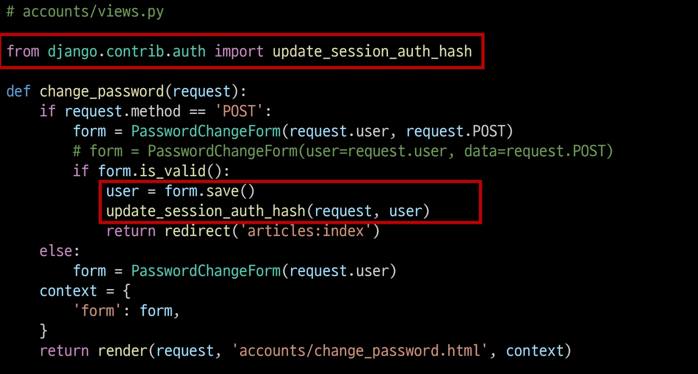
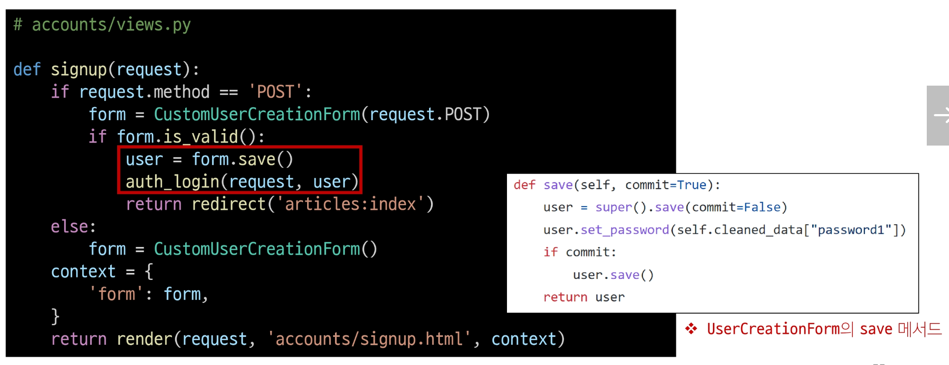

## 회원 가입

### 회원 가입
User 객체를 Create하는 과정

### UserCreationForm()
회원 가입시 사용자 입력 데이터를 받는 built-in ModelForm

### 회원 가입 로직 작성
```python
def signup(request):
    if request.method == 'POST':
        form = UserCreationForm(request.POST)
        if form.is_valid():
            form.save()
            return redirect('articles:index')
    else:
        form = UserCreationForm()
    context = {
        'form': form,
    }
    return render(request, 'accounts/signup.html', context)
```

### 회원 가입 로직 에러
회원가입 진행 후 에러 페이지 확인  
-> Manager isn't available; 'auth.User' has been swapped for 'accounts.User'

- 회원가입에 사용하는 UserCreationForm이 기존 유저 모델로 인해 작성된 클래스이기 때문  
  -> 대체한 유저 모델로 변경 필요

```python
class Meta:
    model = User
    fields = ("username",)
    fields_classes = {"username": UsernameField}
```

### 커스텀 유저 모델을 ㅅ가용하려면 다시 작성해야 하는 Form
- UserCreationForm
- UserChangeForm
- 두 Form 모두 class Meta: model = User가 작성된 Form

```python
from django.contrib.auth import get_user_model
from django.contrib.auth.forms import UserCreationForm, UserChangeForm

class CustomUserCreationForm(UserCreationForm):
    class Meta(UserCreationForm.Meta):
        model = get_user_model()

class CustomUserChangeForm(UserChangeForm):
    class Meta(UserChangeForm.Meta):
        model = get_user_model()
```

### get_user_model()
현재 프로젝트에서 활성화된 사용자 모델(active user model)을 반환하는 함수

### User 모델을 직접 참조하지 않는 이유
- get_user_model()을 사용해 User 모델을 참조하면 커스텀 User 모델을 자동으로 반환해주기 때문
- Django는 필수적으로 User 클래스를 직접 참조하는 대신 get_user_model()을 사용해 참조해야 한다고 강조하고 있음


## 회원 탈퇴

### 회원 탈퇴
User 객체를 Delete 하는 과정

### 회원 탈퇴 로직 작성
```python
def delete(request):
    request.user.delete()
    return redirect('articles:index')
```

## 회원 정보 수정
### 회원정보 수정
User 객체를 Update 하는 과정

### UserChangeForm()
회원정보 수정 시 사용자 입력 데이터를 받는 built-in ModelForm

### 회원정보 수정 페이지 작성
```python
def update(request):
    if request.method == "POST":
        pass
    else:
        form = CustomUserChangeForm(instance=request.user)
    context = {
      'form': form,
    }
    return render(request, 'accounts/update.html', context)
```

### UserChangeForm 사용 시 문제점
- User 모델의 모든 정보들(fields)까지 모두 출력되어 수정이 가능하기 때문에 일반 사용자들이 접근해서는 안되는 정보는 출력하지 않도록 해야 함
- CustomUserChangeForm에서 접근 가능한 필드를 다시 조정

### CustomUserChangeForm 출력 필드 재정의
- User Model의 필드 목록 확인

```python
class CustomUserChangeForm(UserChangeForm):
    class Meta(UserChangeForm.Meta):
        model = get_user_model()
        fields = ('first_name', 'last_name', 'email',)
```

### 회원정보 수정 로직 작성
```python
def update(request):
    if request.method == "POST":
      form = CustomUserChangeForm(request.POST, instance=request.user)
      if form.is_valid():
          form.save()
          return redirect('articles:index')

    else:
        form = CustomUserChangeForm(instance=request.user)
    context = {
      'form': form,
    }
    return render(request, 'accounts/update.html', context)
```

## 비밀번호 변경
### 비밀번호 변경
인증된 사용자의 Session 데이터를 Update 하는 과정

### PasswordChangeForm()
비밀번호 변경 시 사용자 입력 데이터를 받는 built-in Form

### 비밀번호 변경 로직 작성

```python
def change_password(request, user_pk):
    if request.method == 'POST':
        form = PasswordChangeForm(request.user, request.POST)
        if form.is_valid():
            form.save()
            return redirect('articles:index')
    else:
        form = PasswordChangeForm(request.user)
    context = {
      'form': form,
    }
    return render(request, 'accounts/change_password.html', context)
```

## 세션 무효화 방지하기
### 암호 변경 시 세션 무효화
- 비밀번호가 변경되면 기존 세션과의 회원 인증 정보가 일치하지 않게 되어 버려 로그인 상태가 유지되지 못하고 로그아웃 처리됨
- 비밀번호가 변경되면서 기존 세션과의 회원 인증 정보가 일치하지 않기 때문

### update_session_auth_hash(request, user)
암호 변경 시 세션 무효화를 막아주는 함수  
-> 암호가 변경되면 새로운 password의 Session Data로 기존 session을 자동으로 갱신  



## 인증된 사용자에 대한 접근 제한

### 로그인 사용자에 대해 접근을 제한하는 2가지 방법
1. is_authenticated 속성 (attribute)
2. login_required 데코레이터 (decorator)

### is_authenticated
사용자가 인증 되었는지 여부를 알 수 있는 User model의 속성  
-> 모든 User 인스턴스에 대해 항상 True인 `읽기 전용 속성`이며, 비인증 사용자에 대해서는 항상 False

### login_required
인증된 사용자에 대해서만 view 함수를 실행시키는 데코레이터  
-> 비인증 사용자의 경우 /accounts/login/ 주소로 redirect 시킴

## 참고
### 회원가입 후 로그인까지 이어서 진행하려면?


### 탈퇴와 함께 기존 사용자의 Session Data 삭제 방법
- 사용자 객체 삭제 이후 로그아웃 함수 호출
- 단, 탈퇴 후 로그아웃의 순서가 바뀌면 안됨
- 먼저 로그아웃이 진행되면 해당 요청 객체 정보가 없어지기 때문에 탈퇴에 필요한 유저 정보 또한 없어지기 때문