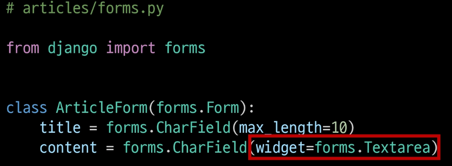

# Form

### HTML 'form'
지금까지 사용자로부터 데이터를 받기위해 활용한 방법  
그러나 비정상적 혹은 악의적인 요청을 필터링 할 수 없음    
-> 유효한 데이터인지에 대한 확인이 필요

### 유효성 검사
수집한 데이터가 정확하고 유효한지 확인하는 과정

### 유효성 검사 구현
- 유효성 검사를 구현하기 위해서는 입력 값, 형식, 중복, 범위, 보안 등 많은 것들을 고려해야 함
- 이런 과정과 기능을 직접 개발하는 것이 아닌 Django가 제공하는 Form을 사용

## Form Class

### Django Form
사용자 입력 데이터를 수집하고, 처리 및 유효성 검사를 수행하기 위한 도구  
-> 유효성 검사를 단순화하고 자동화 할 수 있는 기능을 제공

### Form class 정의
```python
from Django import forms
```

- Form class를 적용했을 때 form 변수는 `{{form}}` 으로 사용
- label, input 쌍을 특정 HTML 태그로 감싸는 옵션은 `{{form.as_p}}`

## Widgets
HTML 'input' element의 '표현'을 담당

### Widget 사용
- Widget은 단순히 input 요소의 속성 및 출력되는 부분을 변경하는 것  


## Django ModelForm

### Form
- 사용자 입력 데이터를 DB에 저장하지 않을 때
- ex) 로그인

### ModelForm
- 사용자 입력 데이터를 DB에 저장해야 할 때
- ex) 게시글 작성, 회원가입 
- Model과 연결된 Form을 자동으로 생성해주는 기능을 제공
- Form + Model

### ModelForm class 정의
```python
from django import forms
from .models import Article

class ArticleForm(forms.ModelForm):
    class Meta:
        model = Article
        fields = '__all__'
```

### Meta class
ModelForm의 정보를 작성하는 곳

### 'fields' 및 'exclude' 속성
exclude 속성을 사용하여 모델에서 포함하지 않을 필드를 지정할 수도 있음

### is_valid()
여러 유효성 검사를 실행하고, 데이터가 유효한지 여부를 Boolean으로 반환

### 공백 데이터가 유효하지 않은 이유와 에러메시지가 출력되는 과정
- 별도로 명시하지 않았지만 모델 필드에는 기본적으로 빈 값은 허용하지 않는 제약조건이 설정되어있음
- 빈 값은 is_valid()에 의해 False로 평가되고 form 객체에는 그에 맞는 에러 메시지가 포함되어 다음 코드로 진행됨

### save()
데이터베이스 객체를 만들고 저장

### save() 메서드가 생성과 수정을 구분하는 법
키워드 인자 instance 여부를 통해 생성할 지, 수정할 지를 결정

### Django Form 정리
사용자로부터 데이터를 수집하고 처리하기 위한 강력하고 유연한 도구  
HTML form의 생성,데이터 유효성 검사 및 처리를 쉽게 할 수 있도록 도움

## Handling HTTP requests
### view 함수 구조 변화
- new & create view 함수간 공톰점과 차이점
    - 공통점: 데이터 생성을 구현하기 위함
    - 차이점: new는 GET method 요청만을, create는 POST method 요청만을 처리

### HTTP request method 차이점을 활용해 동일한 목적을 가지는 2개의 view 함수를 하나로 구조화

