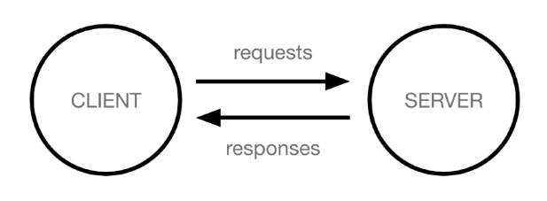
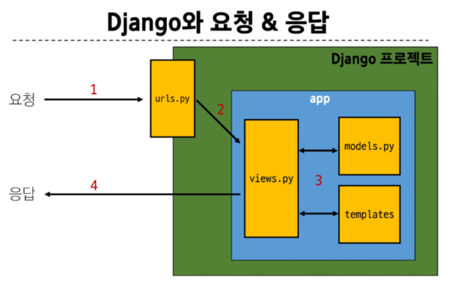

# Django 01

### Web Application (web service) 개발
- 인터넷을 통해 사용자에게 제공되는 소프트웨어 프로그램을 구축하는 과정
- 다양한 디바이스(모바일, 태블릿, PC 등)에서 웹 브라우저를 통해 접근하고 사용할 수 있음

## 클라이언트와 서버
### 웹의 동작 방식
우리가 컴퓨터 혹은 모바일 기기로 웹 페이지를 보게 될 때까지 무슨 일이 일어날까?

### 클라이언트-서버 구조


### Client
서비스를 요청하는 주체  
(웹 사용자의 인터넷이 연결된 장치, 웹 브라우저)

### Server
클라이언트의 요청에 응답하는 주체  
(웹 페이지, 앱을 저장하는 컴퓨터)

## Frontend & Backend

### 웹 개발에서의 Frontend와 Backend
- Frontend(프론트엔드)
    - 사용자 인터페이스(UI)를 구성하고, 사용자가 애플리케이션과 상호작용할 수 있도록 함  
        -> HTML, CSS JavaScript, 프론트엔드 프레임워크 등
      
- Backend(백엔드)
    - 서버 측에서 동작하며, 클라이언트의 요청에 대한 처리와 데이터베이스와의 상호작용 등을 담당  
        -> 서버 언어(Python, Java 등) 및 백엔드 프레임워크, 데이터베이스, API, 보안 등
      
## Framework

### 웹 서비스 개발에는 무엇이 필요할까?
- 로그인, 로그아웃, 회원관리, 데이터베이스, 보안 등 너무 많은 기술들이 필요
- 하나부터 열까지 개발자가 모두 작성하는 것은 현실적으로 어려움
- 하지만 모든 걸 직접 만들 필요가 없음
- 잘 만들어진 것들을 가져와 좋은 환경에서 내 것으로 잘 사용하는 것도 능력인 시대

### Web Framework
웹 애플리케이션을 빠르게 개발할 수 있도록 도와주는 도구  
(개발에 필요한 기본 구조, 규칙, 라이브러리 등을 제공)

## Django framework
### django
Python 기반의 대표적인 웹 프레임워크

### 왜 Django를 사용할까?
- 다양성
    - Python 기반으로 소셜 미디어 및 빅데이터 관리 등 광범위한 서비스 개발에 적합
    
- 확장성
    - 대량의 데이터에 대해 빠르고 유연하게 확장할 수 있는 기능을 제공
    
- 보안
    - 취약점으로부터 보호하는 보안 기능이 기본적으로 내장되어 있음
    
- 커뮤니티 지원
    - 개발자를 위한 지원, 문서 및 업데이트를 제공하는 활성화 된 커뮤니티
    
## 가상 환경
### 가상 환경
Python 애플리케이션과 그에 따른 패키지들을 격리하여 관리할 수 있는 `독립적인` 실행 환경

1. 가상환경 venv 생성
```ssh
$ python -m venv venv
```
2. 가상환경 활성화
```ssh
$ source venv/Scripts/activate
```
3. 환경에 설치된 패키지 목록 확인
```ssh
$ pip list
```

### 패키지 목록이 필요한 이유
- 만약 2명(A와 B)의 가발자가 하나의 프로젝트를 함께 개발한다고 하자.
- 팀원 A가 먼저 가상 환경을 생성 후 프로젝트를 설정하고 관련된 패키지를 설치하고 개발하다가 협업을 위해 github에 프로젝트를 push 한다.
- 팀원 B는 해당 프로젝트를 clone 받고 실행해보려 하지만 실행되지 않는다.
- 팀원 A가 이 프로젝트를 위해 어떤 패키지를 설치했고, 어떤 버전을 설치했는지 A의 가상 환경 상황을 알 수 없다.
- 가상 환경에 대한 정보 즉 패키지 목록이 공유되어야 한다.

### 의존성 패키지
- 한 소프트웨어 패키지가 다른 패키지의 기능이나 코드를 사용하기 때문에 그 패키지가 존재해야만 제대로 작동하는 관계
- 사용하려는 패키지가 설치되지 않았거나, 호환되는 버전이 아니면 오류가 발생하거나 예상치 못한 동작을 보일 수 있음

4. 의존성 패키지 목록 생성
```shell
$ pip freeze > requirements.txt
```

### 의존성 패키지 관리의 중요성
개발 환경에서는 각각의 프로젝트가 사용하는 패키지와 그 버전을 정확히 관리하는 것이 중요  
-> 가상환경 & 의존성 패키지 관리

## Django 프로젝트
### Django 프로젝트 생성 전 루틴
```ssh
# 1. 가상환경(venv) 생성
$ python -m venv venv

# 2. 가상환경 활성화
$ source venv/Scripts/activate

# 3. Django 설치
$ pip install django

# 4. 의존성 파일 생성
$ pip freeze > requirements.txt
```

### Django 프로젝트 생성
```ssh
$ django-admin startproject firstpjt .
# firstpjt라는 이름의 프로젝트를 생성
```

### Django 서버 실행
```ssh
$ python manage.py runserver
# manage.py와 동일한 경로에서 진행
```

### 서버 확인
http://127.0.0.1:8000/ 접속 후 확인

### Django 프로젝트 생성 루틴 정리 + git
1. 가상 환경 생성
2. 가상 환경 활성화
3. Django 설치
4. 의존성 파일 생성(패키지 설치시마다 진행)
5. .gitignore 파일 생성(첫 add 전)
6. git 저장소 생성
7. Django 프로젝트 생성

### 가상 환경을 사용하는 이유
- 의존성 관리
    - 라이브러리 및 패키지를 각 프로젝트마다 독립적으로 사용 가능
    
- 팀 프로젝트 협업
    - 모든 팀원이 동일한 환경과 의존성 위에서 작업하여 버전간 충돌을 방지
    
## Django Design Pattern
### 디자인 패턴
소프트웨어 설계에서 발생하는 문제를 해결하기 위한 일반적인 해결책  
(공통적인 문제를 해결하는 데 쓰이는 형식화 된 관행)  
-> "애플리케이션의 구조는 이렇게 구성하자" 라는 관행

### MVC 디자인 패턴(Model, View, Controller)
애플리케이션을 구조화하는 대표적인 패턴  
("데이터" & "사용자 인터페이스" & "비즈니스 로직"을 분리)  
-> 시각적 요소와 뒤에서 실행되는 로직을 서로 영향 없이, 독립적이고 쉽게 유지 보수할 수 있는 애플리케이션을 만들기 위해

### MTV 디자인 패턴(Model, Template, View)
Django에서 애플리케이션을 구조화하는 패턴  
(기존 MVC 패턴과 동일하나 단순히 명칭을 다르게 정의한 것)  
- View  -> Template
- Controller -> View  
-> 단순한 명칭 변경
  
### Django project
애플리케이션의 집합  
(DB 설정, URL 연결, 전체 앱 설정 등을 처리)

### Django application
독립적으로 작동하는 기능 단위 모듈  
(각자 특정한 기능을 담당하며 다른 앱들과 함께 하나의 프로젝트를 구성)

### 만약 온라인 커뮤니티 카페를 만든다면
- 프로젝트: 카페(전체 설정 담당)
- 앱: 게시글, 댓글, 회원 관리 등(Db, 인증, 화면)

### 앱을 사용하기 위한 순서
1. 앱 생성
   - 앱의 이름은 '복수형'으로 지정하는 것을 권장  
       ```
       $ python manage.py startapp articles
       ```
2. 앱 등록
    - 반드시 앱을 생성한 후에 등록해야 함
    - 프로젝트 폴더의 settings.py에 Installed_apps의 첫번째에 앱 이름을 넣어줌
    
### 프로젝트 구조
- seetings.py
    - 프로젝트의 모든 설정을 관리
- urls.py
    - 요청 들어오는 URL에 따라 이에 해당하는 적절한 views를 연결
    
- __init__.py
    - 해당 폴더를 패키지로 인식하도록 설정하는 파일
- asgi.py
    - 비동기식 웹 서버와의 연결 관련 설정

-> 3, 4 수업 과정에서 수정할 일 없음
      
- wsgi.py
    - 웹 서버와의 연결 관련 설정
- manage.py
    - Django 프로젝트와 다양한 방법으로 상호작용 하는 커맨드라인 유틸리티  

-> 5, 6 수업 과정에서 수정할 일 없음
      
### 앱 구조
- admin.py
    - 관리자용 페이지 설정
- models.py
    - DB와 관련된 Model을 정의
    - MTV 패턴의 M
- views.py
    - HTTP 요청을 처리하고 해당 요청에 대한 응답을 반환(url, model, template과 연계)
    - MTV 패턴의 V  

-> 이 세 개 중요    
      
- apps.py
    - 앱의 정보가 작성된 곳
- tests.py
    - 프로젝트 테스트 코드를 작성하는 곳  

-> 수업 과정에서 수정할 일 없음

## 요청과 응답
### Django와 요청 & 응답


### URLs
- url 경로는 반드시 `/` 로 끝나야 함
- from articles import views → articles 패키지에서 views 모듈을 가져오는 것
- urls.py는 요청 들어오는 ulr에 따라 적절한 view를 연결해주는 역할

### View
- 특정 경로에 있는 template과 request 객체를 결합해 응답 객체를 반환하는 index view 함수 정의
- 모든 view 함수는 첫번째 인자로 request 요청 객체를 필수적으로 받음
- 매개변수 이름이 request가 아니어도 되지만 그렇게 작성하지 않음

### Template
- 앱 폴더 안에 templates 폴더 생성
- 폴더명은 반드시 templates여야 하며 개발자가 직접 생성해야함
- html 파일을 가지고 있음
- django에서 template을 인식하는 경로는 app폴더 / templates /가 기본임
- 그래서 view함수에서 template 경로 작성 시 이 시점 이후의 경로를 작성해야 함

따라서 데이터 흐름은 URLs -> View -> Template

### MTV 디자인 패턴 정리
- Model
  - 데이터와 관련된 로직을 관리
  - 응용프로그램의 데이터 구조를 정의하고 데이터베이스의 기록을 관리
  
- Template
  - 레이아웃과 화면을 처리
  - 화면 상의 사용자 인터페이스 구조와 레이아웃을 정의

- View
  - Model & Template과 관련한 로직을 처리해서 응답을 반환
  - 클라이언트의 요청에 대해 처리를 분기하는 역할

- View 예시
  - 데이터가 필요하다면 model에 접근해서 데이터를 가져오고,
  - 가져온 데이터를 template으로 보내 화면을 구성하고,
  - 구성된 화면을 응답으로 만들어 클라이언트에게 반환

### render
- 주이진 템플릿을 주어진 컨텍스트 데이터와 결합하고 렌더링 된 텍스트와 함께 HttpResponse 응답 객체를 반환하는 함수

1. request
   - 응답을 생성하는데 사용되는 요청 객체
   
2. template_name
   - 템플릿 이름의 경로

3. context
   - 템플릿에서 사용할 데이터(딕셔너리 타입으로 작성)

```python
return render(request, template_name, context)
```

### 지금까지 나온 Django의 규칙
1. urls.py에서 각 url경로는 반드시 `/`로 끝남
2. views.py에서 모든 view 함수는 첫번째 인자로 요청 객체를 받음
   - 매개변수 이름은 반드시 request로 지정
3. Django는 정해진 경로에 있는 template 파일만 읽어올 수 있음
   - app폴더/templates/ 이후