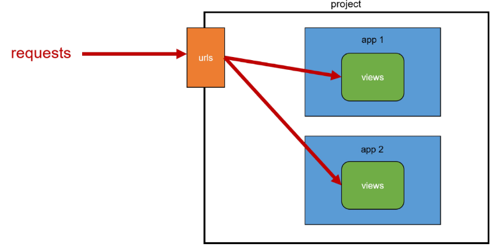

# Django 03

## Django URLs
### 요청과 응답에서 Django URLs의 역할



### URL dispatcher
URL 패턴을 정의하고 해당 패턴이 일치하는 요청을 처리할 view 함수를 연결(매핑)

## App과 URL

### App URL mapping
각 앱에 URL을 정의하는 것  
-> 프로젝트와 각 앱이 URL을 나누어 관리를 편하게 하기 위함

### 앱 2개 생성 후 발생할 수 있는 문제
- view 함수 이름이 같거나 같은 패턴의 URL 주소를 사용하게 되는 경우
- 아래 코드와 같이 해결해 볼 수 있으나 더 좋은 방법이 필요  

  
-> 이렇게 하느니 URL을 각자 app에서 관리하자!

### 그래서 변경된 url 구조


### include()
프로젝트 내부 앱들의 URL을 참조할 수 있도록 매핑하는 함수  
-> URL의 일치하는 부분까지 잘라내고, 남은 문자열 부분은 후속 처리를 위해 include된 URL로 전달

### include 적용
변경된 프로젝트의 urls.py
```python
from django.urls import path, include

urlpatterns = [
    path('admin/', admin.site.urls),
    path('articles/', include('articles.urls')),
    path('pages/', include('pages.urls')),
]
```

## URL 이름 지정
### url 구조 변경에 따른 문제점
- 기존 'articles/' 주소가 'articles/index/'로 변경됨에 따라 해당 주소를 사용하는 모든 위치를 찾아가 변경해야 함  
-> URL에 이름을 지어주면 이름만 기억하면 되지 않을까?
  


### Naming URL patterns
URL에 이름을 지정하는 것(path 함수의 name 인자를 정의해서 사용)

### URL 표기 변화
a 태그의 href 속성 값 뿐만 아니라 form의 action 속성처럼 url을 작성하는 모든 위치에서 변경


### 'url' tag
```python

```
주어진 URL 패턴의 이름과 일치하는 절대 경로 주소를 반환

### URL 이름 지정 후 남은 문제
- articles 앱의 url 이름과 pages 앱의 url 이름이 같은 상황
- 단순히 이름만으로는 완벽하게 분리할 수 없음  
-> 이름에 성(key)을 붙이자
  
### 'app_name' 속성 지정
app_name 변수 값 설정


### URL tag의 최종 변화
마지막으로 url 태그가 사용하는 모든 곳의 표기 변경하기


## Model
### Model을 통한 DB 관리


### Django Model
DB의 테이블을 정의하고 데이터를 조작할 수 있는 기능들을 제공  
-> 테이블 구조를 설계하는 '청사진(blueprint)'

1. 필드 이름
2. 필드 데이터 타입
3. (선택) 필드의 제약 조건 -> 우리 커뮤니티 게시글의 제목은 최대 10자까지만 작성 가능하도록 설정

### 제약 조건
데이터가 올바르게 저장되고 관리하도록 하기 위한 규칙

## Migrations
### Migrations
model 클래스의 변경사항(필드 생성, 수정 삭제 등)을 DB에 최종 반영하는 방법
