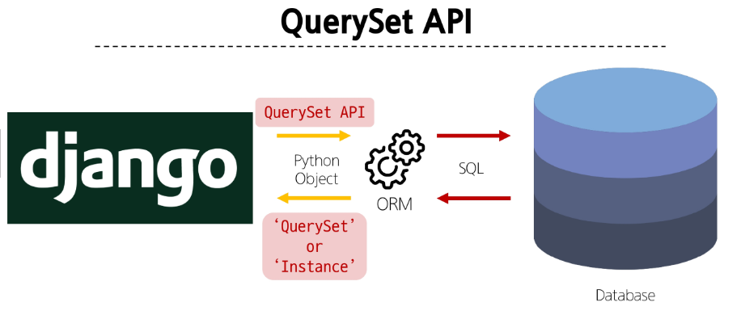
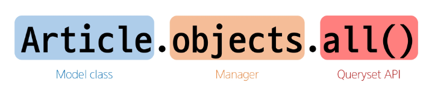

# ORM

### ORM(Object-Relational-Mapping)
객체 지향 프로그래밍 언어를 사용하여 호환되지 않는 유형의 시스템 간에 데이터를 변환하는 기술  
-> 데이터베이스를 다루기 위해 배움

### ORM의 역할
사용하는 언어가 다르기 때문에 소통 불가 -> Django에 내장된 ORM이 중간에서 이를 해석

## QuerySet API
ORM에서 데이터를 검색, 필터링, 정렬 및 그룹화 하는 데 사용하는 도구  
-> API를 사용하여 SQL이 아닌 Python 코드로 데이터를 처리


ORM을 통해 QuerySet 또는 Instance가 오는데 여러 개의 데이터가 반환될 때 QuerySet

### QuerySet Api 구문


### Query
- 데이터베이스에 특정한 데이터를 보여 달라는 요청
- "쿼리문을 작성한다"  
    - 원하는 데이터를 얻기 위해 데이터베이스에 요청을 보낼 코드를 작성한다.
    
- 파이썬으로 작성한 코드가 ORM에 의해 SQL로 변환되어 데이터베이스에 전달되며, 데이터베이스의 응답 데이터를 ORM이 QuerySet이라는 자료 형태로 변환하여 우리에게 전달

### QuerySet
- 데이터베이스에게서 전달 받은 객체 목록(데이터 모음)  
    - 순회가 가능한 데이터로써 1개 이상의 데이터를 불러와 사용할 수 있음
    
- Django ORM을 통해 만들어진 자료형
- 단, 데이터베이스가 단일한 객체를 반환할 때는 QuerySet이 아닌 모델(Class)의 인스턴스로 반환됨

### QuerySet API는 python의 모델 클래스와 인스턴스를 활용해 DB에 데이터를 저장, 조회, 수정, 삭제하는 것(CRUD)

### Django shell
Django 환경 안에서 실행되는 python shell(입력하는 QuerySet API 구문이 Django 프로젝트에 영향을 미침)

### Django shell 실행
```shell
$ python manage.py shell_plus
```

## Create
### 데이터 객체를 만드는(생성하는) 3가지 방법
1. 첫번째 방법
```shell
article = Article()
#article (조회)

article.title = 'first' # 인스턴스 변수(title)에 값을 할당
article.content = 'django!' # 인스턴스 변수(content)에 값을 할당

article.save() # save를 호출하고 확인하면 저장된 것을 확인할 수 있다.

# 조회
article
article.id
article.pk
Article.objects.all()
article.created_at
```

2. 두번째 방법
```shell
article = Article(title='second', content='django!')
article.save()
```

3. 세번째 방법
```shell
Article.objects.create(title='third', content='django!')
```

### save()
객체를 데이터베이스에 저장하는 메서드

## Read
### 대표적인 조회 메서드
- Return new QuerySets  
    - all() -> 전체 데이터 조회
    - filter() -> 특정 조건 데이터 조회
    
- Do not return QuerySets  
    - get() -> 단일 데이터 조회
    
### get() 특징
- 객체를 찾을 수 없으면 DoesNotExist 예외를 발생시키고, 둘 이상의 객체를 찾으면
MultipleObjectsReturned 예외를 발생시킴
  
- 위와 같은 특징을 가지고 있기 때문에 primary key와 같이 고유성(uniqueness)을 보장하는 조회에서 사용해야 함

## Update
### 데이터 수정
인스턴스 변수를 변경 후 save 메서드 호출

```shell
# 수정할 인스턴스 조회
article Article.objects.get(pk=1)

# 인스턴스 변수를 변경
article.titel = 'byebye'

# 저장
article.save()

#정상적으로 변경된 것을 확인
article.title
```

## Delete
### 데이터 삭제
삭제하려는 데이터 조회 후 delete 메서드 호출

```shell
# 삭제할 인스턴스 조회
article = Article.objects.get(pk=1)

# delete 메서드 호출 (삭제 된 객체가 반환)
article.delete()
(1, {'articles.Article' : 1})

# 삭제한 데이터는 더이상 조회할 수 없음
Article.objects.get(pk=1)
DoesNotExist: Article matching query does not exist.
```