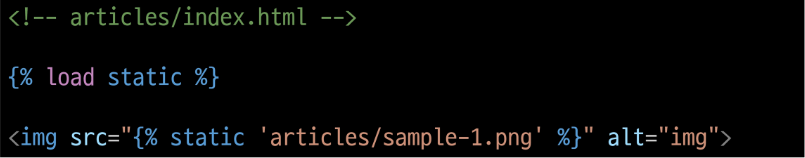
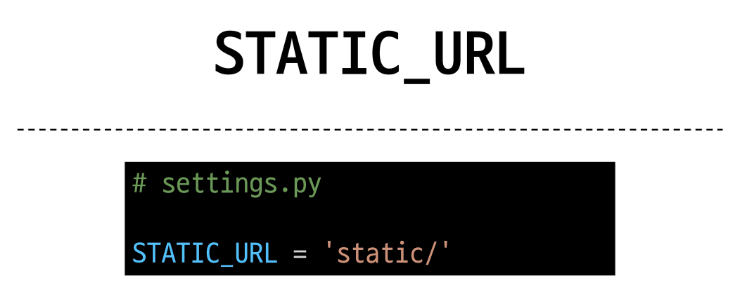
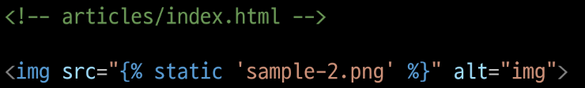
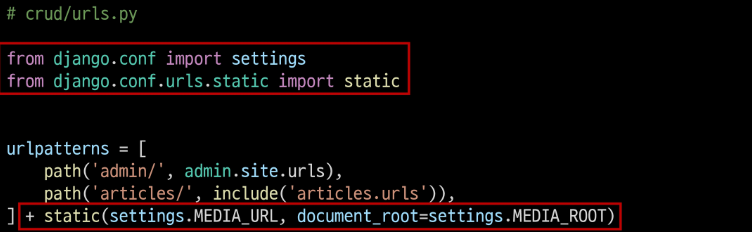
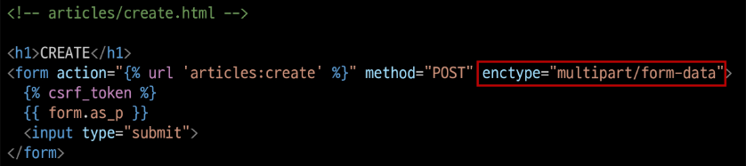
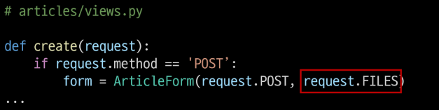
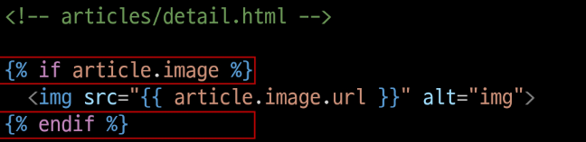
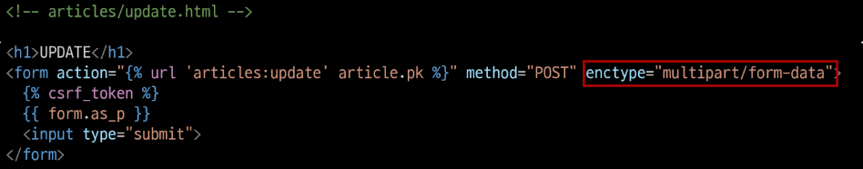
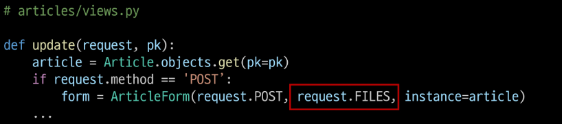

# Static Files (정적 파일)

## Static Files
서버 측에서 변경되지 않고 고정적으로 제공되는 파일(이미지, JS, CSS 파일 등)

### 웹 서버와 정적 파일
- 웹 서버의 기본 동작은 특정 위치(URL)에 있는 자원을 
  요청(HTTP request) 받아서 응답(HTTP response)을 처리하고 제공하는 것
  
- 이는 "자원에 접근 가능한 주소가 있다."라는 의미
- 웹 서버는 요청 받은 URL로 서버에 존재하는 정적 자원을 제공함  
-> 정적 파일을 제공하기 위한 경로(URL)가 있어야 함
  
## Static files 제공하기
1. 기본 경로에서 제공하기
2. 추가 경로에서 제공하기

### Static files 기본 경로
- app폴더/static/
- ex) articles/static/articles/ 경로에 이미지 파일 배치
- static tag를 사용해 이미지 파일에 대한 경로 제공  

  
### STATIC_URL
기본 경로 및 추가 경로에 위치한 정적 파일을 참조하기 위한 URL  
-> 실제 파일이나 디렉토리가 아니며, URL로만 존재  

  


### Static files 추가 경로
STATICFILES_DIRS에 문자열 값으로 추가 경로 설정 - setting.py에

### STATICFILES_DIRS
정적 파일의 기본 경로 외에 추가적인 경로 목록을 정의하는 리스트

### 추가 경로 static file 제공하기
- 임의의 추가 경로 설정  

  
- 추가 경로에 이미지 파일 배치
- static tag를 사용해 이미지 파일에 대한 경로 제공  

  
- 이미지를 제공 받기 위해 요청하는 Request URL 확인 -> 웹페이지 개발자 도구의 Network에서 확인 가능

<b>-> 정적 파일을 제공하려면 요청에 응답하기 위한 URL이 필요</b>


# Media Files
사용자가 웹에서 업로드하는 정적 파일(user-uploaded)

## 이미지 업로드

### ImageField()
이미지 업로드에 사용하는 모델 필드  
-> 이미지 객체가 직접 저장되는 것이 아닌 '이미지 파일의 경로'가 문자열로 DB에 저장

### 미디어 파일 제공을 위한 사전 준비
1. settings.py에 MEDIA_ROOT, MEDIA_URL 설정
2. 작성한 MEDIA_ROOT와 MEDIA_URL에 대한 url 지정

### MEDIA_ROOT
실제 미디어 파일들이 위치하는 디렉토리의 절대 경로
```python
# settings.py
MEDIA_ROOT = BASE_DIR / 'media'
```

### MEDIA_URL
MEDIA_ROOT에서 제공되는 미디어 파일에 대한 주소를 생성(STATIC_URL과 동일한 역할)
```python
# settings.py
MEDIA_URL = 'media/'
```

### MEDIA_ROOT와 MEDIA_URL에 대한 url 지정
- 업로드 된 파일을 제공하는 URL = settings.MEDIA_URL
- 위 URL을 통해 참조하는 파일의 실제 위치 = settings.MEDIA_ROOT  

  
### 이미지 업로드
1. models.py에 image컬럼 추가
- blank-True 속성을 작성해 빈 문자열이 저장될 수 있도록 제약 조건 설정  
-> 게시글 작성 시 이미지 없이 작성할 수 있도록  
  


2. migration 진행
- 진행 후 `pip freeze > requirements.txt` 실행
- ImageField를 사용하려면 반드시 Pillow 라이브러리가 필요. 없으면 에러 뜸

3. form 요소의 enctype 속성 추가  


4. view 함수에서 업로드 파일에 대한 추가 코드 작성

   
### 업로드 이미지 제공하기
- 'url' 속성을 통해 업로드 파일의 경로 값을 얻을 수 잇음
- article.image.url
  - 업로드 파일의 경로
  
- article.image
  - 업로드 파일의 파일 이름
  
  

- 업로드 이미지 출력 확인 및 MEDIA_URL 확인
- 이미지를 업로드하지 않은 게시물은 detail 템플릿을 렌더링 할 수 없음
- 이미지 데이터가 있는 경우만 이미지를 출력할 수 있도록 처리하기



### 업로드 이미지 수정
- 수정 페이지 from 요소에 enctype 속성 추가



- update view 함수에서 업로드 파일에 대한 추가 코드 작성



load static은 extends 아래 위치해야함 (위에 X)
부모에서 로드했다고 자식에서도 로드되는 것이 아님. 안됨