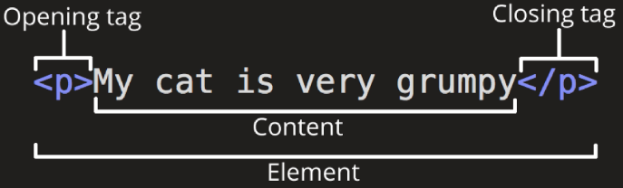
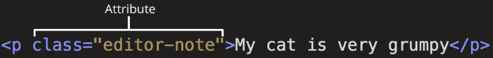

## Web

### World Wide Web
인터넷으로 연결된 컴퓨터들이 정보를 공유하는 거대한 정보 공간

### Web
Web site, Web application 등을 통해 사용자들이 정보를 검색하고 상호 작용하는 기술

### Web site
인터넷에서 여러 개의 Web page가 모인 것으로, 사용자들에게 정보나 서비스를 제공하는 공간

### Web page
HTML, CSS 등의 웹 기술을 이용하여 만들어진, `"Web site"를 구성하는 하나의 요소`

## 웹 구조화

### HTML
HyperText Markup Language 웹 페이지의 의미와 구조를 정의하는 언어

### Hypertext
웹 페이지를 다른 페이지로 연결하는 링크. 참조를 통해 사용자가 한 문서에서 다른 문서로 즉시 접근할 수 있는 텍스트

###  Markup Language
태그 등을 이용하여 문서나 데이터의 구조를 명시하는 언어  
ex) HTML, Markdown

## Structure of HTML

### HTML 구조
- <!DOCTYPE html>
    - 해당 문서가 html로 문서라는 것을 나타냄
    
- <html></html>
    - 전체 페이지의 콘텐츠를 포함
  
- <title></title>
    - 브라우저 탭 및 즐겨찾기 시 표시되는 제목으로 사용
  
- <head></head>
    - HTML 문서에 관련된 설명, 설정 등
    - 사용자에게 보이지 않음
  
- <body></body>
    - 페이지에 표시되는 모든 콘텐츠
  
### HTML Element(요소)

하나의 요소는 여는 태그와 닫는 태그 그리고 그 안의 내용으로 구성됨  
닫는 태그는 태그 이름 앞에 슬래시가 포함되며 닫는 태그가 없는 태그도 존재

### HTML Attributes(속성)

규칙
- 속성은 요소 이름과 속성 사이에 공백이 있어야 함
- 하나 이상의 속성들이 있는 경우엔 속성 사이에 공백으로 구분함
- 속성 값은 열고 닫는 따옴표로 감싸야 함  

목적
  - 나타내고 싶지 않지만 추가적인 기능, 내용을 담고 싶을 때 사용
  - CSS에서 해당 요소를 선택하기 위한 값으로 활용됨

### HTML Text structure
HTML의 주요 목적 중 하나는 텍스트 구조와 의미를 제공하는 것

### 대표적인 HTML Text structure
- Heading & Paragraphs
  - h1~6, p
  
- Lists
  - ol, ul, li
  
Emphasis & Importance
  - em, strong

## 웹 스타일링
### CSS
Cascading Style Sheet  
웹 페이지의 디자인과 레이아웃을 구성하는 언어

### CSS 적용 방법
1. 인라인 스타일
   - HTML 요소 안에 style 속성 값으로 작성
2. 내부 스타일 시트
   - head 태그 안에 style 태그에 작성
3. 외부 스타일 시트
    - 별도의 CSS 파일 생성 후 HTML link 태그를 사용해 불러오기
  
### CSS Selectors
HTML 요소를 선택하여 스타일을 적용할 수 있도록 하는 선택자

### CSS Selectors 종류
- 기본 선택자
  - 전체("*") 선택자
  - 요소(tag) 선택자
  - 클래스(class) 선택자
  - 아이디(id) 선택자
  - 속성(attr) 선택자 등
  
- 결합자(Combinators)
  - 자손 결합자(" "(space))
  - 자식 결합자(">")
  
### CSS Selectors 특징
- 전체 선택자 (*)
  - HTML 모든 요소를 선택
  
- 요소 선택자
  - 지정한 모든 태그를 선택
  
- 클래스 선택자 ('.'(dot))
  - 주어진 클래스 속성을 가진 모든 요소를 선택
  
- 아이디 선택자 ('#')
  - 주어진 아이디 속성을 가진 요소 선택
  - 문서에는 주어진 아이디를 가진 요소가 하나만 있어야 함
  
- 자손 결합자(" "(space))
  - 첫 번째 요소의 자손 요소들 선택
  - ex) p span은 
 안에 있는 모든 를 선택(하위 레벨 상관 없이)
  
- 자식 결합자(">")
  - 첫 번째 요소의 직계 자식만 선택
  - ex) ul > li은 <ul> 안에 있는 모든 <li>를 선택(한 단계 아래 자식들만)

### Specificity(명시도)
결과적으로 요소에 적용할 CSS 선언을 결정하기 위한 알고리즘  
- CSS Selector에 가중치를 계산하여 어떤 스타일을 적용할지 결정
- 동일한 요소를 가리키는 2개 이상의 CSS 규칙이 있는 경우 가장 높은 명시도를 가진 Selector가 승리하여 스타일이 적용됨

### Cascade(계단식)
한 요소에 동일한 가중치를 가진 선택자가 적용될 때 CSS에서 마지막에 나오는 선언이 사용됨 -> 동일한 가중치일 때 순서 중요  
클래스 내부 순서는 상관 없고 위의 <style>에서의 순서가 중요함

### 명시도가 높은 순
1. Importance
  - !important
2. Inline 스타일
3. 선택자
  - id 선택자 > class 선택자 > 요소 선택자
4. 소스 코드 선언 순서

### !important
다른 우선순위 규칙보다 우선하여 적용하는 키워드  
-> Cascade의 구조를 무시하고 강제로 스타일을 적용하는 방식이므로 사용을 권장하지 않음

### 속성은 되도록 'class'만 사용할 것
- id, 요소 선택자 등 여러 선택자들과 함께 사용할 경우 우선순위 규칙에 따라 예기치 못한 스타일 규칙이 적용되어 전반적인 유지보수가 어려워지기 때문
- 문서에서 단 한번 유일하게 적용될 스타일에 경우에만 "id 선택자" 사용을 고려

### CSS 상속
기본적으로 CSS는 상속을 통해 부모 요소의 속성을 자식에게 상속해 재사용성을 높임

- 상속 되는 속성
  - Text 관련 요소(font, color, text-align), opacity, visibility 등
  
- 상속 되지 않는 속성
  - Box model 관련 요소(width, height, border, box-sizing ...)  
    position 관련 요소(position, top/right/bottom/left,z-index) 등