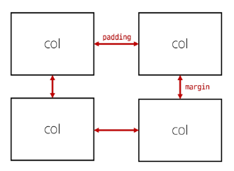

## Bootstrap Grid system
### Bootstrap Grid system
웹 페이지의 레이아웃을 조정하는 데 사용되는 12개의 컬럼으로 구성된 시스템

### Grid system 목적
반응형 디자인을 지원해 웹 페이지를 모바일, 태블릿, 데스크탑 등 다양한 기기에서 적절하게 표시할 수 있도록 도움

### 반응형 웹 디자인
디바이스 종류나 화면 크기에 상관없이, 어디서든 일관된 레이아웃 및 사용자 경험을 제공하는 디자인 기술

## Grid system 구조
### Grid system 기본 요소
1. Container
    - Column들을 담고 있는 공간
    
2. Column
    - 실제 컨텐츠를 포함하는 부분
    
3. Gutter
    - 컬럼과 컬럼 사이읭 여백 영역
    
1개의 row 안에 12개의 column 영역이 구성  
-> 각 요소는 12개 중 몇 개를 차지할 것인지 지정됨

- 기본
- 중첩(Nesting)
- 상쇄(Offset)
- Gutters  
Gird system에서 column 사이에 여백 영역  
x축은 padding, y축은 margin으로 여백 생성
  

### The Grid System
- CSS가 아닌 편집 디자인에서 나온 개념으로 구성 요소를 잘 배치해서 시각적으로 좋은 결과물을 만들기 위함
- 기본적으로 안쪽에 있는 요소들의 오와 열을 맞추는 것에서 기인
- 정보 구조와 배열을 체계적으로 작성하여 정보의 질서를 부여하는 시스템

### Responsive Web Design
디바이스 종류나 화면 크기에 상관없이, 어디서든 일관된 레이아웃 및 사용자 경험을 제공하는 디자인 기술  
Bootstrap grid system에서는 12개 column과 6개 breakpoints를 사용하여 반응형 웹 디자인을 구현

## Grid system Breakpoints
### Grid system breakpoints
웹 페이지를 다양한 화면 크기에서 적절하게 배치하기 위한 분기점  
-> 화면 너비에 따라 6개의 분기점 제공(xs, sm, md, lg, xl, xxl)

