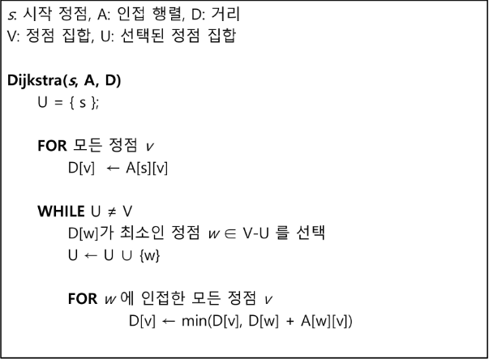

# 다익스트라
## 최단 경로
- 최단 경로 정의
    - 간선의 가중치가 있는 그래프에서 두 정점 사이의 경로들 중에 간선의 가중치의 합이 최소인 경로
    
- 하나의 시작 정점에서 끝 정점까지의 최단경로
    - 다익스트라(dijkstra) 알고리즘
        - 음의 가중치를 허용하지 않음
    - 벨만-포드(Bellman-Ford) 알고리즘
        - 음의 가중치 허용
    
- 모든 정점들에 대한 최단 경로
    - 플로이드-워샬(Floyd-Warshall) 알고리즘
    
## 다익스트라 알고리즘
- 시작 정점에서 거리가 최소인 정점을 선택해 나가면서 최단 경로를 구하는 방식
- 시작정점(s)에서 끝정점(t) 까지의 최단 경로에 정점 x가 존재한다.
- 이 때, 최단경로는 s에서 x까지의 최단 경로와 x에서 t까지의 최단경로 구성도니다.
- 탐욕 기법을 사용한 알고리즘으로 MST의 프림 알고리즘과 유사하다.

