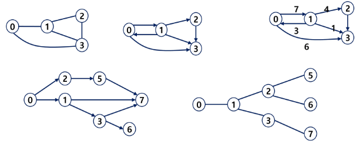

# 그래프

### 그래프
- 그래프는 아이템(사물 또는 추상적 개념)들과 이들 사이의 연결 관계를 표현한다.
- 그래프는 정점(Vertex)들의 집합과 이들을 연결하는 간선(Edge)들의 집합으로 구성된 자료구조
    - |V|: 정점의 개수, |E|: 그래프에 포함된 간선의 개서
    - |V|개의 정점을 가지는 그래프는 최대 |V| (|V| - 1)/2 간선이 가능
    
- 선형 자료구조나 트리 자료구조로 표현하기 어려운 N : N 관계를 가지는 원소들을 표현하기에 용이

### 그래프 유형
- 무향 그래프(Undirected Graph)
- 유향 그래프(Directed Graph)
- 가중치 그래프(Weighted Graph)
- 사이클 없는 방향 그래프(DAG, Directed Acyclic Graph)



- 완전 그래프
    - 정점들에 대해 가능한 모든 간선들을 가진 그래프
    
- 부분 그래프
    - 원래 그래프에서 일부의 정점이나 간선을 제외한 그래프
    
### 인접 정점
- 인접(Adjacency)
    - 두 개의 정점에 간선이 존재(연결됨)하면 서로 인접해 있다고 한다.
    - 완전 그래프에 속한 임의의 두 정점들은 모두 인접해 있다.
    
### 그래프 경로
- 경로란 간선들을 순서대로 나열한 것
    - 간선들: (0,2), (2,4) 등등
    - 정점들: 0 - 2 - 4 - 6 등등
    
- 경로 중 한 정점을 최대한 한번만 지나는 경로를 단순경로라 한다.
- 시작한 정점에서 끝나는 경로를 사이클(Cycle)이라고 한다.

### 그래프 표현
- 간선의 정보를 저장하는 방식, 메모리나 성능을 고려해서 결정
- 인접 행렬(Adjacent matrix)
    - |V| x |V|크기의 2차원 배열을 이용해서 간선 정보를 저장
    - 배열의 배열(포인터 배열)
    
- 인접 리스트(Adjacent List)
    - 각 정점마다 해당 정점으로 나가는 간선의 정보를 저장
    
- 간선의 배열
    - 간선(시작 정점, 끝 정점)을 배열에 연속적으로 저장

### 그래프 표현    
```python
# 1. 그래프를 코드로 표현
# - 인접 행렬
#   - V x V 배열을 활용해서 표현
#   - 갈 수 없다면 0, 있다면1(가중치) 을 저장
# - 장점
#   - 노드 간의 연결 정보를 한번에 확인 가능
#   - 간선이 많을수록 유리
# - 단점
#   - 노드 수가 커지면 메모리가 낭비된다.
#       - 연결이 안되는 것도 저장
#       -> 노드 수 + 메모리 제한 반드시 확인할 것
# [2000][2000] 정도면 메모리 터짐

# 특징: 양방향 그래프는
#       중앙 우하단 대각선 기준으로 대칭됨

graph = [
    [0, 1, 0, 1, 0],
    [1, 0, 1, 0, 1],
    [0, 1, 0, 0, 0],
    [1, 0, 0, 0, 1],
    [0, 1, 0, 1, 0],
]

# - 인접 리스트
#   - V 개의 노드가 갈 수 있는 정보만 저장
# - 장점
#   - 메모리 사용량이 적다
#   - 탐색할 때 갈 수 있는 곳만 확인하기 때문에
#     시간적으로 효율
# - 단점
#   - 특정 노드 간 연결 여부를 확인하는 데 시간이 걸린다.
graph = [
    [1, 3],
    [0, 2, 4],
    [1],
    [0, 4],
    [1, 3],
]

```