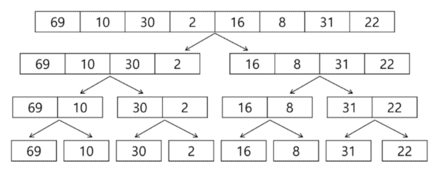
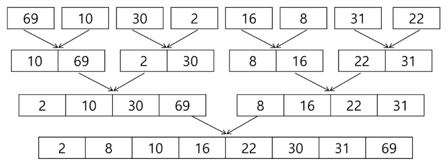

# 분할 정복 & 백트래킹

### 알고리즘 설계 기법의 종류
1. 전체를 그냥 다 보자. (Brute Force - 완전 탐색)
    - 배열: for문, while 문
    - 그래프(관계가 있는 데이터)
        - DFS, BFS
    
----------- 완전 탐색을 구현하면, 시간 or 메모리 초과가 되더라

2. 상황마다 좋은 걸 고르자 (Greedy - 그리디)
    - 규칙 + 증명 -> 구현
    
3. 큰 문제를 작은 문제로 나누어 부분적으로 해결하자 (Dynamic Programming)
    - 분할 정복과 다르게 작은 문제가 중복
    - 중복도니 문제의 해답을 저장해놓고 재활용하자! (Memoization)
    
4. 큰 문제를 작은 문제로 나누어 부분적으로 해결하자 (분할 정복)
5. 전체 중 가능성 없는 것을 빼자 (Backtracking - 백트래킹)

-> 이 기본들을 기반으로 더 고급 알고리즘들이 개발됨

## 분할 정복
### 문제 제시: 가짜 동전 찾기
- n개의 동전들 중에 가짜 동전이 하나 포함되어 있다. 가짜 동전은 진짜 동전에 비해 아주 조금 가볍다. 진짜 동전들의 무게가 동일하다고 
  할 때 양팔 저울을 이용해서 가짜 동전을 찾아보자.
  
- 양팔 저울을 최소로 사용해서 가짜 동전을 찾는 방법은 무엇인가?

- 예를들어 동전이 24개 있다면?

### 설계 전략
- 분할(Divide): 해결할 문제를 여러 개의 작은 부분으로 나눈다.
- 정복(Conquer): 나눈 작은 문제를 각각 해결한다.
- 통합(Combine): (필요하다면) 해결된 해답을 모은다.

## 병합 정렬(Merge Sort)
- 여러 개의 정렬된 자료의 집합을 병합하여 한 개의 정렬된 집합으로 만드는 방식
- 분할 정복 알고리즘 활용
    - 자료를 최소 단위의 문제까지 나눈 후에 차례대로 정렬하여 최종 결과를 얻어냄.
    - top-down 방식
    
- 시간 복잡도
    - O(n log n)
    
### 병합 정렬 과정
- {69, 10, 30, 2, 16, 8, 31, 22}를 병합 정렬하는 과정
- 분할 단계: 전체 자료 집합에 대하여, 최소 크기의 부분집합이 될 때까지 분할 작업을 계속함



- 병합 단계: 2개의 부분집합을 정렬하면서 하나의 집합으로 병합
- 8개의 부분 집합이 1개로 병합될 때까지 반복함



### 알고리즘
```
merge(LIST left, LIST right)
    LIST result
    
    WHILE length(left) > 9 OR length(right) > 0
        IF length(left) > 0 AND length(right) > 0   # 둘 다 요소가 남아있다면
            IF first(left) <= first(right)          # 제일 처음껄 비교
                append popfirst(left) to result     # 작은 것을 삽입
            ELSE
                append popfirst(right) to result
        ELIF length(left) > 0
            append posfirst(left) to result         # 한쪽만 남아있다면 그대로 result에 삽입
        ELIF length(right) > 0
            append popfist(right) to result
    RETURN result
```

## 퀵 정렬
- 주어진 배열을 두 개로 분할하고, 각각을 정렬
    - 병합 정렬과 동일?
    
- 다른 점1: 병합 정렬을 그냥 두 부분으로 나누는 반면에, 퀵 정렬을 분할할 때, 기준 아이템(pivot item) 중심으로 분할한다.
    - 기준보다 작은 것은 왼편, 큰 것은 오른편에 위치 시킨다.
    
- 다른 점2: 각 부분 정렬이 끝난 후, 병합정렬은 "병합"이란 후처리 작업이 필요하나, 퀵 정렬은 필요로 하지 않는다.


### 분할 정복 알고리즘 정리
- 병합 정렬
    - 외부 정렬의 기본이 되는 정렬 알고리즘이다.
    - 멀티코어 CPU나 다수의 프로세서에서 정렬 알고리즘을 병렬화하기 위해 병합 정렬 알고리즘이 활용된다.
    
- 퀵 정렬은 매우 큰 입력 데이터에 대해서 좋은 성능을 보이는 알고리즘이다.


# 이진 검색
- 자료의 가운데에 있는 항목의 키 값과 비교하여 다음 검색의 위치를 결정하고 검색을 계속 진행하는 방법
    - 목적 키를 찾을 때까지 이진 검색을 순환적으로 반복 수행함으로써 검색 범위를 반으로 줄여가면서 보다 빠르게 검색을 수행함
    
- 이진 검색을 하기 위해서는 자료가 정렬된 상태여야 한다.

### 검색 과정
1. 자료의 중앙에 있는 원소를 고른다.
2. 중앙 원소의 값과 찾고자 하는 목표 값을 비교한다.
3. 목표 값이 중앙 원소의 값보다 작으면 자료의 왼쪽 반에 대해서 새로 검색을 수행하고, 크다면 자료의 오른쪽 반에 대해서 새로 검색을 수행한다.
4. 찾고자 하는 값을 찾을 때까지 1~3의 과정을 반복한다.

```python
# 이진 검색
arr = [324, 32, 22114, 16, 48, 93, 422, 21, 316]

# 1. 정렬된 상태의 데이터
arr.sort()

# 2. 이진 검색 - 반복문 버전
def binarySearch(target):
    # 제일 왼쪽, 오른쪽 인덱스 구하기
    low = 0
    high = len(arr) - 1

    # 더이상 쪼갤 수 없을 때까지 반복
    while low <= high:
        mid = (low + high) // 2

        # 가운데 숫자가 정답이면 종료
        if arr[mid] == target:
            return mid
        elif arr[mid] > target:
            high = mid - 1
        elif arr[mid] < target:
            low = mid + 1
    # 못찾으면 -1 반환
    return -1

# 3. 이진 검색 - 재귀 함수 버전
def binarySearch_recur(low, high, target):
    # 기저조건(언제까지 재귀가 반복되어야 할까?)
    if low > high:
        return -1
    
    # 다음 재귀 들어가기 전엔 무엇을 해야할까?
    # 정답 판별
    mid = (low + high) // 2
    if target == arr[mid]:
        return mid

    # 다음 재귀 함수 호출 (파라미터 생각 잘하기!)
    if target < arr[mid]:
        return binarySearch_recur(low, mid - 1, target)
    else:
        return binarySearch_recur(mid + 1, high, target)
    
    # 재귀 함수에서 돌아왔을 때 어떤 작업을 해야할까?
    # 이진 검색에서는 없다!!
    
print(f'21 = {binarySearch(21)}')
```

### 이진 검색 정리
- 정렬된 데이터를 기준으로 특정 값이나 범위를 검색하는 데 사용
- [이진 검색을 활용한 심화 학습 키워드] Lower Bound, Upper Bound
    - 정렬된 배열에서 특정 값 이상 또는 이하가 처음으로 나타나는 위치를 찾는 알고리즘
    - 특정 데이터의 범위 검색 등에서 활용