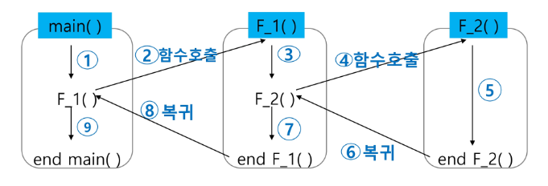
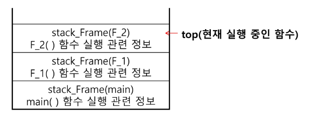
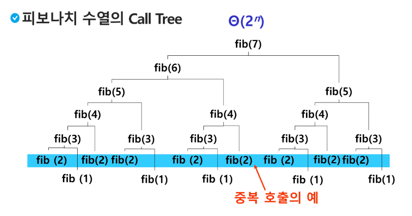
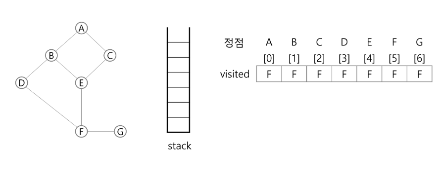

# 스택
## 스택
- 스택(stack)의 특성
    - 물건을 쌓아 올리듯 자료를 쌓아 올린 형태의 자료구조
    - 스택에 저장된 자료는 선형 구조를 가짐
        - 선형구조: 자료 간의 관계가 1대1의 관계를 가짐
        - 비선형구조: 자료 간의 관계가 1대N의 관계를 가짐(예: 트리)
    - 스택에 자료를 삽입하거나 스택에서 자료를 꺼낼 수 있음
    - 마지막에 삽입한 자료를 가장 먼저 꺼냄. 후입선출(LIFO)이라고 불림

- 스택을 프로그램에서 구현하기 위해서 필요한 자료구조와 연산
    - 자료구조: 자료를 선형으로 저장할 저장소
        - 배열을 사용할 수 있음
        - 저장소 자체를 스택이라 부르기도 함
        - 스택에서 마지막 삽입된 원소의 위치를 top이라고 부름
    
    - 연산
        - 삽입: 저장소에 자료를 저장. 보통 push라고 부름
        - 삭제: 저장소에서 자료를 꺼냄. 꺼낸 자료는 삽입한 자료의 역순으로 꺼냄. 보통 pop이라고 부름
        - 스택이 공백인지 아닌지를 확인하는 연산. isEmpty
        - 스택의 top에 있는 item(원소)을 반환하는 연산. peek

### 스택의 구현
```py
def push(item, size):
    global top
    top += 1
    if top == size:
        print('overflow!')
    else:
        stack[top] = item

size = 10
stack = [0] * size
top = -1

push(10, size)
top += 1
stack[top] = 20
```

- 스택의 pop 알고리즘
```py
def pop():
    if len(s) == 0:
        # underflow
        return
    else:
        return s.pop()
```

```py
def pop():
    global top
    if top == -1:
        print('underflow')
        return 0
    else:
        top -= 1
        return stack[top+1]
print(pop())

if top > -1:    # pop()
    top -= 1
    print(stack[top+1])
```

### 스택 구현 고려 사항
- 1차원 배열을 사용하여 구현할 경우 구현이 용이하다는 장점이  있지만 스택의 크기를 변경하기가 어렵다는 단점이 있음
- 이를 해결하기 위한 방법으로 저장소를 동적으로 할당하여 스택을 구현하는 방법이 있음. 동적 연결리스트를 이용하여 구현하는 방법을 의미. 구현이 복잡하다는 단점이 있지만 메모리를 효육적으로 사용한다는 장점을 가짐.

### 스택의 응용2: function call
응용1은 괄호 체크였음.
- Fucntion call
    - 프로그램에서의 함수 호출과 복귀에 따른 수행 순서를 관리
        - 가장 마지막에 호출된 함수가 가장 먼저 실행을 완료하고 복귀하는 후입선출 구조이므로, 후입선출 구조의 스택을 이용하여 수행순서 관리  
          
        - 함수 호출이 발생하면 호출한 함수 수행에 필요한 지역변수, 매개변수 및 수행 후 복귀할 주소 등의 정보를 스택 프레임(stack farame)에 저장하여 시스템 스택에 삽입  
          
        - 함수의 실행이 끝나면 시스템 스택의 top 원소(스택 프레임)를 삭제(pop)하면서 프레임에 저장되어 있던 복귀주소를 확인하고 복귀
        - 함수 호출과 복귀에 따라 이 과정을 반복하여 전체 프로그램 수행이 종료되면 시스템 스택은 공백 스택이 됨


## 재귀호출
- 필요한 함수가 자신과 같은 경우 자신을 다시 호출하는 구조
- 함수에서 실행해야 하는 작업의 특성에 따라 일반적인 호출방식보다 재귀호출방식을 사용하여 함수를 만들면 프로그램의 크기를 줄이고 간단하게 작성

## Memoization
- 피보나치 수를 구하는 함수를 재귀함수로 구현한 알고리즘은 문제점이 있음
- 엄청난 중복 호출이 존재한다는 것  

- 메모이제이션(memoization)은 컴퓨터 프로그램을 실행할 때 이전에 계산한 값을 메모리에 저장해서 매번 다시 계산하지 않도록 하여 전체적인 실행속도를 빠르게 하는 기술. 동적 계획법의 핵심이 되는 기술
- 'memoization'은 글자 그대로 해석하면 '메모리에 넣기(to put in memory)'라는 의미이며 '기억되어야 할 것'이라는 뜻의 라틴어 memorandum에서 파생되었음. 흔히 '기억하기','암기하기'라는 뜻의 memorization과 혼동하지만, 정확한 단어는 memoization임. 동사형은 memoize.
- 피보나치 수를 구하는 알고리즘에서 fibo(n)의 값을 계산하자마자 저장하면(memoize), 실행시간을 Θ(n)으로 줄일 수 있음
- Memoization 방법을 적용한 알고리즘
```py
# memo를 위한 배열을 할당하고, 모드 0으로 초기화
# memo[0]을 0으로 memo[1]는 1로 초기화
def fibo1(n):
    global memo
    if n >= 2 and memo[n] == 0:
        memo[n] = fibo1(n-1) + fibo1(n-2)
    return memo[n]

memo = [0] * (n+1)
memo[0] = 0
memo[1] = 1
```

### 스택의 구현 - 우리반
```py
def push(c):
    global top
    if is_full():
        print('full')
    top += 1
    STACK[top] = c

def pop():
    global top
    if is_empty():
        print('empty-')
        return

    top -= 1 # return 값으로 나가기 전에 top 위치 수정
    return STACK[top+1] # top 위치 수정 전 값이 필요함으로 +1

def peek():
    return STACK[top]

def is_empty():
    if top < 0:
        print('empty')
        return True
    return False

def is_full():
    if top >= SIZE-1:
        print('full')
        return True
    return False
```

### 스택의 구현 - function call (우리반)
```py
def fun2(x):
    x *= 2
    print('func2=>', x)

def fun1(x):
    x += 1
    print('func1=>', x)
    fun2(x)

for i in range(1, 5):
    print('main =>', i)
    fun1(i)
```

## DP(Dynamic Programming)
- 동적 계획(Dynamic Programming) 알고리즘은 그리디 알고리즘과 같이 최적화 문제를 해결하는 알고리즘
- 동적 계획 알고리즘은 먼저 입력 크기가 작은 부분 문제들을 모두 해결한 후에 그 해들을 이용하여 보다 큰 크기의 부분 문제들을 해결하여, 최종적으로 원래 주어진 입력의 문제를 해결하는 알고리즘

- 피보나치 수 DP 적용 알고리즘
```py
def fibo2(n):
    f = [0] * (n + 1)
    f[0] = 0
    f[1] = 1
    for i in range(2, n+1):
        f[i] = f[i-1] + f[i-2]
    
    return f[n]
```

- DP의 구현 방식
    - recursive 방식: 기존 피보나치
    - iterative 방식: 위의 fibo2()

    - memoization을 재귀적 구조에 사용하는 것보다 반복적 구조로 DP를 구현한 것이 성능 면에서 보다 효율적
    - 재귀적 구조는 내부에 시스템 호출 스택을 사용하는 오버헤드가 발생하기 때문

## DFS(깊이우선탐색)
- 비선형구조인 그래프 구조는 그래프로 표현된 모든 자료를 빠짐없이 검색하는 것이 중요
- 두 가지 방법
    - 깊이 우선 탐색(Depth First Search, DFS)
    - 너비 우선 탐색(Breadth First Search, BFS)

- 시작 정점의 한 방향으로 갈 수 있는 경로가 있는 곳까지 깊이 탐색해 가다가 더 이상 갈 곳이 없게 되면, 가장 마지막에 만났던 갈림길 간선이 있는 정점으로 되돌아와서 다른 방향의 정점으로 탐색을 계속 반복하여 결국 모든 정점을 방문하는 순회 방법
- 가장 마지막에 만났던 갈림길의 정점으로 되돌아가서 다시 깊이 우선 탐색을 반복해야 하므로 후입선출 구조의 스택 사용

### 과정
1. 시작 정점 v를 결정하여 방문
2. 정점 v에 인접한 정점 중에서
    1) 방문하지 않은 정점 w가 있으면, 정점 v를 스택에 push하고 정점 w를 방문. 그리고 w를 v로 하여 다시 2를 반복
    2) 방문하지 않은 정점이 없으면, 탐색의 방향을 바꾸기 위해서 스택을 pop하여 받은 가장 마지막 방문 정점을 v로 하여 다시 2를 반복
3. 스택이 공백이 될 때까지 2를 반복.

### DFS 알고리즘
```
visited[], stack[] 초기화
DFS(v)
    시작점 v 방문;
    visited[v] <- true;
    while {
        if(v의 인점 정점 중 방문 안 한 정점 w가 있으면)
            push(v);
            v <- w; (w에 방문)
            visited[w] <- true;
        else
            if (스택이 비어 있지 않으면)
                v <- pop(stack);
            else
                break
    }
end DFS()
```

### DFS 예
- 초기상태: 배열 visited를 False로 초기화하고, 공백 스택을 생성


```py
# 78
# 1 2 1 3 2 4 2 5 4 6 5 6 6 7 3 7
def dfs(i, V):
    visited = [0] * (V + 1)
    st = []
    visited[i] = 1
    print(i)
    while True: # 탐색
        for w in adjl[i]:
            if visited[w]==0:   # 현재 방문한 정점에 인접하고 방문안한 정점 w
                st.append(i)    # push(i), i를 지나서
                i = w           # w에 방문
                visited[i] = 1  # 방문해서 할 일
                print(i)
                break
        else:               # i에 남은 인접 정점이 없으면
            if st:  # 스택이 비어있지 않으면(지나온 정점이 남아 있으면)
                i = st.pop()
            else:   # 스택이 비어있으면(출발점에서 남은 정점이 없으면)
                break

V, E = map(int, input().split())
arr = list(map(int, input().split()))

# 인접리스트
adjl = [[] for _ in range(V+1)] #adjl[i] 행에 i에 인접인 정점번호
for i in range(E):
    n1, n2 = i*2, i*2+1
    adjl[n1].append(n2)
    adjl[n2].append(n1) # 방향이 없는 경우에 추가
dfs(1, V)
```
