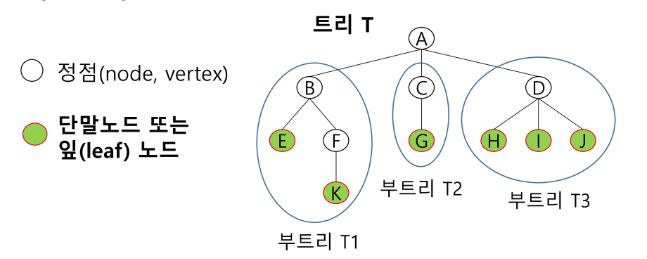
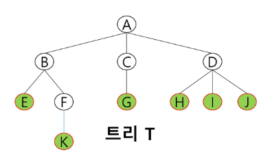
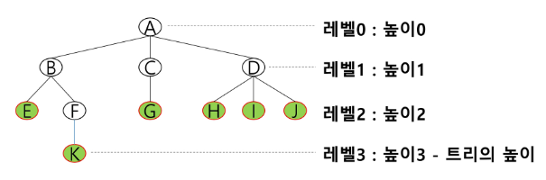
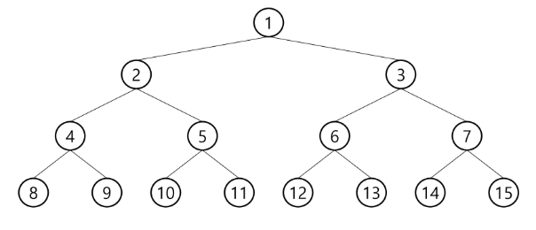
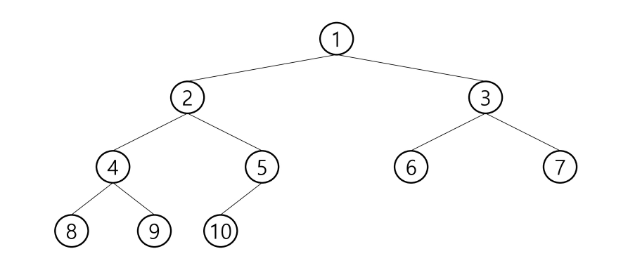
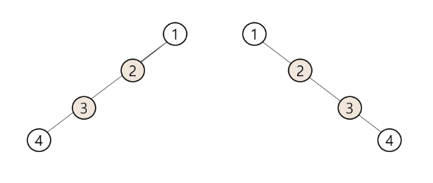
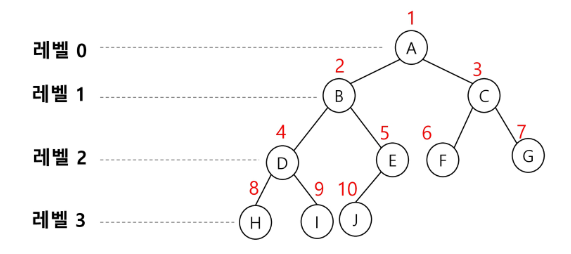

# 트리

## 트리 - 정의
- 비선형 구조
- 원소들 간에 1:n 관계를 가지는 자료구조
- 원소들 간에 계층관계를 가지는 계층형 자료구조
- 상위 원소에서 하위 원소로 내려가면서 확장되는 트리(나무)모양의 구조

- 한 개 이상의 노드로 이루어진 유한 집합이며 다음 조건을 만족한다.
    - 노드 중 최상위 노드를 루트(root)라 한다.
    - 나머지 노드들은 n(>=0)개의 분리 집합 T1,...,TN으로 분리될 수 있다.
- 이들 T1,...,TN은 각각 하나의 트리가 되며(재귀적 정의) 루트의 부 트리(subtree)라 한다.  



## 트리 - 용어
- 노드(node) - 트리의 원소
    - 트리 T의 노드 - A, B, C, D, E, F, G, H, I, J, K
- 간선(edge) - 노드를 연결하는 선. 부모 노드와 자식 노드를 연결
- 루트 노드(root node) - 트리의 시작 노드
    - 트리 T의 루트 노드 - A
- 형제 노드(sibiling node) - 같은 부모 노드의 자식 노드들
    - B, C, D 는 형제 노드
- 조상 노드 - 간선을 따라 루트 노드까지 이르는 경로에 있는 모든 노드들
    - K의 조상 노드: F, B, A
- 서브 트리(subtree) - 부모 노드와 연결된 간선을 끊었을 때 생성되는 트리
- 자손 노드 - 서브 트리에 있는 하위 레벨의 노드들
    - B의 자손 노드 - E, F, K  



- 높이
    - 노드의 높이: 루트에서 노드에 이르는 간선의 수. 노드의 레벨
        - B의 높이=1, F의 높이=2
    - 트리의 높이: 트리에 있는 노드의 높이 중에서 가장 큰 값. 최대 레벨
        - 트리 T의 높이=3  



## 이진 트리
- 모든 노드들이 2개의 서브트리를 갖는 특별한 형태의 트리
- 각 노드가 자식 노드를 최대한 2개 까지만 가질 수 있는 트리
    - 왼쪽 자식 노드 + 오른쪽 자식 노드

### 이진 트리 - 특성
- 레벨 i에서의 노드의 최대 개수는 2^i개
- 높이가 h인 이진 트리가 가질 수 있는 노드의 최소 개수는 (h+1)개가 되며, 최대 가수는 (2^(h+1)-1)개가 된다.

### 이진 트리 - 종류
- 포화 이진 트리(Full Binary Tree)
    - 모든 레벨에 노드가 포화상태로 차 있는 이진 트리
    - 높이가 h일 때, 최대의 노드 개수인 (2^(h+1) - 1)의 노드를 가진 이진트리
        - 높이 3일 때 2^(3+1)-1 = 15개의 노드
    - 루트를 1번으로 하여 2^(h+1)-1까지 정해진 위치에 대한 노드 번호를 가짐  

- 완전 이진 트리(Complete Binary Tree)
    - 높이가 h이고 노드 수가 n개일 때 (단, 2^h <= n <= 2^(h+1)-1), 포화 이진 트리의 노드 번호 1번부터 n번까지 빈 자리가 없는 이진 트리
    - 예) 노드가 10개인 완전 이진 트리  

- 편향 이진 트리(Skewed Binary Tree)
    - 높이 h에 대한 최소 개수를 노드로 가지면서 한쪽 방향의 자식 노드만을 가진 이진 트리
        - 왼쪽 편향 이진 트리
        - 오른쪽 편향 이진 트리  


### 이진 트리 - 순회(Traversal)
- 순회란 트리의 각 노드를 중복되지 않게 전부 방문하는 것을 말하는데 트리는 비 선형 구조이기 때문에 선형구조에서와 같이 선후 연결 관계를 알 수 없다.
- 따라서 특별한 방법이 필요하다.

- 순회: 트리의 노드들을 체계적으로 방문하는 것
- 3가지의 기본적인 순회방법
    - 전위순회(preorder traversal): VLR
        - 부모노드 방문 후, 자식노드를 좌,우 순서로 방문
    - 중위순회(inorder traversal): LVR
        - 왼쪽 자식노드, 부모노드, 오른쪽 자식노드 순으로 방문
    - 후위순회(postorder traversal): LRV
        - 자식노드를 좌우 순서로 방문한 후, 부모노드로 방문

- 전위 순회
    1) 현재 노드 n을 방문하여 처리한다. -> V
    2) 현재 노드 n의 왼쪽 서브트리로 이동한다. -> L
    3) 현재 노드 n의 오른쪽 서브트리로 이동한다. -> R

    - 알고리즘
    ```
    def preorder_traverse(T):
        if T:
            visit(T)
            preorder_traverse(T.left)
            preorder_traverse(T.right)
    ```

- 중위 순회
    1) 현재 노드 n의 왼쪽 서브트리로 이동한다.: L
    2) 현재 노드 n을 방문하여 처리한다.: V
    3) 현재 노드 n의 오른쪽 서브트리로 이동한다.: R
    
    - 알고리즘
    ```
    def inorder_traverse(T):
        if T:
            inorder_traverse(T.left)
            visit(T)
            inorder_traverse(T.right)
    ```

- 후위 순회
    1) 현재 노드 n의 왼쪽 서브트리로 이동한다.: L
    2) 현재 노드 n의 오른쪽 서브트리로 이동한다.: R
    3) 현재 노드 n을 방문하여 처리한다.: V

    - 알고리즘
    ```
    def postorder_traverse(T):
        if T:
            postorder_traverse(T.left)
            postorder_traverse(T.right)
            visit(T)
    ```

### 이진 트리의 표현
- 배열을 이용한 이진 트리의 표현
    - 이진 트리에 각 노드 번호를 다음과 같이 부여
    - 루트의 번호를 1로 함
    - 레벨 n에 있는 노드에 대하여 왼쪽부터 오른쪽으로 2^n부터 2^(n+1) - 1 까지 번호를 차례로 부여  



- 노드 번호의 성질
    - 노드 번호가 i인 노드의 부모 노드 번호 - i/2 (버림)
    - 노드 번호가 i인 노드의 왼쪽 자식 노드 버호 - 2*i
    - 노드 번호가 i인 노드의 오른쪽 자식 노드 번호 - 2*i+1
    - 레벨 n의 노드 번호 시작 번호 - 2^n

- 노드 번호를 배열의 인덱스로 사용
- 높이가 h인 이진트리를 위한 배열의 크기는?
    - 레벨 i의 최대 노드 수는? 2^i
    - 따라서 1 + 2 + 4 + 8... + 2^i = 2^(h+1) - 1
  

## 오프라인 강의
```python
'''
13
1 2 1 3 2 4 3 5 3 6 4 7 5 8 5 9 6 10 6 11 7 12 11 13
'''
# def preOrder(root):
#     print(root)
#     # l = TREE[root][0]
#     # r = TREE[root][1]
#     if leftC[root]: # 왼쪽이 있으면
#         preOrder(leftC[root])
#     if TREE[root]: # 오른쪽이 있으면
#         preOrder(rightC[root])

def preOrder(root):
    if root: # 마지막에 연결된 트리가 빈 값으로 있다고 생각, 값이 있는 것만 프린트
        print(root)
        preOrder(leftC[root])
        preOrder(rightC[root])

def inOrder(root):
    if root:
        inOrder(leftC[root])
        print(root)
        inOrder(rightC[root])   
        
def postOrder(root):
    if root:
        postOrder(leftC[root])
        postOrder(rightC[root])
        print(root)

N = int(input())
lst = list(map(int, input().split()))
leftC = [0] * (N+1)
rightC = [0] * (N+1)
for idx in range(0, len(lst), 2):
    p = lst[idx]
    c = lst[idx+1]
    
    if leftC[p] == 0:
        leftC[p] = c
    else:
        rightC[p] = c

print(leftC)
print(rightC)
```

```python
def inOrder(root):
    if len(TREE[root]) >=1: # 왼쪽이 있으면
        postOrder(TREE[root][0])
        print(root)
    if len(TREE[root]) >=2: # 오른쪽이 있으면
        postOrder(TREE[root][1])
    


def postOrder(root):
    if len(TREE[root]) >=1: # 왼쪽이 있으면
        postOrder(TREE[root][0])
    if len(TREE[root]) >=2: # 오른쪽이 있으면
        postOrder(TREE[root][1])
    print(root)
        

def preOrder(root):
    print(root)
    # l = TREE[root][0]
    # r = TREE[root][1]
    if len(TREE[root]) >= 1: # 왼쪽이 있으면
        preOrder(TREE[root][0])
    if len(TREE[root]) >= 2: # 오른쪽이 있으면
        preOrder(TREE[root][1])

N = int(input())
lst = list(map(int, input().split()))
TREE = [[] for _ in range(N+1)]

for idx in range(0, len(lst), 2):
    p = lst[idx]
    c = lst[idx+1]
    
    TREE[p].append(c) #부모에서 자식으로 연결되어있기 때문에 단방향
    
preOrder(1)
```

```python
def preOrder(root):
  if TREE[root]:
    print(root, TREE[root])
    preOrder(root * 2)
    preOrder(root *2+1)
      
def inOrder(root):
  if TREE[root]:
    preOrder(root * 2)
    print(root, TREE[root])
    preOrder(root *2+1)

def postOrder(root):
  if TREE[root]:
    preOrder(root * 2)
    preOrder(root *2+1)
    print(root, TREE[root])

s = 'TEST 순회! 테스트'
lst = list(s)
N = len(lst)
TREE = [0] * 100

for idx in range(0, len(lst),2):
    TREE[idx+1] = lst[idx]

print(TREE)
preOrder(1)
postOrder(1)
inOrder(1)
```