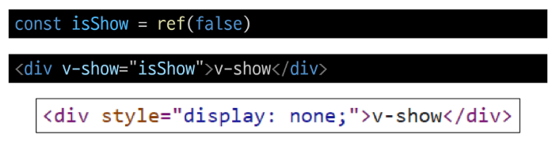
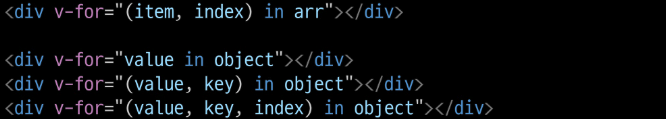
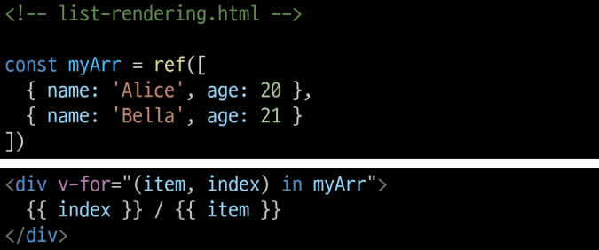
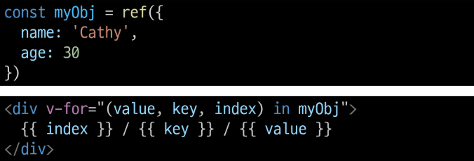
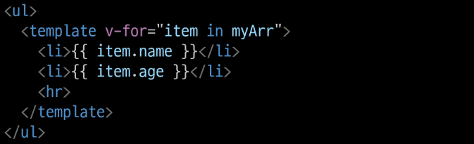
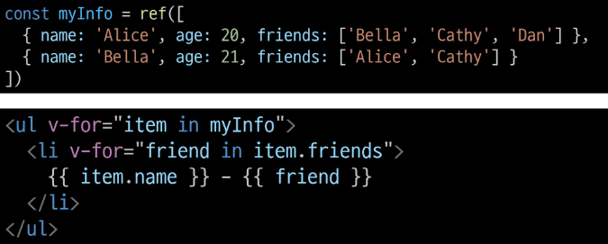
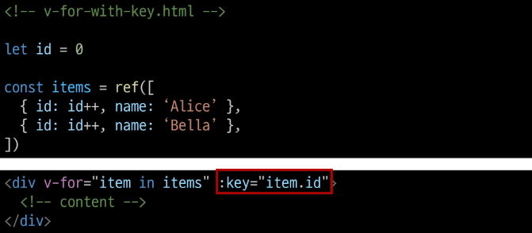

# BasicSyntax2

## Computed Properties
## Computed
### computed()
"계산된 속성"을 정의하는 함수  
> 미리 계산된 속성을 사용하여 템플릿에서 표현식을 단순하게 하고 불필요한 반복 연산을 줄임

### computed 기본 예시 (1/2)
- 할 일이 남았는지 여부에 따라 다른 메시지를 출력하기  
  ```html
  <h2>남은 할 일</h2>
  <p>{{ todos.length > 0 ? '아직 남았다' : '퇴근!'}}</p>
  <script>
    const todos = ref([
      { text: 'Vue 실습' },
      { text: '자격증 공부' },
      { text: 'TIL 작성'},
    ])
  </script>
  ```
> 템플릿이 복잡해지며 todos에 따라 계산을 수행하게 됨  
> 만약 이 계산을 템플릿에 여러 번 사용하는 경우에는 반복이 발생

### compute 기본 예시 (2/2)
- computed 적용
- 반응형 데이터를 포함하는 복잡한 로직의 경우 computed를 활용하여 미리 값을 계산하여 계산된 값을 사용

```html
<h2>남은 할 일</h2>
<p>{{ restOfTodos }}</p>
<script>
  const { createApp, ref, computed } = Vue

  const restOfTodos = computed(()=>{
    return todos.value.length > 0 ? '아직 남았다' : '퇴근!'
  })
</script>
```

### computed 특징
- 반환되는 값은 computed ref이며 일반 refs와 유사하게 계산된 결과를 .value로 참조할 수 있음(템플릿에서는 .value 생략 가능)
- computed 속성은 의존된 반응형 데이터를 자동으로 추적
- 의존하는 데이터가 변경될 때만 재평가
  - restOfTodos의 계산은 todos에 의존하고 있음
  - 따라서 todos가 변경될 때만 restOfTodos가 업데이트 됨

## Computed vs Methods
### computed와 동일한 로직을 처리할 수 있는 method
- computed 속성 대신 method로도 동일한 기능을 정의할 수 있음  
  ```html
  <p>{{ restOfTodos() }}</p>
  <script>
    const getRestOfTodos = function() {
      return todos.value.length > 0 ? '아직 남았다' : '퇴근!'
    }
  </script>
  ```

### computed와 method 차이
- computed 속성은 의존된 반응형 데이터를 기반으로 캐시(cached)된다
- 외존하는 데이터가 변경된 경우에만 재평가됨
- 즉, 의존된 반응형 데이터가 변경되지 않는 한 이미 계산된 결과에 대한 여러 참조는 다시 평가할 필요 없이 이전에 계산된 결과를 즉시 반환

> 반면, method 호출은 다시 렌더링이 발생할 때마다 항상 함수를 실행

### Cache(캐시)
- 데이터나 결과를 일시적으로 저장해두는 임시 저장소
- 이후에 같은 데이터나 결과를 다시 계산하지 않고 빠르게 접근할 수 있도록 함

### computed와 method의 적절한 사용처
- computed
  - 의존하는 데이터에 따라 결과가 바뀌는 계산된 속성을 만들 때 유용
  - 동일한 의존성을 가진 여러 곳에서 사용할 때 계산 결과를 캐싱하여 중복 계산 방지

- method
  - 단순히 특정 동작을 수행하는 함수를 정의할 때 사용
  - 데이터에 의존하는지 여부와 관계없이 항상 동일한 결과를 반환하는 함수

### method와 computed 정리
- computed
  - 의존된 데이터가 변경되면 자동으로 업데이트

- method
  - 호출해야만 실행됨

> 무조건 computed만 사용하는 것이 아니라 사용 목적과 상황에 맞게 computed와 method를 적절히 조합하여 사용

## Conditional Rendering
## v-if

### v-if
표현식 값의 true/false를 기반으로 요소를 조건부로 렌더링  
- v-else directive를 사용하여 v-if에 대한 else 블록을 나타낼 수 있음
- v-else-if directive를 사용하여 v-if에 대한 else if 블록을 나타낼 수 있음

### 여러 요소에 대한 v-if 적용
- HTML template 요소에 v-if를 사용하여 하나 이상의 요소에 대해 적용할 수 있음(v-else, v-else-if 모두 적용 가능)  

```html
<template v-if="name=== 'Cathy'">
  <div>Cathy입니다</div>
  <div>나이는 30살입니다</div>
</template>
```

### HTML <template> element
- 페이지가 로드될 때 렌더링 되지 않지만 JavaScript를 사용하여 나중에 문서에서 사용할 수 있도록 하는 HTML을 보유하기 위한 메커니즘  
> "보이지 않는 wrapper 역할"

## v-if vs v-show
### v-show
표현식 값의 true/false를 기반으로 요소의 가시성을 전환

### v-show 예시
- v-show 요소는 항상 DOM에 렌더링 되어있음
- CSS display 속성만 전환하기 때문  


### v-if와 v-show의 적절한 사용처
- v-if(Cheap initial load, expensive toggle)
  - 초기 조건이 false인 경우 아무 작업도 수행하지 않음
  - 토글 비용이 높음
- v-show(Expensive initial load, cheap toggle)
  - 초기 조건에 관계 없이 항상 렌더링
  - 초기 렌더링 비용이 더 높음

> 콘텐츠를 매우 자주 전환해야 하는 경우에는 v-show를, 실행 중에 조건이 변경되지 않는 경우에는 v-if를 권장

## List Rendering
## v-for
### v-for
소스 데이터를 기반으로 요소 또는 템플릿 블록 여러 번 렌더링

### v-for 구조
- v-for는 alias in expression 형식의 특수 구문을 사용  
  
- 인덱스(객체에서는 key)에 대한 별칭을 지정할 수 있음  
  

- 기본적으로 위의 사진과 같이 특이하게 value, key, index 순서의 구조를 가짐

### v-for 예시
- 배열 반복  
  

- 객체 반복  
  

### 여러 요소에 대한 v-for 적용
- HTML template 요소에 v-for를 사용하여 하나 이상의 요소에 대해 반복 렌더링 할 수 있음  



### 중첩된 v-for
- 각 v-for 범위는 상위 범위에 접근할 수 있음  


## v-for with key
### 반드시 v-for와 key를 함께 사용한다
내부 컴포넌트의 상태를 일관되게 하여 데이터의 예측 가능한 행동을 유지하기 위함

### v-for와 key
- key는 반드시 각 요소에 대한 고유한 값을 나타낼 수 있는 식별자여야 함


### 내장 특수 속성 key
- number 혹은 string으로만 사용해야 함
- Vue의 내부 가상 DOM 알고리즘이 이전 목록과 새 노드 목록을 비교할 때 각 node를 식별하는 용도로 사용  
> Vue 내부 동작 관련된 부분이기에 최대한 작성하려고 노력할 것 

