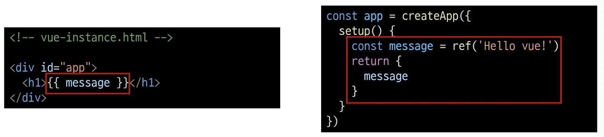
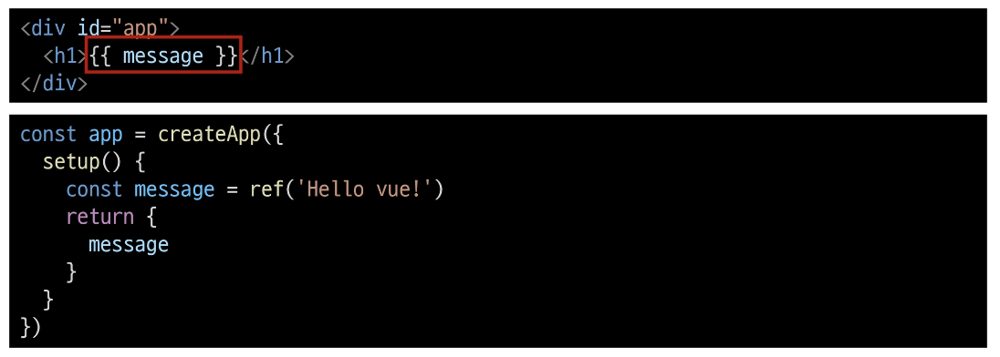
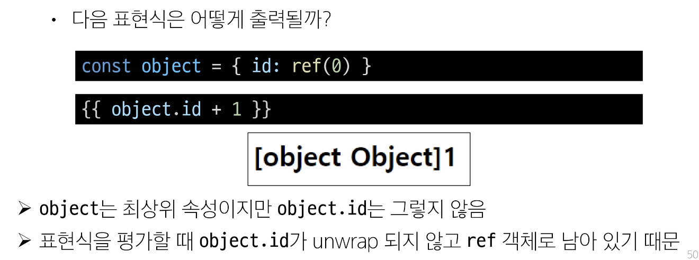
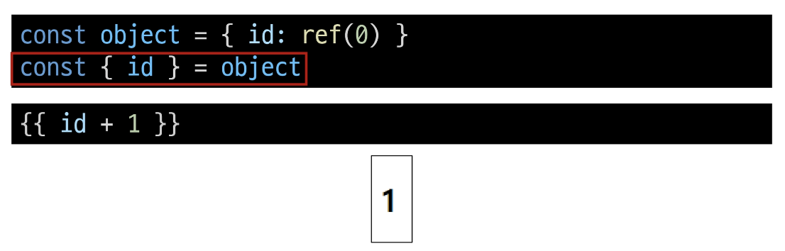
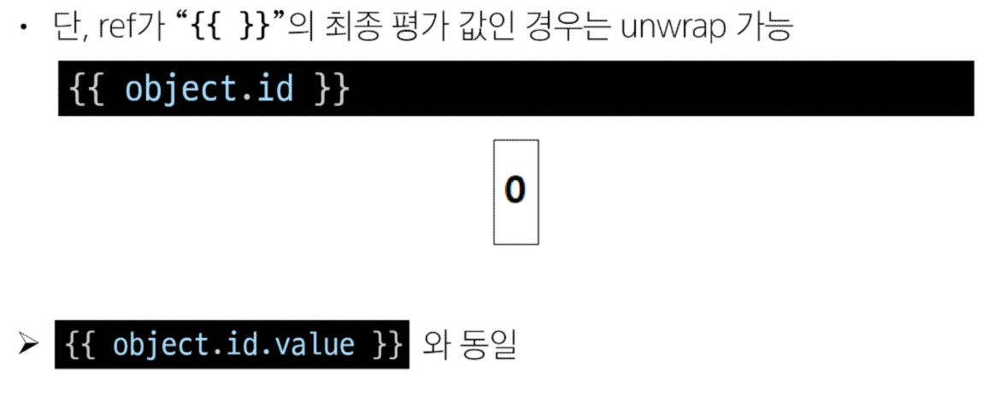

# Vue

### Vue의 2가지 핵심 기능
1. 선언적 렌더링 (Declarative Rendering)
    - 표준 HTML을 확장하는 "템플릿 구문"을 사용하여 JavaScript 상태(데이터)를 기반으로 화면에 출력될 HTML을 선언적으로 작성

2. 반응성 (Reactivity)
    - JavaScript 상태(데이터) 변경을 추적하고, 변경사항이 발생하면 자동으로 DOM을 업데이

## Vue tutorial
### Vue 사용 방법
1. 'CDN' 방식
2. 'NPM' 설치 방식

- 전역 Vue 객체
    - CDN에서 Vue를 사용하는 경우 전역 Vue 객체를 불러오게 됨  
- Application instance
    - 모든 Vue 애플리케이션은 createApp 함수로 새 Application instance를 생성하는 것으로 시작
- app.mount()
    - HTML 요소에 Vue 애플리케이션 인스턴스를 탑재(연결)
    - 각 앱 인스턴스에 대해 mount()는 한 번만 호출할 수 있음

```html
<script>
    // createApp 함수
    const { createApp } = Vue
    // Application instance    
    const app = createApp({})
    // mount
    app.mount('#app')
</script>
```

### ref()
반응형 상태(데이터)를 선언하는 함수  
(Declaring Reactive State)  

- .value 속성이 있는 ref 객체로 래핑(wrapping)하여 반환하는 함수
- ref로 선언된 변수의 값이 변경되면, 해당 값을 사용하는 템플릿에서 자동으로 업데이트
- 인자는 어떠한 타입도 가능

```html
<script>
    const { createApp, ref } = Vue

    const app = createApp({
        setup() {
            const message = ref('Hello vue!')
            console.log(message) // ref 객체
            console.log(message.value) // Hello vue!
        }
    })
</script>
```

- 템플릿의 참조에 접근하려면 setup 함수에서 선언 및 반환 필요
- 편의상 템플릿에서 ref를 사용할 때는 .value를 작성할 필요 없음  
  (automatically unwrapped)  



### ref()
반응형 상태(데이터)를 선언하는 함수

> 반응형을 가지는 참조 변수를 만드는 것(ref === reactive reference)

### Vue 기본 구조
- createApp()에 전달되는 객체는 Vue 컴포넌트(Component)
- 컴포넌트의 상태는 setup() 함수 내에서 선언되어야 하며 객체를 반환해야 함

### 템플릿 렌더링
- 반환된 객체의 속성은 템플릿에서 사용할 수 있음
- Mustache syntax(콧수염 구문)를 사용하여 메시지 값을 기반으로 동적 텍스트를 렌더링  



- 콘텐츠는 식별자나 경로에만 국한되지 않으며 유효한 JavaScript 표현식을 사용할 수 있음  


### Event Listeners in Vue
- 'v-on' directive를 사용하여 DOM 이벤트를 수신할 수 있음
- 함수 내에서 반응형 변수를 변경하여 구성 요소 상태를 업데이트

## 참고
## Ref Unwrap 주의사항

### 템플릿에서의 unwrap 시 주의사항
- 템플릿에서의 unwrap은 ref가 최상위 속성인 경우에만 적용 가능  



- 이 문제를 해결하기 위해서는 id를 최상위 속성으로 분해해야함  

  



### ref 객체가 필요한 이유
- 일반적인 변수가 안니 객체 데이터 타입으로 사용하는 이유는?
- Vue 템플릿에서 ref를 사용하고 나중에 ref의 값을 변경하면 자동으로 변경 사항을 감지하고 그에 따라 DOM을 업데이트 함("의존성 추적 기반의 반응형 시스템")
- Vue는 렌더링 중에 사용된 모든 ref를 추적하며, 나중에 ref가 변경되면 이를 추적하는 구성 요소에 대해 다시 렌더링
- 이를 위해서 참조 자료형의 객체 타입으로 구현한 것

### SEO(Search Engine Optimization)
- google, bing과 같은 검색 엔진 등에 내 서비스나 제품 등이 효율적으로 검색 엔진에 노출되도록 개선하는 과정을 일컫는 작업
- 정보의 대상은 주로 HTML에 작성된 내용
- 검색
    - 각 사이트가 운용하는 검색 엔진에 의해 이루어지는 작업
- 검색 엔진
    - 웹 상에 존재하는 가능한 모든 정보들을 긁어 모으는 방식으로 동작
- 최근에는 SPA, 즉 CSR로 구성된 서비스의 비중이 증가
- SPA 서비스도 검색 대상으로 넓히기 위해 JS를 지원하는 방식으로 발전하는 중

### CSR & SSR
- CSR과 SSR은 흑과 백이 아님
- 애플리케이션의 목적, 규모, 성능 및 SEO 요구 사항에 따라 달라질 수 있음
    - 내 서비스에 적합한 렌더링 방식을 적절하게 활용할 수 있어야 함

- SPA 서비스에서도 SSR을 지원하는 Framework가 발전하고 있음
    - Vue의 Nuxt.js
    - React의 Next.js

    